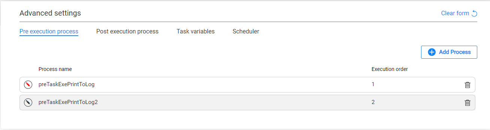

# Task - Pre and Post Execution Processes

The **Pre-execution process** and **Post-execution process** tabs in the task's **Advanced settings** enable adding pre and post execution processes to the task. The pre-execution processes run in the beginning of the task's execution, before all the related LUs have been executed. The post-execution processes run at the end of the task's execution, after all the related LUs have been executed. 

Examples:

- Running a cleanup flow before executing the task's LUs.
- Sending an email to the tester to notify that the execution of a task has ended.

The pre and post execution processes are **optional**. A task can be created and executed without any post-execution processes.

The pre and post execution processes that are available for tasks, are defined in the task's  [Business entity (BE)](/articles/TDM/tdm_overview/03_business_entity_overview.md) and must be [added to the BE by the admin user](04_tdm_gui_business_entity_window.md#pre-and-post-execution-processes-tabs). You can select only pre and post execution processes from the list of processes added to the task's BE. Note that a given flow can be attached to a BE and to a task with this BE as both pre and post execution processes. The execution order of the pre and post execution order is set according to the execution order defined in the BE.

## How to Add a Pre/Post Execution Process?

- Click the **Add Process** button in the Pre execution process or Post execution process tabs. A popup window is opened. Select from the drop-down list a process and click the Save:

  

- The list of selected processes is displayed with the execution order as set in the task's BE. The execution order is displayed for view only. TDM 9.1 has added a support of input parameters for pre and post executions. A pre or post execution with parameters is marked with an Edit icon. If the process has mandatory parameters that must be set by the task creator, the Edit icon is marked by red:

  

- Click the Edit icon to populate the parameters for the process. A popup window is opened with the process' parameters. Mandatory input parameters are marked with a red asterisk. Populate the parameter values for the task:

  

  

## How to Add a Pre/Post Execution Process?

Click the Trash icon next to the selected process in order to remove it from the task.

