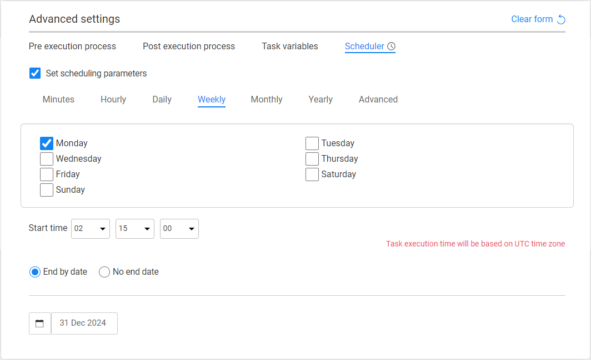

# Task - Scheduler Tab 

The **Scheduler** tab in the task's **Advanced settings** enables setting a **scheduled execution**: 

- Sets the automatic execution of a task via the TDM Scheduler process on predefined intervals.  For example, execute the task every Monday at 2:15 AM.

Notes:

- Testers can set an automatic scheduling for a task only when their [TDM Environment permission set](10_environment_roles_tab.md) has permissions to select this method for the target environment. 
- A scheduled can cab still be executed on demand. To execute a scheduled task, click  next to the task record in the Tasks window.

### Scheduled Execution Parameters

The Execution Time Interval is saved in TDM as a **crontab** value. Scheduling parameters can be populated by either:
 - Selecting the **Advanced** tab and populating the **crontab** value manually. Set a **Quartz crontab expression**. 
 - Selecting another tab and setting the scheduling parameters using the TDM Wizard. The following options are available:

 <table width="900pxl">
<tbody>
<tr>
<td valign="top" width="300pxl"><strong>Time Interval</strong></td>
<td valign="top" width="600pxl"><strong>Scheduling Parameters</strong></td>
</tr>
<tr>
<td valign="top" width="300pxl">Minutes</td>
<td valign="top" width="600pxl">
<ul>
<li>Minutes</li>
<li>Seconds</li>
</ul>
</td>
</tr>
<tr>
<td valign="top" width="300pxl">Hourly</td>
<td valign="top" width="600pxl">
<ul>
<li>Hours</li>
<li>Minutes</li>
<li>Seconds</li>
</ul>
</td>
</tr>
<tr>
<td valign="top" width="300pxl">Daily</td>
<td valign="top" width="600pxl">
<ul>
<li>Day interval. For example, every 1 day</li>
<li>Hours</li>
<li>Minutes</li>
<li>Seconds</li>
</ul>
</td>
</tr>
<tr>
<td valign="top" width="300pxl">Weekly</td>
<td valign="top" width="600pxl">
<ul>
<li>Day. For example, Monday</li>
</ul>
</td>
</tr>
<tr>
<td valign="top" width="300pxl">Monthly</td>
<td valign="top" width="600pxl">
<ul>
<li>A day in the month. For example, 1st, 2nd, First Monday, Second Thursday...</li>
<li>Months interval. For example, every 2 months</li>
<li>Hours</li>
<li>Minutes</li>
<li>Seconds</li>
</ul>
</td>
</tr>
<tr>
<td valign="top" width="300pxl">Yearly</td>
<td valign="top" width="600pxl">
<ul>
<li>Month</li>
<li>A day in the month. For example, 1st, 2nd, First Monday, Second Thursday...</li>
<li>Months interval. For example, every 2 months</li>
<li>Hours</li>
<li>Minutes</li>
<li>Seconds</li>
</ul>
</td>
</tr>
</tbody>
</table>
​    

The **End By** setting can be set to run a task by the Scheduler until a predefined date. For example, run the task every week till the end of February.

  

  

