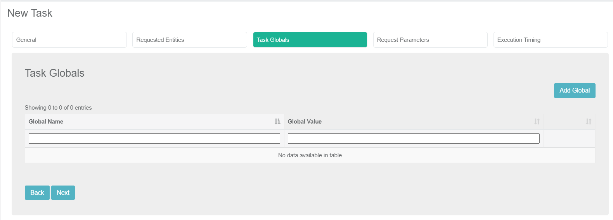
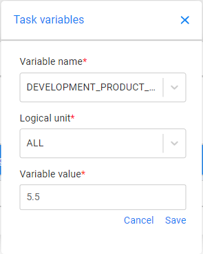

# Task Variables Tab

The TDM enables overriding [Global variables](/articles/08_globals/01_globals_overview.md) on both environment and task levels:

-  Setting variables on a task level only impacts the execution of a task. 
-  Setting variables on an environment impacts the execution of all tasks created on the [TDM environment](12_environment_globals_tab.md).

[Click to read more about overriding Fabric settings by a task's execution](/articles/TDM/tdm_architecture/04_task_execution_overridden_parameters.md).

## How do I Set Variable Value on a Task?

Check **Set Task Variables** to open the **Task Variables** tab.

This tab displays the list of variables set on a task level: 

Click **Set Task Variable** to set a variable value on the task. A popup window opens:

- **Variable Name**, select a value from the dropdown list of Global variables defined in the Fabric implementation.
- **Logical Unit**, can be populated with 'ALL' to impact all the task's LUs or with a specific LU name.
- **Variable Value**,  the default value is displayed. You can set a different value on the variable.

 

