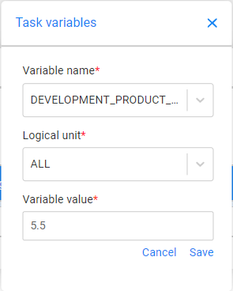

# Task Variables Tab

K2view's TDM enables overriding [Global variables](/articles/08_globals/01_globals_overview.md) on both environment and task levels:

-  Setting variables on a task level only impacts the execution of a task. 
-  Setting variables on an environment impacts the execution of all tasks created on the [TDM environment](12_environment_globals_tab.md).

[Click to read more about overriding Fabric settings by a task's execution](/articles/TDM/tdm_architecture/04_task_execution_overridden_parameters.md).

The **Task variables** tab in the task's **Advanced settings** displays the list of variables set on a task level and enables setting variables on a task. 

Click **Add variable** to set a variable value on the task. The following pop-up window opens:

- **Variable name** (required) — select from the drop-down list of Global variables defined in the Fabric implementation.
- **Logical unit** (required) — select either a specific LU name or 'ALL' to impact all the task's LUs.
- **Variable value** — the default value is displayed. You can set a different value on the variable.

## Add Parameters at Execution

The task creator can check the **Add parameters at execution** checkbox to allow the task runner to add new variable overrides at execution time, in addition to any variables already defined in the task. If this checkbox is unchecked, the task runner cannot add new variables at execution.

## Lock Icons

Each variable row has a lock icon. The task creator can unlock individual variables to allow the task runner to edit their values at execution time:

- **Locked** — the variable value is fixed and cannot be changed by the task runner at execution time.
- **Unlocked** — the task runner can edit the variable's value when executing the task.

At execution time, all variables are displayed, but the task runner can only edit the values of unlocked variables.
