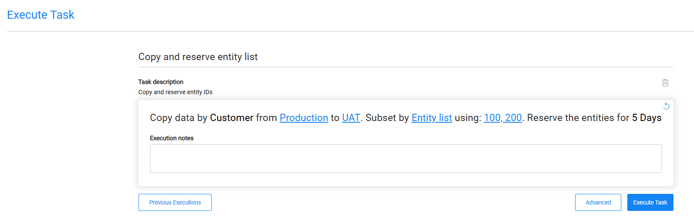
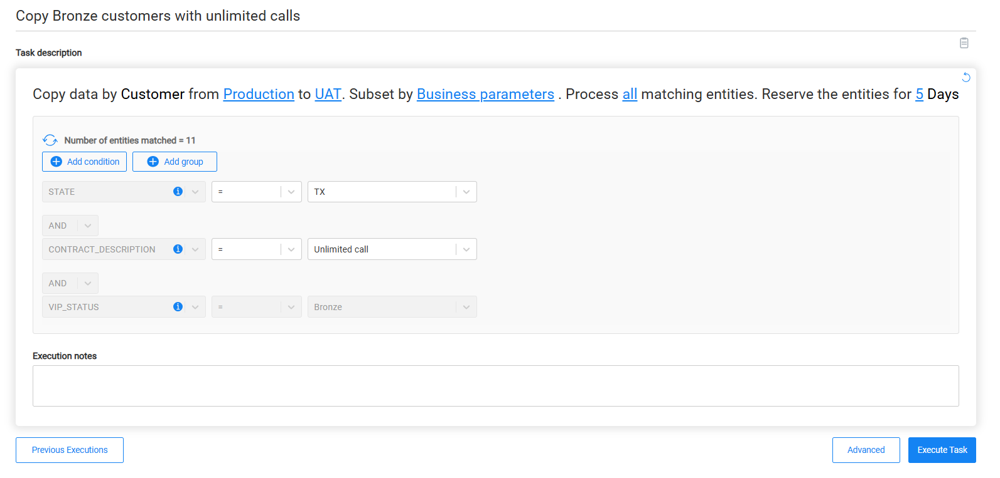
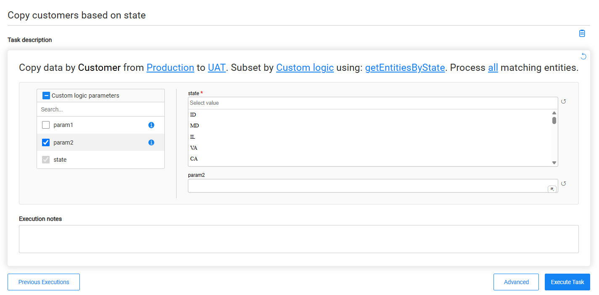
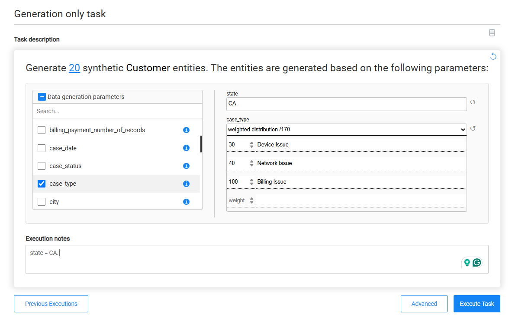
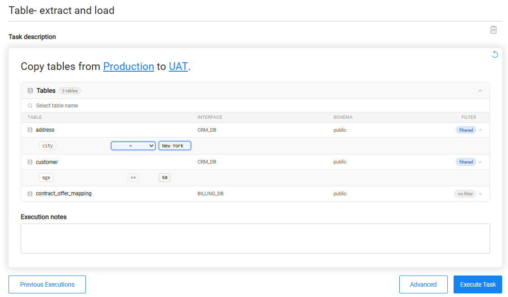
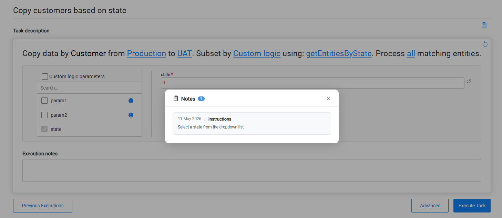

# Task Execution Window

TDM 10 introduces a simplified way to execute tasks that requires no technical knowledge of TDM configuration. Rather than building a task from scratch, task runners work from a pre-defined task created by a qualified engineer. The task serves as a reusable **template** — the task runner adjusts only what is relevant for the current run, and the task itself is never modified.

## Tasks as Templates

When a task creator defines a task, they decide — attribute by attribute — which parameters are fixed and which can be adjusted at execution time. Fixed parameters are **locked**: the task runner sees them but cannot change them. Parameters the creator has explicitly unlocked can be edited by the task runner before each execution.

This means task runners get a clean, guided experience with sensible defaults already in place, and only the parameters that are meaningful for their run are exposed. No deep TDM knowledge is required.

> **Important:** Changes made in the execution window apply only to the current execution. They never modify the saved task. The task template remains intact for every future run.

## Opening the Execution Window

The Execute Task window can be opened in two ways:

- **From the Task Management window** — click a task card to open the execution window for that task.
- **From the task window** — click the **Save & open Execution** button to save the task and immediately open its execution window.
- **From the execution history** — select a previous execution to reopen the task execution window pre-populated with the parameters used in that run.

## Task Execution Prompt

The task execution prompt is a predefined text that describes the task action. Each task type has its own predefined prompt text. The prompt includes the task's attributes — for example:

Attributes the creator has **unlocked** appear as **clickable blue links**. Clicking a link opens an inline editor where the task runner can provide or change the value for this execution. Attributes that are **locked** appear as plain bold text and cannot be changed.

The **refresh icon** in the top-right corner of the prompt box resets all editable attributes back to the task's default values.

### Editing an Unlocked Attribute

Clicking an unlocked attribute opens a small editing popup. 

### Business Parameters

For tasks that filter entities using business parameters, the task execution window includes the business parameters list. The task runner can change the values of individual conditions the creator has unlocked — for example, changing a STATE value — but cannot modify the overall filter structure.

If the [task](15a_entity_subset.md#business-parameters) allows adding parameters at execution time, the task runner can also add additional business parameters at execution time.

### Custom Logic

If the task's custom logic flow is [unlocked in the task](15a_entity_subset.md#predefined-custom-logic), the task runner can select a different custom logic flow at execution time.

If the selected custom logic flow defines input parameters, the **Custom logic parameters** section is displayed when either:

- The task already contains at least one custom logic parameter.
- The task runner is allowed to add custom logic parameters at execution time.

#### Custom Logic Parameters

The **Custom logic parameters** section displays the input parameters of the selected custom logic flow.

For each parameter already defined in the task, the task runner can edit its value if the parameter is marked as editable. If the task allows adding parameters at execution time, the task runner can also add additional parameters defined by the selected custom logic flow that are not already included in the task.

Each parameter includes a reset icon that restores its default value.

### Data Generation Parameters

The task execution prompt displays the business entity for which data will be generated, along with the number of entities to generate.

The **Data generation parameters** section is displayed when either:

- The [task](14d_task_source_rule_based_generation.md) contains at least one data generation parameter.
- The task runner is allowed to add data generation parameters at execution time.

The **Data generation parameters** section displays the parameters used during data generation.

For each parameter already defined in the task, the task runner can edit its value if the parameter is marked as editable. If the task allows adding data generation parameters at execution time, the task runner can add additional parameters supported by the data generation flow that are not already included in the task. Existing parameters cannot be removed.

Each parameter includes a reset icon that restores its default value.

### Table-Level Task Execution

For table-based tasks, the task execution prompt includes an expandable **Tables** section that displays the tables included in the task. The task runner can search for a table by name and review its interface, schema, and filter status.

Each table is expandable. For tables that have filters configured in the task, expanding the table displays the configured filter conditions. If a filter parameter is open for editing in the task, the task runner can modify its operator, value, or both. Filter parameters that are locked in the task are displayed as read-only.

The task runner can also enter optional execution notes before executing the task.

## Task Notes

Clicking the **clipboard icon** next to the task description opens the **Notes** panel. Notes are written by the task creator to guide the task runner — for example, explaining which parameters to update for a typical execution or what values are appropriate.

## Execution Notes

The **Execution notes** field is a free-text area where the task runner can record context about the current run. Execution notes are saved with the execution record and visible in the execution history.

## Advanced Settings

The **Advanced** button opens additional execution options across four tabs:

- **System settings** — displayed for entity-based tasks. It displays the LU-level affinity and worker settings and enables the task runner to edit [unlocked attributes](14b_task_source_component_entities.md#advanced-be---systems--logical-units-tab).
- **Pre execution process** — lists pre-execution processes. If the creator has unlocked input parameters, the task runner can expand each process and provide values before running.
- **Post execution process** — same as above for post-execution processes.
- **Task variables** — variables defined in the task. Unlocked variables can be set or overridden for the current execution.

## Previous Executions

Clicking **Previous Executions** opens the [execution dashboard](28_task_execution_dashboard.md) for this task. Task runners can review past runs and select any previous execution to reopen the task execution window pre-populated with the parameter values used in that run. This makes it easy to repeat or adjust a previous execution without starting from scratch.

## Executing the Task

Once the task runner has reviewed and set any editable parameters, click **Execute Task** to run. The execution uses the current parameter values for this run only — the original task is not affected.

 
