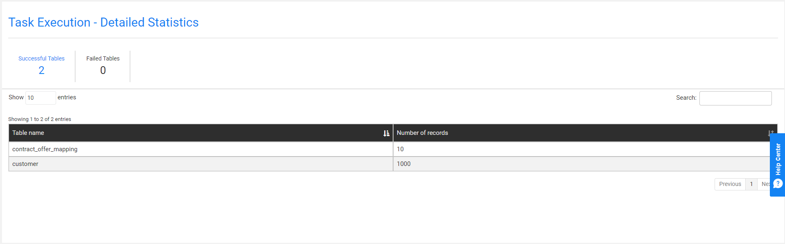
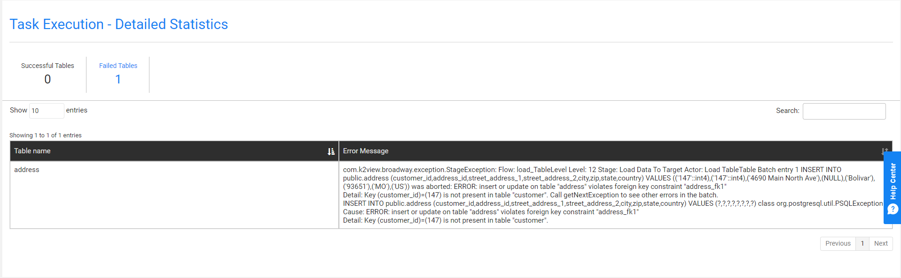

# Task Execution History

The TDM Portal has several windows that display a task's execution history:

- [Task Execution Summary](#task-executions-summary) - displays a list of the task's executions.
- [Execution Summary](#execution-summary) - displays a list of a task's LUs and post-execution processes.
- [Task Execution- Detailed Statistics](#task-execution---detailed-statistics) - displays the hierarchical structure of successful and failed entities of an executed task.

## Task Executions Summary 

The Task Executions Summary displays a list of executed tasks. When a task is edited - a new version of the task is created. Each version has its own record in the Tasks Lists window as well as its own Task Execution Summary. 

Open the [Tasks List window](14_task_overview.md#tdm-tasks-list-window) and click the  next to a selected task to open its Task Execution Summary window and display a full list of the task's executions.

Click **Show/Hide Columns** to open a pop-up window, which displays a list of available fields for each task. Fields in green are displayed by default. Click a field to remove it from the display.

The following information is displayed for each executed task:

- Task_execution_id

- Source and target environments

- Task Executed By, which the name of the user executing the task.

- BE name

- Summary statistics about the processed entities, tables, pre-execution processes and post-execution processes.

- Execution status, which is set to *Completed* when all of a task's processes have been completed successfully.

  

### Generating a Task Execution Summary Report

Click next to each executed task to generate and download a Summary Execution report. Note that the report displays the [task execution overridden parameters](/articles/TDM/tdm_architecture/04_task_execution_overridden_parameters.md), if they exist.

Click [here](Extract_and_load_customers_Summary_Execution_Report_EXECID_2839.xlsx) to download an example of a Summary Execution Report.

## Execution Summary

This is a display of the LUs, pre-execution processes and post-execution processes for the selected task execution. To display the Logical Units Execution Summary, click a task's **Task Execution Id** setting in the **Task Execution Summary** window.

Click **Show/Hide Columns** to open a pop-up window, which displays a list of available fields for each task. Fields in green are displayed by default. Click a field to remove it from the display.

### Generating a Task Execution Report on each Process

The execution report displays the following information about the LU execution:

- General information
- Entities list
- Tables list
- Execution errors
- Replaced sequences on Load tasks

To generate and download a Summary Execution Report on an LU, click the  next to each LU.

Note: The number of entities in the TDM execution report is limited to the number in the TDM_SUMMARY_REPORT_LIMIT Global (imported from the TDM library).

## Task Execution - Detailed Statistics

### Entity-based Task 

The Task Execution - Detailed Statistics window displays the following:

-  Detailed information on the number of successful and failed entities and tables in a task execution.
-  The hierarchical structure of the LUs and their entities.
-  A sample list of successful and failed entities.
-  Successful and failed and tables. 
-  Search option used for searching an entity.

To display the Task Execution - Detailed Statistics window (shown below), click  in the right corner of the **Execution Summary** window.

- The left pane displays the [hierarchical tree of the task's LU](/articles/TDM/tdm_overview/03_business_entity_overview.md#building-an-lu-hierarchy-in-a-be).
- The right pane displays the number of successful and failed entities and tables and a sample of entities and tables. 

By default, the root LU's list of entities and tables is displayed. To view the entities and tables in the **Logical Units Hierarchy**, click the LU.

The Source ID and Target ID sequences are displayed for each entity ID. When the task [replaces the source IDs](17a_task_target_component_entities.md#replace-ids-for-the-copied-entities), the Target ID and Source ID can be different. If an LU in the tree has failed entities, it is marked in red.

#### Failed Entities List Tab

An entity is marked as Failed if its process fails or if a child ID fails. For example, a Customer ID is marked as Failed if a copy of a billing subscriber fails.  The Failed Entities List tab displays both statuses: 

- Copy Entity Status, marked as Failed if the task execution fails to process the entity ID.
- Copy Hierarchy Data Status, marked as Failed if the task execution fails to process a child ID.

#### View the Hierarchy of a Selected Entity

Click the **Source Id** setting of an entity to view its hierarchy. 

Example:

View Customer #10:

Click the Billing LU to view the Subscriber IDs of Customer #10:

Click the child Billing subscriber ID -  #37 - to view its hierarchical structure:

### Table-based Task

When the user selected the [Tables](14c_task_source_component_tables.md) option in the task's Source component, the task is created and runs on tables without entities.

The Task Execution - Detailed Statistics window displays the following:

-  Number of successful and failed tables in a task execution.
-  List of successful and failed tables. 
-  Search option used for searching a table.

To display the Task Execution - Detailed Statistics window (shown below), click  in the right corner of the **Execution Summary** window.

#### Successful Tables Tab

The following information is displayed for each successful table:

- Table name
- Number of records

See example below:

#### Failed Tables Tab

The following information is displayed for each failed table:

- Table name
- Error message

See example below:

  

