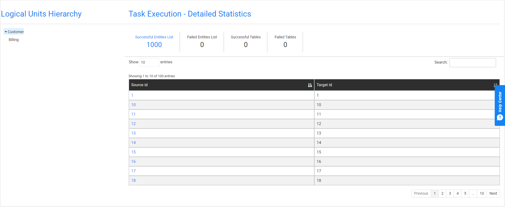
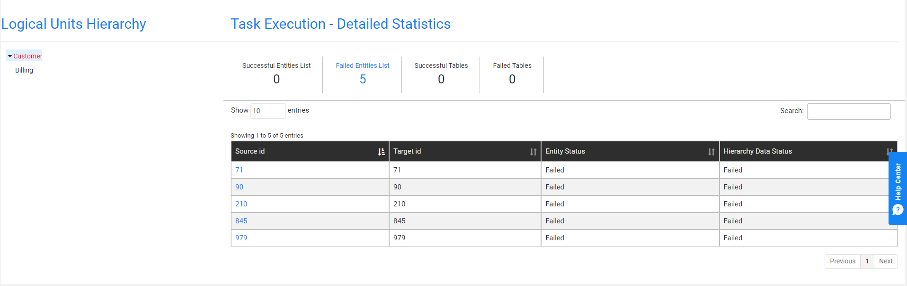
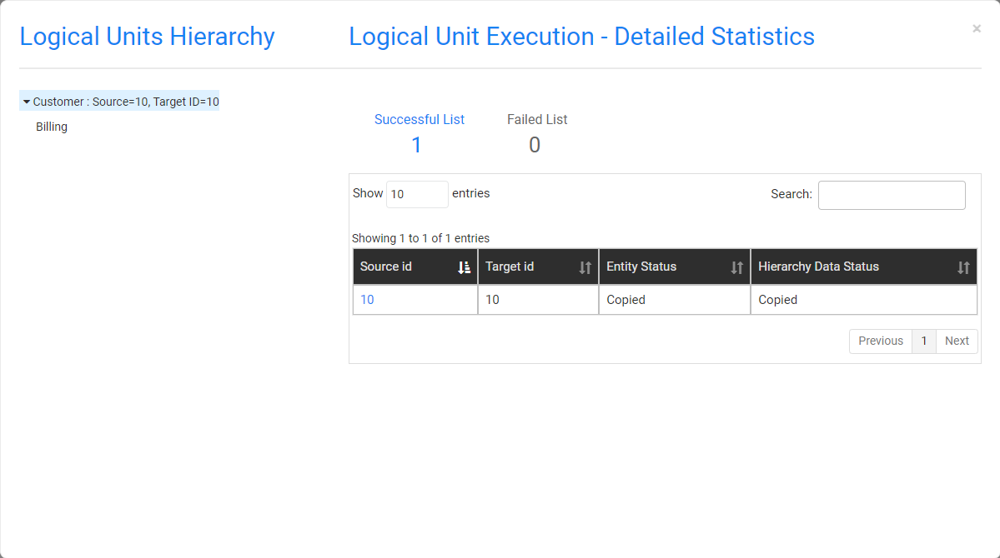
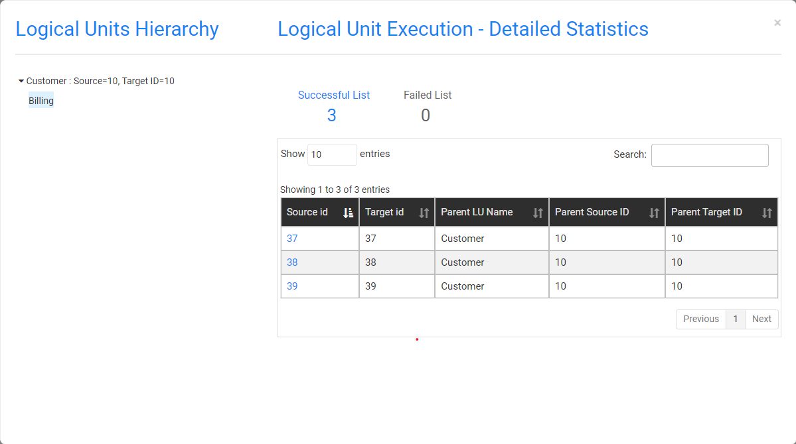
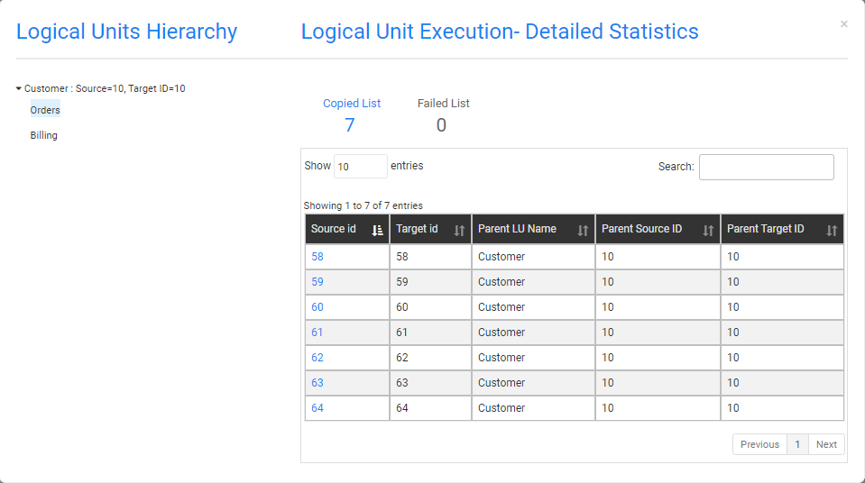
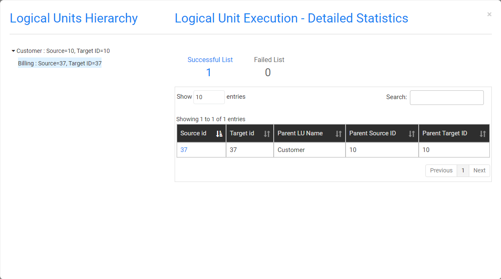

# Task Execution History

The TDM GUI has several windows that display a task's execution history:

- [Task Execution Summary](#task-executions-summary), displays a list of the task's executions.
- [Logical Units Execution Summary](#logical-units-execution-summary), displays a list of a task's LUs and post execution processes.
- [Task Execution- Detailed Statistics](#task-execution---detailed-statistics), displays the hierarchical structure of copied and failed entities of an executed task.

## Task Executions Summary 

The Task Executions Summary displays a list of executed tasks. When a task is edited a new version of the task is created. Each version has its own record in the Tasks Lists window and has its own Task Execution Summary. 

Open the [Tasks List window](14_task_overview.md#tdm-tasks-list-window) and click the  next to a selected task to open its Task Execution Summary window and display a full list of the task's executions.

Click **Show/Hide Columns** to open a popup window displaying a list of available fields for each task. Fields in green are displayed by default. Click a field to remove it from the display.

The following information is displayed for each executed task:

- Task_execution_id.

- Source and target environments.

- Task Executed By, the name of the user executing the task.

- BE name.

- Summary statistics about the processed entities, Reference tables and post execution processes.

- Execution status, which is set to Completed when all a task's processes have been completed successfully.

  

### Generating a Task Execution Summary Report

Click next to each executed task to generate and download a Summary Execution report. Note that the report displays the [task execution overridden parameters](/articles/TDM/tdm_architecture/04_task_execution_overridden_parameters.md) if they exist.

Click [here](testParams2_Summary_Execution_Report_EXECID_217.xlsx) to download an example of Summary Execution Report.

## Logical Units Execution Summary

Displays an executed task's LUs and post execution processes. To display the Logical Units Execution Summary, click a task's **Task Execution Id** setting in the **Task Execution Summary** window.

Click **Show/Hide Columns** to open a popup window displaying a list of available fields for each task. Fields in green are displayed by default.  Click a field to remove it from the display.

The window displays a summary on each LU or post execution process of an executed task.

### Generating a Task Execution Report on each Process

The execution report displays the following information about the LU execution:

- General information.
- Entities list.
- Reference tables list.
- Execution errors.
- Replaced sequences on Load tasks.

To generate and download a Summary Execution Report on an LU, click the  next to each LU.

## Task Execution - Detailed Statistics

The Task Execution - Detailed Statistics window displays the following:

-  Detailed information on the number of copied and failed entities and Reference tables in a task execution.
-  The hierarchical structure of the LUs and their entities.
-  A sample list of copied and failed entities and Reference tables. 
-  Search option used to search for an entity.

To display the Task Execution - Detailed Statistics window, click  in the right corner of the **Logical Units Execution Summary** window.

- The left pane displays the [hierarchical tree of the task's LU](/articles/TDM/tdm_overview/03_business_entity_overview.md#building-an-lu-hierarchy-in-a-be).
- The right pane displays the number of copied and failed entities and Reference tables and a sample of entities and Reference tables. 

By default, the root LU's list of entities and Reference tables is displayed. To view the entities and Reference tables in the **Logical Units Hierarchy**, click the LU.

The Source ID and Target ID sequences are displayed for each entity ID. When the task [replaces the source sequences](17_load_task_regular_mode.md#replace-sequence), the Target ID and Source ID can be different. If an LU in the tree has failed entities it is marked in red.

### Failed Entities List Tab

An entity is marked as Failed if its process fails or if a child ID fails. For example, a Customer ID is marked as Failed if a copy of an order fails.  The Failed Entities List tab displays both statuses: 

- Copy Entity Status, marked as Failed if the task execution fails to process the entity ID.
- Copy Hierarchy Data Status, marked as Failed if the task execution fails to process a child ID.

### View the Hierarchy of a Selected Entity

Click the **Source Id** setting of an entity to view its hierarchy. 

Example:

View Customer #10:

Click the Billing LU to view the Subscriber IDs of Customer #10:

Click the Orders LU to view the Order IDs of Customer #10:

Click the child Order ID - Order #60 - to view its hierarchical structure:

  

