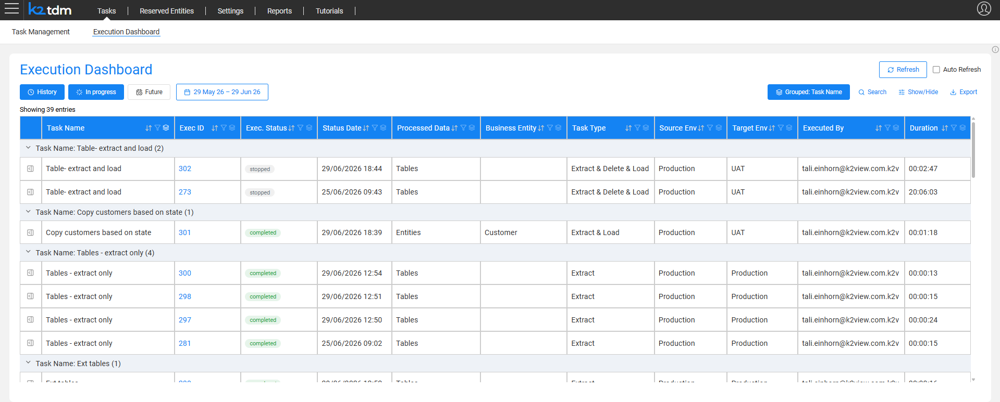

# Execution Dashboard Window

The **Execution Dashboard** is the unified operations center for monitoring and managing TDM task executions. It replaces the scattered per-task execution views of previous TDM versions, providing a single window to monitor live executions, review execution history, view upcoming scheduled executions, download reports, and rerun previous executions — all in one place.

The dashboard is accessible in two ways:

- From the **Tasks** navigation bar by selecting the **Execution Dashboard** tab.
- By clicking the **Previous executions** button in the task execution window. In this case, the dashboard opens pre-filtered to show only executions of that specific task.

## Who Can View What?

Each user sees only the executions relevant to them:

- **Admin users** — view all executions across all environments and tasks.
- **Environment owners** — view executions for tasks running on their environments.
- **Testers** — view their own executions only.

## Views

The dashboard provides three views, toggled by the buttons at the top-left:

- **History** — displays past executions within a selected date range. Use the date range picker to control the time window.
- **In progress** — displays executions that are currently running or pending.
- **Future** — displays upcoming executions for scheduled tasks.

## Filtering, Sorting, and Grouping

The table supports sorting and filtering on any column. By default, executions are **grouped by Task Name**, so all executions of the same task appear together under a collapsible group header showing the task name and the number of executions in the group. Click a group header to expand or collapse it.

When grouping is active, the button label shows the active grouping fields (e.g., **Grouped: Task Type, Business Entity**). When no grouping is active, the button shows **Group By**. Click the button to open the grouping panel, where you can:

- Check one or more fields to group by them. Multiple fields create a hierarchical grouping — for example, grouping by Task Type and then Business Entity nests the Business Entity groups inside each Task Type group.
- Uncheck a field to remove that grouping level.
- Click **Clear grouping** to remove all grouping and display a flat list.

The available grouping fields are: Task Name, Exec. Status, Task Type, Business Entity, Source Env, Target Env, and Executed By.

Use the **Search** field to perform a free-text search across executions.

## Columns

The table includes a set of default columns. Click **Show/Hide** to add optional columns to the view. The available optional columns include: Task ID, Selection Method, Processed Entities, Completed Entities, Failed Entities, Processed Tables, Completed Tables, and Failed Tables.

## Export

Click **Export** to export the current table view to a CSV file.

## Refresh

- **Refresh** — manually refreshes the dashboard.
- **Auto Refresh** — when checked, the dashboard refreshes automatically, keeping live execution status up to date.

## Execution Record Actions

Click the icon on the left of any execution row to open a side panel with details and actions for that execution. The panel displays:

- **Task name and Exec ID** as the panel title.
- **Selection method** — the entity selection method used for this execution.
- **Notes** — the execution note entered at execution time, if populated.

The panel provides the following action links:

- **Download report** — downloads the execution report.
- **Execution monitor** — opens the [Execution Summary & Monitor](26b_task_execution_monitor.md) for the execution.
- **Open task execution** — opens the task execution window to view execution details or rerun the execution.

