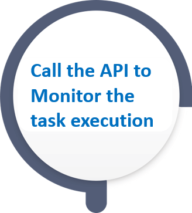

# TDM - Basic Task Execution Flow

 Send the task_id of the selected task.

 Send the task_id of the selected task.

 Send the task_id of the selected task.

 Send the task_execution_id returned by the execute task API.

 Send the task_execution_id returned by the execute task API.

