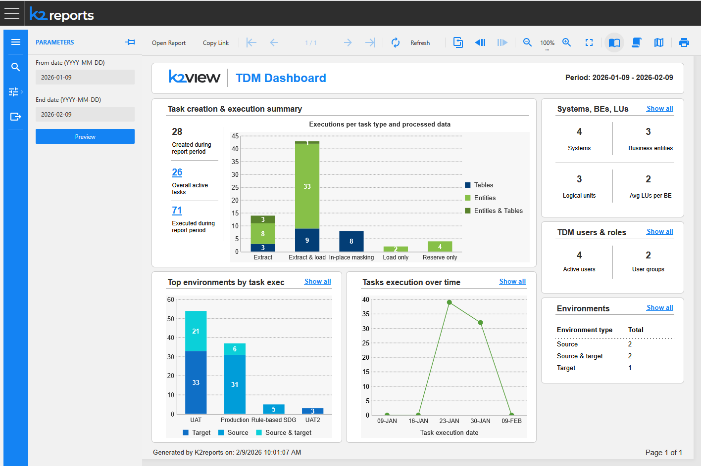
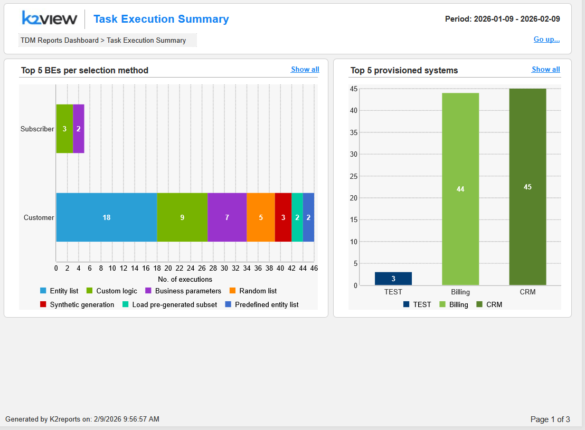
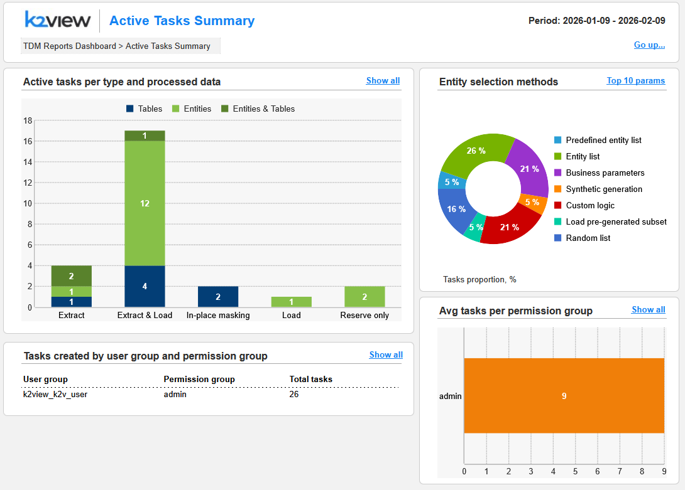
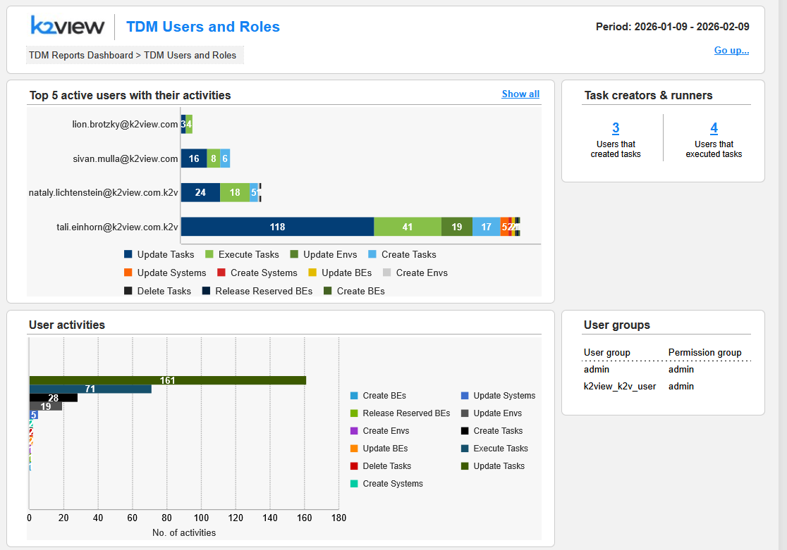
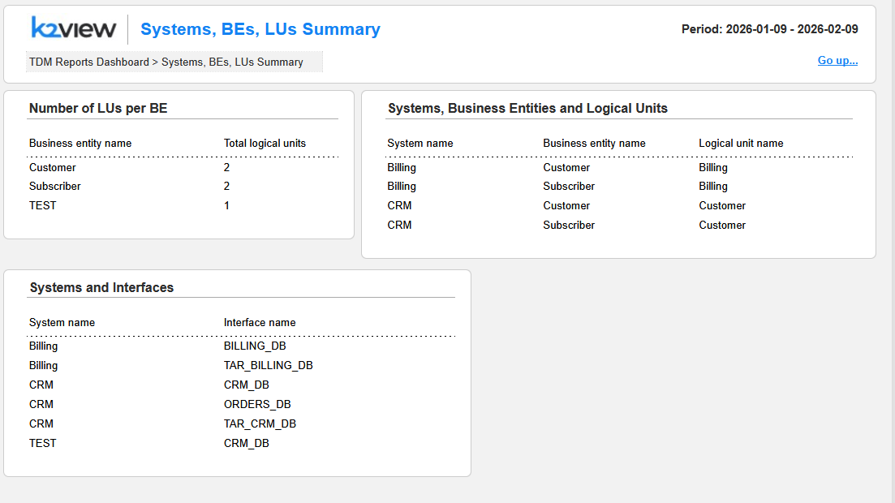

# TDM Dashboard User Guide

## Overview

The **TDM Dashboard** is now available in the **Reports** application. It provides a comprehensive view of your test data management activities, including task execution metrics, user activities, system configurations, and environment utilization. This dashboard enables you to monitor and analyze TDM operations across your organization. The TDM Dashboard can be opened from TDM application, starting from TDM V9.5.

**Time Period**: All dashboard views and reports display data for the past month from today's date. You can change this default period by opening the **Parameters** section using the icon on the left-side menu bar of the Reports application. The desired date range should be added in the format YYYY-MM-DD.

**Export:** Each dashboard and report can be exported into PDF or CSV format by opening the **Export** section using the relevant icon on the left-side menu. 

**Navigation between the linked reports**: The navigation from the main dashboard to the linked reports and back can be done by one of the following two options:

* By clicking the links (such as 'Show all') to drill down into the next level of details and 'Go up...' to return to the previous level.
* Using the native pagination icons of the Reports application.

**Navigation within each report**: Each dashboard and report can be extended to multiple pages (based on the included data). Page numbers are displayed in the bottom-right corner for multi-page reports. The nivation between the pages of each report can be done by using the native navigation icons of the Reports application.

**Breadcrumb trail**: Located at the top of each report page. For example: TDM Reports Dashboard > Task Execution Summary. The breadcrumbs are added for orientation only and are not clickable.

Click [here](/articles/38_reports/01_reports_overview.md) for more information about the Reports application.

---

## Main Dashboard

The TDM Dashboard displays the main key metrics and visualizations organized into the several sections. Each section include linked to deep dive into the statistics related to the section.

### Task Creation & Execution Summary

**Metrics displayed:**
- **Created during report period**: Total number of tasks created within the selected timeframe.
- **Overall active tasks**: Number of currently active tasks. Clicking the number allows to zoom into the *Active Tasks Summary* report, described further in this article.
- **Executed during report period**: Total task executions in the timeframe. Clicking the number allows to zoom into the *Task Execution Summary* report, described further in this article.

**Executions per task type and processed data** (Bar Chart):
- Visualizes the number of executions by task type, such as Extract, Extract & Load, etc.
- Shows breakdown by data type processed: Tables, Entities, and Entities & Tables.
- Each bar displays the count of executions with color-coded segments.

### Top Environments by Task Executions

Identifies which environments have the highest task execution activity. Up to 5 top environments are shown in this chart. For each environment in the chart, the relevant bar displays a number of executions broken down by environment type: Source, Target or Source & target.

The 'Show all' link opens the *Task Execution per Environment* report. By clicking on each bar of the chart, the same report opens filtering the data by the environment name.

### Tasks Execution Over Time

Tracks execution trends across the reporting period. It displays the line chart showing the number of task executions grouped by several days. This graph helps to identify peak activity periods and execution patterns. 

The 'Show all' link opens the *Task Execution Summary* report, described further in this article.

### Systems, BEs, LUs

**Metrics displayed:**
- **Systems**: Total number of systems.
- **Business entities**: Number of business entities configured.
- **Logical units**: Total logical units.
- **Avg LUs per BE**: Average logical units per business entity.

The 'Show all' link allows to drill-down to the detailed *Systems, BEs, LUs Summary* report, described further in this article.

### TDM Users & Roles

**Metrics displayed:**
- **Active users**: Number of users who have performed activities.
- **User groups**: Total configured user groups. A user group is equivalent to a Fabric role. 

The 'Show all' link allows to drill-down to the detailed *TDM Users and Roles* report, described further in this article.

### Environments

Provides a breakdown of configured environments by type (Source, Source & target, Target).

The 'Show all' link allows to drill-down to the detailed *Environments Summary* report.

------

## Linked Reports

### General

The reports data includes three levels: Main dashboard > Level 1 details (in each functional area) > Level 2 details (in each functional area). 

Below you can find the detailed description of several selected reports.

### Task Execution Summary

**Access**: Either by clicking the number of executed tasks in the *Task creation & execution summary* section or by clicking 'Show all' in the *Tasks execution over time* section of the main dashboard.

**Purpose**: Detailed analysis of task executions with multiple perspectives.

**Sections include:**

**Top 5 BEs per selection method**
- Horizontal stacked bar chart showing business entities.
- Color-coded by selection method (Entity list, Custom logic, etc.).
- Shows execution count for each method.

**Top 5 provisioned systems**
- Bar chart displaying systems with the most provisioning activity. These are the systems that are provisioned when running load and in-place masking. 
- Broken down by system name.

**Entities statistics per task execution**
- Performance metrics for entity-level processing: Average entities per execution, Average failed entities %, Average time per entity (sec).

**Tables statistics per task execution**
- Performance metrics for table-level processing: Average tables per execution, Average failed tables %.

**Executions per user and permission group**
- Shows which user groups and permission groups are executing tasks.
- Total execution count per group.

**Executions per task type and processed data**

- Shows granular breakdown of all executions by task type and data processing method.

### Active Tasks Summary

**Access**: By clicking the number of active tasks in the *Task creation & execution summary* section of the main dashboard.

**Purpose**: Overview of currently active tasks in the system.

**Sections include:**

**Active tasks per type and processed data**
- Stacked bar chart showing active tasks by task type, such as Extract, Extract & Load, etc.
- Shows breakdown by data type processed: Tables, Entities, and Entities & Tables.
- Displays count of active tasks per category.

**Entity selection methods**
- Donut chart showing distribution of selection methods used in active tasks.
- Proportion of tasks (in %) per each selection method, such as Predefined entity list, Entity list, Business parameters, etc.

**Tasks created by user group and permission group**
- Table showing: User group, Permission group, Total tasks.
- Identifies which groups are creating the most tasks.

**Avg tasks per permission group**
- Horizontal bar chart showing average task count per permission group.
- Helps identify workload distribution across groups.

### TDM Users and Roles

**Access**: By clicking 'Show all' in the *TDM users & roles* section of the main dashboard.

**Purpose**: Analyze user activities and role assignments.

**Sections include:**

**Top 5 active users with their activities**
- Horizontal stacked bar chart showing users and their activity counts.
- Color-coded legend for all activity types.
- Shows the most active users and what actions they're performing.

**Task creators & runners**
- **Users that created tasks**: Count of users who have created tasks (e.g., 3).
- **Users that executed tasks**: Count of users who have run tasks (e.g., 4).
- Helps distinguish between task creation and execution activities.

**User activities**
- Stacked bar chart showing total activities by type.
- X-axis: Number of activities.
- Color-coded legend for all activity types.
- Provides overall activity volume metrics.

**User groups**
- Table showing: User group, Permission group.
- Lists all configured user groups and their associated permission levels. A user group is equivalent to a Fabric role.

### Systems, BEs, LUs Summary

**Access**: By clicking 'Show all' in the *Systems, BEs, LUs* section of the main dashboard. 

**Purpose**: Detailed view of system architecture and configuration.

**Sections include:**

**Number of LUs per BE**
- Table showing: Business entity name, Total logical units.
- Helps understand data model complexity.

**Systems, Business Entities and Logical Units**
- Comprehensive table with columns: System name, Business entity name, Logical unit name.
- Shows the complete hierarchy and relationships.

**Systems and Interfaces**
- Table showing: System name, Interface name.
- Lists all system connections and their associated interfaces.

---

