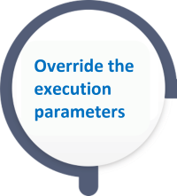
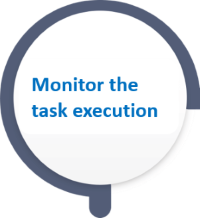

# TDM - Overriding Task Execution Parameters Flow

Click the blue text to open the articles about the related TDM APIs of each step. 

 Send the task_id of the selected task.

 Send the selected task's attributes.

 Send the selected task's LUs.

 

 Send the task_id and the overriden parameters of the selected task.

 Send the task_id of the selected task.

 Send the task_execution_id returned by the execute task API.

 Send the task_execution_id returned by the execute task API.

