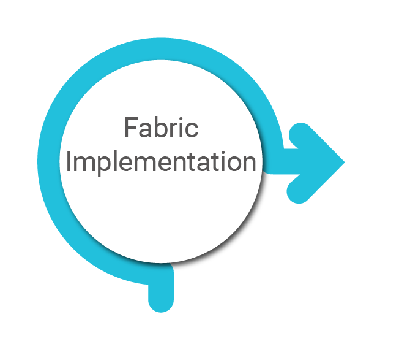
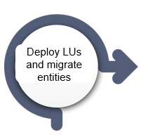
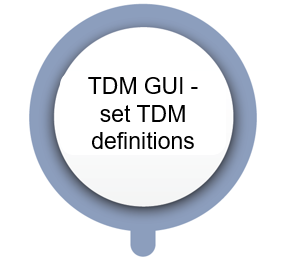

# TDM Implementation Flow

The TDM implementation involves several steps. The following is an overview of the main steps :

The TDM implementation starts with [Fabric Implementation](03_tdm_fabric_implementation_flow.md). Then it is required to complete the Fabric setup, deploy the implementation to Fabric, and set the TDM definitions via the TDM GUI.

**Notes:** 

- It is required to deploy the LUs to Fabric before setting the TDM definitions via the TDM GUI, since the TDM GUI only retrieves the deployed LUs when adding LUs to the [BE](/articles/TDM/tdm_overview/03_business_entity_overview.md).
- It is recommended to migrate a large sub-set of entities of each LU into Fabric to get the [TDM relation](/articles/TDM/tdm_architecture/02_tdm_database.md#tdm_lu_type_relation_eid)  and the [LU Parameters](/articles/TDM/tdm_architecture/02_tdm_database.md#lu_name_params) TDM table populated before starting the TDM definitions via the TDM GUI. 

