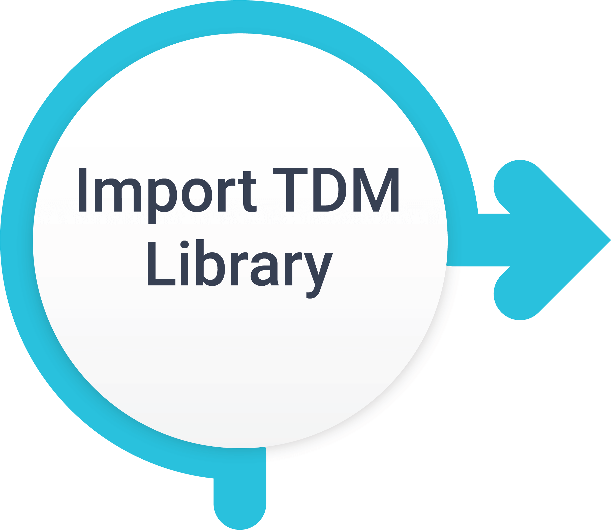
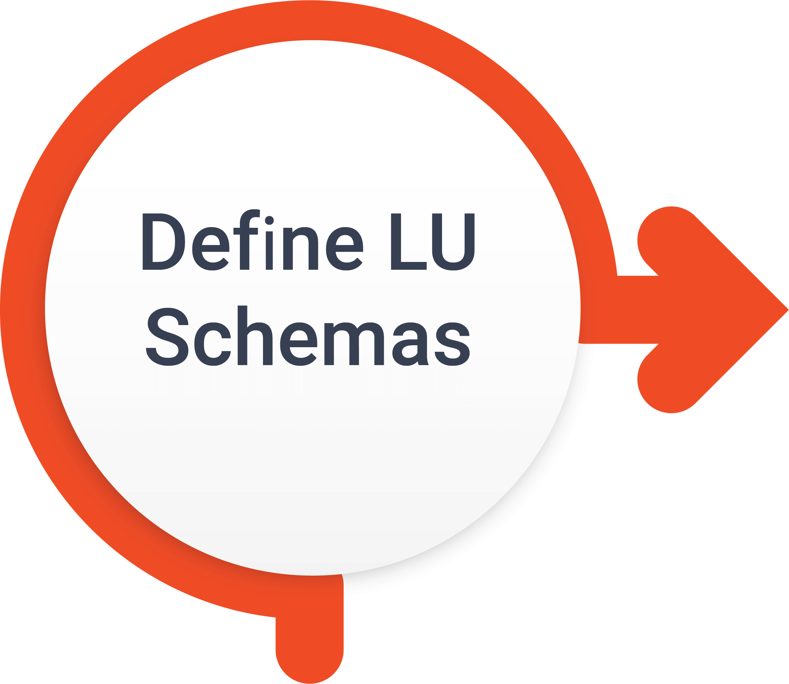

# TDM - Fabric Implementation Overview

The implementation of TDM in Fabric involves several steps. The following illustration displays the main ones. All the steps are implemented in Fabric Studio except the Fabric Catalog step: 

1. TDM Library installation

2. Creating interfaces for data sources

3. Optional - Fabric Catalog - 

   - Running a discovery on the project interfaces
   - PII settings
   - Sequence settings

4. Logical units (LUs) creation

5. Adding a TDM setup to the LUs:

   - TDM tables and flows
   - Masking handling
   - Sequence handling
   - Business parameters implementation
   - Error and statistics handling

6. Optional - Synthetic data implementation:

   - Rule-based generation
   - AI-based generation

7. Environment setup

8. Optional setting: 

   - Table level tasks' implementation

   - Pre and post execution processes implementation

   - Custom logic flows implementation

     

   

A Fabric TDM project includes the following:

- TDM Utilities - TDM Web Services, [TDM LU](04_fabric_tdm_library.md#tdm-lu) and TDM_TableLevel LU.
- Logical Units - TDM entities and their related data are modeled into LUs like CRM, Billing, Ordering, etc.
- Broadway flows that are defined under each LU in order to delete or load entities from/to the target environment.
- An environment setup - a process in which the source and target environments of the TDM are defined, and the connection details of interfaces and the Globals in each environment are set.

K2view offers a TDM library with TDM utilities as well as TDM Templates for Broadway flows. These utilities must be included in the TDM Fabric project. 

