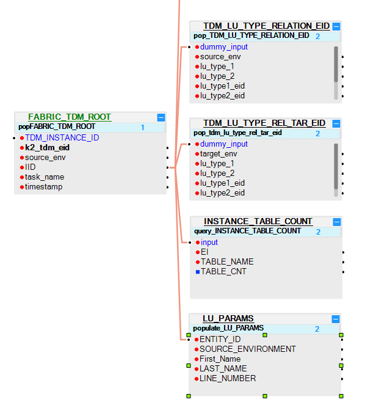
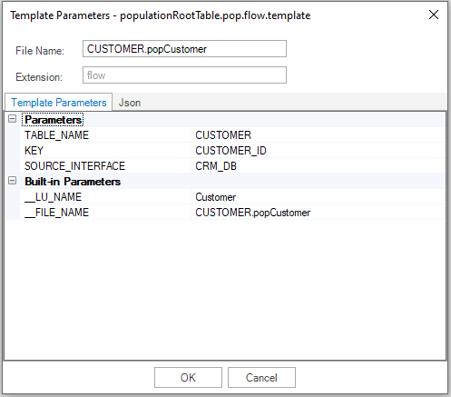
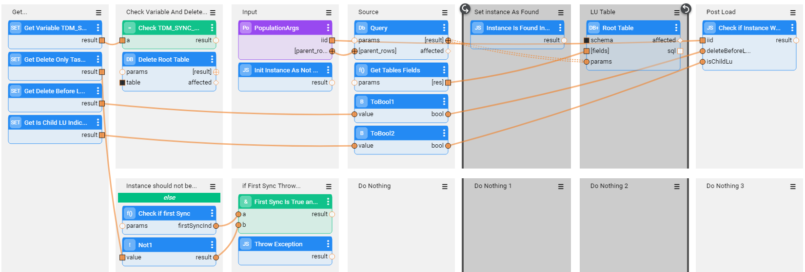

# TDM LU Implementation - General Guidelines

A TDM task copies a [Business Entity](/articles/TDM/tdm_overview/03_business_entity_overview.md) (BE) from a source environment to a target environment. A BE can have multiple [LUs](/articles/03_logical_units/01_LU_overview.md) with a flat or a hierarchical structure. For example, a Customer BE can consist of Customer Care, Billing, Ordering and Usage LUs. The ability to break a BE up into several LUs enables maximum flexibility and avoiding duplicate development. In addition, defining a hierarchical structure of parent-child LUs enables creating LUs based on the natural root entity of the related data sources instead of forcefully setting unified root entities on all LUs related to a given BE.

Each LU in a TDM project must have additional components to support TDM functionality, as described below:   

## Basic LU Structure

Each LU in a TDM project has the following structure:

- Dummy root table, FABRIC_TDM_ROOT. 

- Generic TDM LU tables that are linked to the root table. 

- Two main branches that are linked to the root table:

  - **Source branch**: LU tables that extract an entity's source data. Source LU tables are populated when a TDM task needs to load (insert) entities to a target environment and therefore must extract the source data of these entities.

  - **Target branch**: LU tables that extract the target keys of an entity. The keys are extracted from the target environment to enable deleting an entity from a target environment if required by the TDM task.

    Click for more information about [Fabric implementation and deleting entities from the target environment](08_tdm_implement_delete_of_entities.md).

### Step 1 - Copy the Objects from the TDM_LIBRARY LU into Each LU

Import the [TDM_LIBRARY LU](/articles/TDM/tdm_implementation/04_fabric_tdm_library.md#tdm_library-lu) from the **TDM Library** to your project and copy the LU level objects in the TDM_LIBRARY to your LU.

### Step 2 - Add the TDM Root Table and the Generic TDM Tables to the LU Schema

1. Add the **FABRIC_TDM_ROOT** LU table to the LU Schema and set it as a [Root table](/articles/03_logical_units/08_define_root_table_and_instance_ID_LU_schema.md). 
2. Set the **Instance PK** column to **k2_tdm_eid**.   
3. Add the **LU_PARAMS** and **INSTANCE_TABLE_COUNT** to the LU Schema and link the tables to the **FABRIC_TDM_ROOT.IID**.
4. In Parent LUs, add the **TDM_LU_TYPE_RELATION_EID** and **TDM_LU_TYPE_REL_TAR_EID** relationship tables to the LU Schema and link the tables to the **FABRIC_TDM_ROOT.IID**.

​	Click for more information about supporting [hierarchy in the TDM implementation](06_tdm_implementation_support_hierarchy.md).

4. Add the LU_PARAMS LU table to each LU Schema (even if it is not required for defining LU parameters), so that the LU_PARAM table only holds the ENTITY_ID and SOURCE_ENVIRONMENT fields.

5. Edit **trnLuParams** and **LU_PARAMS** to enable a subset of entities from selected parameters for this LU. 

   Click for more information about [Handling TDM Parameters](07_tdm_implementation_parameters_handling.md).

### Step 3 - Add the Source LU Tables to the LU Schema

1. Link the main source LU tables to the FABRIC_TDM_ROOT table. The main source tables represents the main (root) table in the data source. For example, the Customer table is the main source LU table of the Customer LU.

2. Verify that the the main source LU tables are also populated in [ROOT_TABLE_NAME and ROOT_COLUMN_NAME Globals](/articles/TDM/tdm_implementation/04_fabric_tdm_library.md#globals).

3. Create the population of the main source LU tables:

   Generate a Broadway flow for the populated based on **populationRootTable.pop.flow** template (imported from the TDM Library): 

   - Right click the table name > **New Table Population Flow From Template > populationRootTable.pop.flow**. A popup window is opened.

   - Populate the popup window's settings as follows:

     - **File Name**: populate the file name by [LU Table Name].[flow name]
     - **Parameters**:
       - **TABLE_NAME** : populate it by the LU table name. Note that the LU table name must be identical to the data source table name.
       - **KEY**: populate the key to delete the LU table before populating it.
       - **SOURCE_INTERFACE**: the interface name for the source DB query.

   - Example:

     

4. The Broadway flow deletes and re-populates the main source LU table under the following conditions:

      - Running an [Extract task](/articles/TDM/tdm_gui/16_extract_task.md) or a [regular Load task](/articles/TDM/tdm_gui/19_load_task_request_parameters_regular_mode.md#operation-mode) (the Entity Versioning is false) which  loads (inserts) the entities to the target environment.

      - The **Override Sync Mode** setting is not set to **Do not Sync Source Data**. This will avoid synchronizing the entities from the source. 

        Click to view the [Override Sync Mode Summary Table](/articles/TDM/tdm_architecture/04_task_execution_overridden_parameters.md#overriding-the-sync-mode-on-the-task-execution).

5. As  a result, if the Sync mode is set to **Do not sync** by the user, the task is a [delete only](/articles/TDM/tdm_gui/19_load_task_request_parameters_regular_mode.md#delete-entity-without-load) task, or a [Data Flux load task](/articles/TDM/tdm_gui/15_data_flux_task.md)  the source LU tables are not populated by the LUI sync. 

6. The Broadway flow also validates if the entity exists in the source table. If the entity is not found in the main source tables, it throws an Exception and the entity is rejected.

   See example of a Broadway flow that populates Customer LU table:

   

   

   

7. Link the remaining source LU tables to the main LU tables so that if the main source LU table is not populated, the remaining source LU tables also remain empty.
8. Mask sensitive data in LU tables using a Broadway population and the [Masking Actor](/articles/19_Broadway/actors/07_masking_and_sequence_actors.md). 

   Click for more information about [TDM Masking](/articles/TDM/tdm_implementation/11_tdm_implementation_using_generic_flows.md#step-5---mask-the-sensitive-data).

### Step 4 - Add the Target LU Tables to the LU Schema

1. Define the LU tables to extract the target keys to enable deleting an entity from the target.

2. Link the main target LU table to the FABRIC_TDM_ROOT table.

3. Add the **fnDecisionDeleteFromTarget** Decision function to all target LU tables. Note that this Decision function is under Shared Objects and is imported from the [TDM Library](04_fabric_tdm_library.md).

4. Create the population of the main target LU table based on a Broadway flow. The Broadway flow must set the task's target environment to be the active environment in order to select the target IDs from the target environment. 

5. Link the remaining target LU tables to the main target LU table.

Click for more information about the [deleting entities implementation](/articles/TDM/tdm_implementation/08_tdm_implement_delete_of_entities.md).

Click for more information about [deleting entities](/articles/TDM/tdm_gui/19_load_task_request_parameters_regular_mode.md#operation-mode) from a target environment using a TDM task.

### LU Debug

The LUI must include the source environment which must be set as the [active environment](/articles/25_environments/01_environments_overview.md) in Fabric. When running a [Data Viewer](/articles/13_LUDB_viewer_and_studio_debug_capabilities/01_data_viewer.md) on the LU to debug its implementation, do either:

- Populate the source environment of the LUI using `_dev_`.  For example, **_dev_1**.
- Create and deploy a source and target environments to the Fabric Debug server, set the source environment as an active environment in the Fabric Debug server and populate the deployed source environment name in the LUI. For example, **UAT_1**.   Note that the main target LU table replaces the active environment to the target environment.

