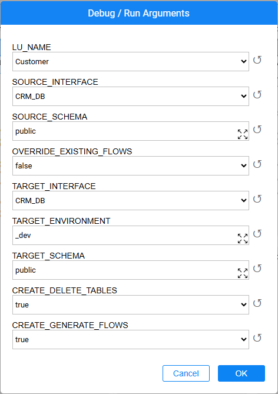

# TDM LU Implementation - General Guidelines

A TDM task copies a [Business Entity](/articles/TDM/tdm_overview/03_business_entity_overview.md) (BE) from a source environment to a target environment. A BE can have multiple [LUs](/articles/03_logical_units/01_LU_overview.md) with either a flat or a hierarchical structure. For instance, a Customer BE consists of Customer Care, Billing, Ordering and Usage LUs. The ability to break up a BE into several LUs provides maximum flexibility and prevents duplication of development. Additionally, defining a hierarchical structure of parent-child LUs allows creating LUs based on the natural root entity of the related data sources, rather than forcefully setting a unified root entity on all LUs within a given BE.

To support TDM functionalities, each LU in a TDM project should include additional components, as described below:   

## Basic LU Structure

In a TDM project, each LU is structured as follows:

- Dummy root table — FABRIC_TDM_ROOT. 

- Generic TDM LU tables that are linked to the root table. 

- Two main branches that are linked to the root table:

  - **Source branch** — LU tables that extract an entity's source data. Source LU tables are populated when a TDM task needs to load (insert) entities into a target environment. In this case, the source data of these entities must first be extracted.

  - **Target branch** — LU tables that extract an entity’s target keys from the target environment. This allows TDM tasks to delete the entity from the target environment when necessary. By default, the names of these tables begin with the 'TAR_' prefix.

    

## LU Implementation Steps 

### I. Creating a New LU

- Create a [new LU](/articles/03_logical_units/05_create_a_new_LU_object.md) on the Studio. It is recommended to run Discovery before creating the LU as the Web Studio gets the relations between the tables from the Catalog's artifacts.
- Deploy it to Fabric.

### II. Adding the TDM Setup to the LU

- Run the **TDMLUInitBasedOnFabric** flow in order to add the TDM setup to the LU. This flow adds the following:

  - It adds the TDM tables to the LU schema.

  - It sets the FABRIC_TDM_ROOT LU table to be the root LU table and links it to the main source LU table.

  - It sets the ROOT_TABLE_NAME and ROOT_COLUMN_NAME Globals on the LU. 

  - It recreates the LU population of the main source LU table.

    Click [here](05a_main_source_lu_table_population_logic.md) for more information about the main source LU table's population logic.

  - It creates the [sequence Actors](05d_tdm_sequence.md#generating-sequence-actor-and-flows) for the load and data generation flows.

  - It creates the delete and load flows.

  - **Optional updates**:
    - Creating and adding the target tables to the LU to support the entity deletion.
    - Creating the [data generation flows](16_tdm_data_generation_implementation.md) to support [Generate tasks](/articles/TDM/tdm_gui/16a_generate_task.md).  

<web>

- Previous TDM versions automated the TDM implementation for JDBC data sources. TDM V9.4.0 has now been enhanced to automate implementation for NoSQL data sources as well. The relevant templates are included in the data source connector’s extension. The **TDMLUInitBasedOnFabric** flow now supports adding the TDM setup to LUs that are based on NoSQL data sources.

</web>

#### TDMLUInitBasedOnFabric Flow Execution

1. Verify that the LU schema does not have [grouped tables](/articles/03_logical_units/16_LU_schema_group_and_ungroup_tables.md), and deploy the LU to Fabric debug server before running the flow. 
2. Optional - [Filter out LU tables from the Broadway flows](05b_filter_out_lu_tables.md) (delete, load, and data generation flows). 
3. Set the flow's input parameters before executing it:

   - **LU_NAME**
   - **SOURCE_INTERFACE** - populated with the source DB interface name.
   - **SOURCE_SCHEMA** - populated with the source DB schema name.
   - **OVERRIDE_EXISTING_FLOWS** - true/false. It indicates if the execution recreates existing flows. 
   - **TARGET_SCHEMA** - populated with the target DB schema name.
   - **TARGET_INTERFACE** - populated with the target DB interface name.
   - **TARGET_ENVIRONMENT** - populated with one of the target environments' names. Can be populated with '_dev' if the Environments are not defined yet.

3. Additional **flow input parameters**:

   - Set the  **CREATE_DELETE_TABLES** input parameter to **true** in order to create and add the target tables to the LU.

   - Set the **CREATE_GENERATE_FLOWS** input parameter to **true** in order to create rule-based data generation flows for the LU.

   Below is an example of the TDMLUInitBasedOnFabric flow's input parameters:

  

4. Run the flow in Fabric Studio.

<web>

## Catalog Masking Integration

- Fabric introduces [Fabric Discovery and Catalog solution]((/articles/39_fabric_catalog/01_catalog_overview.md)), which provides an insight into the Fabric interfaces, including non-JDBC interfaces.
- From TDM V8.1 onwards, the TDM adds new templates to integrate the TDM with the Catalog masking. These templates add the **CatalogMaskingMapper** Actor to the LU population flows in order to run the Catalog-based masking on the identified PII fields before loading them into the LU table. Note that it is not mandatory to implement the Fabric Catalog: if the Catalog is not implemented, the CatalogMaskingMapper Actor returns an empty output.

- Optional: Edit the population flows to override the Catalog masking for some of the PII fields: add [Masking Actors](articles/19_Broadway/actors/07_masking_and_sequence_actors.md) after the **CatalogMaskingMapper** Actor and link them to the relevant fields in the **DbLoad** Actor.

</web>

<web>

# Native Support for NoSQL Document Storage

### Support for Complex Documents

- **TDM V9.4.0**, which is based on **Fabric V8.3.0**, now offers native E2E support for **NoSQL Document Storage** (such as MongoDB or CouchBase). This support includes **Catalog discovery**, **Catalog masking and sequence handling**, **parsing a complex document into an LU**, and **load and delete capabilities** for these documents: 

####  Discovery

- A Discovery job can run on interfaces such as MongoDB or CouchBase, once the corresponding K2exchange connector has been installed in the project. The Catalog is then created based on the discovered document hierarchy. (This feature was already supported before V8.3).

#### Logical Unit implementation

- The Web Studio’s Interface explorer can now display  complex document structures, such as nested hierarchy levels and arrays of primitives.

- Logical Units can now be created based on the Document’s metadata retrieved from the Catalog, after the Discovery process has run on it. Nested hierarchy levels are then created as LU tables, each with a referential link to its respective parent level. 

- Root table population is the only action that reads data from the source (the Document). The remaining populations receive the related data, extracted by the root table population, and use it to populate the child LU tables. 

 Click [here](/articles/03_logical_units/22_native_support_for_NoSQL.md) for more information about how Fabric handles complex documents. 

#### TDM Setup

- TDM V9.4.0 has been enhanced to support LUs that are generated based on NoSQL documents and enable loading masked documents into the target environment. The **TDMLuInitBasedOnFabric** flow now supports various interface types, including NoSQL connectors, and adds the TDM setup to LUs that are created based on complex documents. The following enhancements have been added for complex documents: 

  - Adding a TDM setup to the LUs.

  - Updating the generated load flows for complex documents — a single load flow now assembles the complex document structure based on the LU tables and loads the entire document.
  - Updating the generated delete flows for complex documents — a single delete flow now deletes the document from the target environment. 

Click [here](10_tdm_generic_broadway_flows.md#delete-and-load-flows-for-complex-documents) for more information about the load and delete flows for complex documents.

 </web>

## LU Debug

The LUI should include the source environment, which should be set as the [active environment](/articles/25_environments/01_environments_overview.md) in Fabric. When running a [Data Viewer](/articles/13_LUDB_viewer_and_studio_debug_capabilities/01_data_viewer.md) on the LU to debug its implementation, do either:

- Populate the source environment of the LUI using `_dev_`.  For example, **_dev_1**.
- Create and deploy the Environments to the Fabric Debug server. Set the source environment as the active environment in the Fabric Debug server and populate the deployed source environment name in the LUI, e.g., **UAT_1**. However, note that the main target LU table sets the **target environment** to be the **active environment**.

