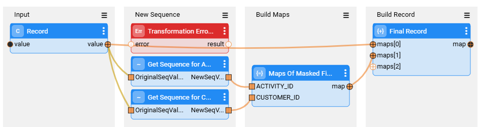

# TDM Sequence Implementation

The [TDM task](/articles/TDM/tdm_gui/17a_task_target_component_entities.md#load) allows the user to replace the sequences (IDs) of all selected entities before loading them into the target environment. This option is required in order to avoid key duplication if the testing environment is not empty and already contains entities. The task execution also replaces an entity's sequences (IDs) when generating clones, for an entity: the task execution replaces the sequences (IDs) of each replica in order to avoid duplicated sequences in the target environment.

Sequence replacement must be set up in advance.

Sequence implementation is also required for [rule-based data generation implementation](16_tdm_data_generation_implementation.md) to maintain referential integrity of synthetic entity IDs.

Starting with TDM V9.3, the following **two sequence handling methods** are supported: 

I. [Sequence handling based on Catalog](11a_tdm_sequence_implementation_based_on_catalog.md).

II. [Sequence handling without Catalog](11b_tdm_sequence_implementation_without_catalog.md). 

## How to Set the Sequence Method for Each LU

A new shared Global — **TDM_USING_CATALOG_SEQUENCES** — was introduced in TDM V9.3. It sets the default **sequence handling behavior** of TDM to either Catalog-based sequence or sequence handling without Catalog. This Global (set to either true or false) can be **added to an LU** for defining the **LU's behavior**.

Example:

- A TDM project contains CRM, Billing and Ordering LUs.
- By default, the sequences are handled without Catalog, except for the Billing LU, in which they are Catalog-based.
- The TDM_USING_CATALOG_SEQUENCES Global must be set as follows:
  - Shared Global — set to false.
  - Billing LU — set to true.

## Generating Sequence Flows and Actors

Both sequence handling methods require execution of the [TDMLuInitBasedOnFabric flow](05_tdm_lu_implementation_general.md#ii-adding-the-tdm-setup-to-the-lu) to create:

- Sequence flows and Actors — for each record in the [TDMSeqList Actor](11b_tdm_sequence_implementation_without_catalog.md#generate-the-sequence-actors), a pair consisting of sequence flow and an Actor is created under the Shared Broadway flows.

- Load flows — 

  - Each load flow invokes the **HandleMaskAndSeqFields** flow, which applies masking and sequence replacements to every record prior to loading it into the target environment. The **TDM_USING_CATALOG_SEQUENCES** Global specifies which of the two sequence handling methods is used.

  - If the table has records in the [TDMSeqSrc2TrgMapping Actor](11b_tdm_sequence_implementation_without_catalog.md#populate-the-sequence-mapping-table) , a new sequence flow is created for the table with the following naming convention: [table name]_sequences. The sequence flows are created in the **Broadway/SequencesFlows** directory for each LU. The sequence flow invokes the sequence Actors for the table's sequence fields. See an example below:

    

     

- [Rule-based data generation flows](16_tdm_data_generation_implementation.md) — adding the relevant sequence IDs to the generated entities in order to keep their referential integrity.

  

  Note that you must set the **OVERRIDING_EXISTING_FLOWS** [TDMLuInitBasedOnFabric flow's](05_tdm_lu_implementation_general.md#ii-adding-the-tdm-setup-to-the-lu) input parameter to **true** in order to generate properly all the sequence flows and actors.

## Data Consistency of Generated Sequences

- A sequence can be shared between tables and multiple LUs. For example, the subscriber_id is shared between the CRM and Billing LUs. In order to ensure referential integrity, all shared LUs must have the same sequence name regardless of their sequence handling method.

- Both of the above-mentioned sequence methods require the creation of the **k2masking** schema. The k2masking schema is created by the TDM deploy flow. Alternatively, creating the k2masking schema can be done by running the **masking-create-cache-table.flow** from the Broadway Examples (found in the Broadway Flow window, Main Menu > Actions > Examples and select this flow). Before deploying the TDM LU, verify that the **SEQ_CACHE_INTREFACE** Shared Global is set with the proper interface name.

  Click [here](/articles/98_installation_and_upgrade/Install_TDM/TDM_Installation_V9.4.md) for more information about the TDM installation and the k2masking schema creation.

## Set the Sequence Report Global

A new Global - **TDM_SEQ_REPORT** — has been added to the Shared Globals in TDM 8.1. When set to **true** (the default value), the task execution populates the **TDM_SEQ_MAPPING** table and adds the **Replace Sequence Summary Report** to the [task execution report](/articles/TDM/tdm_gui/27_task_execution_history.md#generating-a-task-execution-summary-report).

For better performance, set the **TDM_SEQ_REPORT** Global to **false** to prevent populating the TDM_SEQ_MAPPING table and generating the **Replace Sequence Summary Report**. Note that the Replace Sequence Summary Report would not be available for a task that is executed with the TDM_SEQ_REPORT Global set as **false**.

