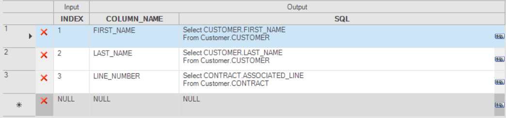
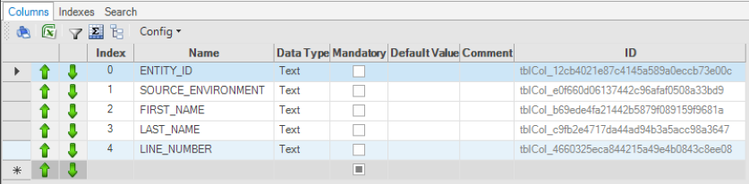
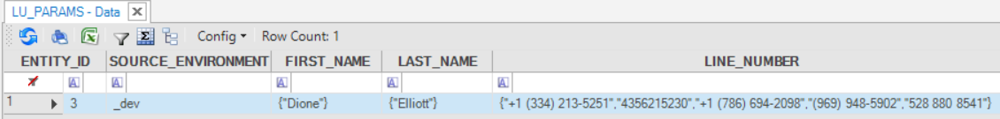

# TDM - Handling Parameters 

## TDM Task - Selecting Entities Based on Parameters

A TDM task enables you to select a subset of entities based on a predefined list of parameters. For example, copy ten business customers that belong to Billing Cycle 1 and that are located in NY.  
The parameters that are available for the task are attached to the LUs of the task's [Business Entity](/articles/TDM/tdm_overview/03_business_entity_overview.md). Parameters are defined at an LU level. 

## TDM Parameter Tables

When [synched](/articles/14_sync_LU_instance/01_sync_LUI_overview.md), the LUIs create and update the Parameters table in the TDM database. A separate parameters table is created for each LU. The naming convention of the parameters tables is `<LU Name>_params`. 

Parameter tables are used for the following:

- Getting the list of available parameters per task.
- Getting the number of matching entities for the selected parameters of the task.
- Creating the entity list for the task if the task's selection method is based on parameters.
- Creating the entity list for the task if a random selection of entities is used whereby the entities are randomly selected from the parameters table in the task's root LU.  

## TDM Parameters - Implementation Guidelines

1.  Import the [TDM Library](/articles/TDM/tdm_implementation/04_fabric_tdm_library.md) into the Fabric project and copy the **LU_PARAMS** LU table from the [TDM_LIBRARY LU](/articles/TDM/tdm_implementation/04_fabric_tdm_library.md#tdm_library-lu) to each LU in the project apart from the TDM LU. 
The LU_PARAMS table copied from the TDM_LIBRARY holds the following columns:
    -  ENTITY_ID 
    -  SOURCE_ENVIRONMENT

    The **fnEnrichmentLuParams** [enrichment function](/articles/10_enrichment_function/01_enrichment_function_overview.md) is attached to the LU_PARAMS table and populates the LU_PARAMS table and then creates a record for each LUI (Entity ID). 

2. Add the LU_PARAMS to the LU Schema and link the ENTITY_ID to the FABRIC_TDM_ROOT.IID.

3. Edit the **COMBO_MAX_COUNT** shared Global imported from the TDM Library if needed. By default the Global is populated with 49 and is checked when creating a TDM task using a parameters selection method. If the number of possible values in the [TDM Parameters tables](#tdm-parameters-tables) is smaller or equal to the COMBO_MAX_COUNT value, the parameter is handled as a **combo** parameter and a list of all possible values for this parameter is displayed. If a value is not selected from the list, the parameter has  more values than the threshold defined in COMBO_MAX_COUNT and you must enter the value in the parameter.

  ### Add Parameters to the Logical Unit

1. Deploy the LU to the Fabric debug server.

2. Copy the **trnLuParams** translation object from the TDM_LIBRARY LU to the LU. 

3. Edit the **trnLuParams**. Populate the parameter name and the SQL query of each parameter. The SQL query runs on the LU and must return only one column that is populated into the Parameter column of the LU_PARAMS table. To validate an SQL query, click the SQL button on the record to open the [Query Builder](/articles/11_query_builder/02_query_builder_window.md) where you can populate the **Fabric** DB connection and select the LU. For example:

    

4. Edit the **LU_PARAMS** table. Each parameter defined for the **trnLuParams** must be added to the LU table as a separate column. Set the type of all columns to **Text**. For example:

    

5. The **fnEnrichmentLuParams** enrichment function runs the SQL queries of the **trnLuParams** and populates each column in the LU_PARAMS with the results of its related SQL query. Each parameter's column holds a JSON file that contains the values of the parameter. Each parameter can hold several values that are separated by a comma. For example:

  

 6. The **fnEnrichmentLuParams** enrichment function also creates and populates the `<LU Name>_params` table in the TDM DB.

**Notes:**

- The COLUMN_NAME value of the trnLuParams must be identical to the column_name added to LU_PARAMS table.
- The COLUMN_NAME value is displayed in the TDM GUI when the user selects parameters for a task.
- Do not include spaces or special characters in parameter names.
- Even if parameters do not need to be defined for an LU, the LU_PARAMS table with the ENTITY_ID and SOURCE_ENVIRONMENT columns must be added to the LU Schema to create the `<LU Name>_params` table in the TDM DB. The `<LU Name>_params` table is needed by both entities selection methods of a TDM task: [Parameters](/articles/TDM/tdm_gui/17_load_task_regular_mode.md#parameters) and [Random Selection](/articles/TDM/tdm_gui/17_load_task_regular_mode.md#random-selection).

