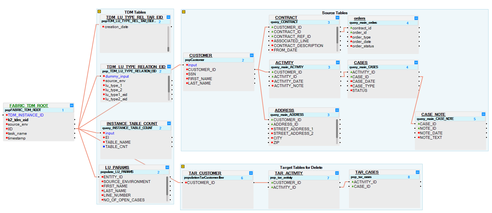
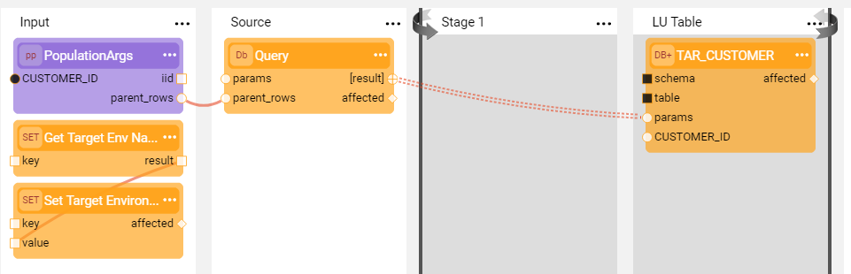

# TDM - Deleting Entities

Every LU must include the ability to Delete Entities from a target environment to support the following load tasks:

- Delete task, the task operation mode is [Delete and Load Entity](/articles/TDM/tdm_gui/19_load_task_request_parameters_regular_mode.md#delete-and-load-entity) or [Delete Entity without Load](/articles/TDM/tdm_gui/19_load_task_request_parameters_regular_mode.md#delete-entity-without-load). 
- [Data Flux](/articles/TDM/tdm_gui/20_load_task_dataflux_mode.md) task, the entities are deleted and reloaded to the target environment.

## LU Structure - Target Tables

Each LU has two main branches that are linked to the **FABRIC_TDM_ROOT** root table:

- **Source branch**, LU tables that extract an entity's source data. Source LU tables are populated when a TDM task needs to load (insert) entities to a target environment and therefore must extract the source data of these entities.
- **Target branch**, LU tables that extract the target keys of an entity. The keys are extracted from the **target environment** to enable deleting an entity from a target environment if required by the TDM task.

The target table contains the list of target IDs (keys) required to delete the data of the selected entities from the target environment and populate [TDM_LU_TYPE_REL_TAR_EID](06_tdm_implementation_support_hierarchy.md#tdm_lu_type_rel_tar_eid) with the target children IDs. It is recommended to add the **TAR_** prefix to each target table. The population of the target table is based on **target interfaces**. 

Note that a given target LU table can be used to delete multiple target tables.

**Example:**

The Customer_ID key can be used to delete Customer, Contract, and Address target tables. Define the TAR_CUSTOMER table to hold the target Customer_ID and use the TAR_CUSTOMER to delete the target tables.

### Adding a Decision Function to the Target LU Tables

The target LU tables must be populated when running a TDM task that deletes the entities from the target environment. The target keys must be extracted from the target environment to enable deleting entities and their related data.

If the task does not delete the entities from the target environment, the target keys do not need to be extracted from the target environment.

The Broadway [InitiateTDMLoad](10_tdm_generic_broadway_flows.md#initialization) flow sets the **TDM_DELETE_BEFORE_LOAD** Global to **true** if the task must **delete the entities** from the target. Otherwise, this Global is set to **false**.   

Add the **fnDecisionDeleteFromTarget** Decision function imported to the Shared Objects from the [TDM Library](04_fabric_tdm_library.md) to **all target tables**. 

### Populating Target Tables with the Target Environment

The LUI sync can populate the branches, source and target when running a load task that requires both delete and load entity operations. 

The **source LU tables** must extract the data from the **source environment**, where the **target LU tables** must extract the data from the **target environment**.

The Broadway [InitiateTDMLoad](10_tdm_generic_broadway_flows.md#initialization) flow sets the active environment to the source environment before synching the LUI into Fabric.

Do the following to run the target LU tables on the target environment:

1.  Update the execution order of the target LU tables to run **after the source LU tables**. For example:

   

2. Create the population object of the **main target LU tables** based on the **Broadway flow**. 

3. Edit the population of the Broadway flow and set the active environment based on the **TDM_TARGET_ENV_NAME** key which is set by the **InitiateTDMLoad** flow based on the task's target environment. Add the following actor before the Query actor: **setTargetEnv_Actor**. 

   For example:

   

   Click for more information about [Broadway as a population and Fabric command actors](/articles/19_Broadway/09_broadway_integration_with_Fabric.md).

## Adding Broadway Flows to Delete the Entities

Add Delete Broadway flows to delete the entities from the target environment based on the target LU tables.

Click for more information about how to add [Broadway Load and Delete flows to each LU](11_tdm_implementation_using_generic_flows.md).

