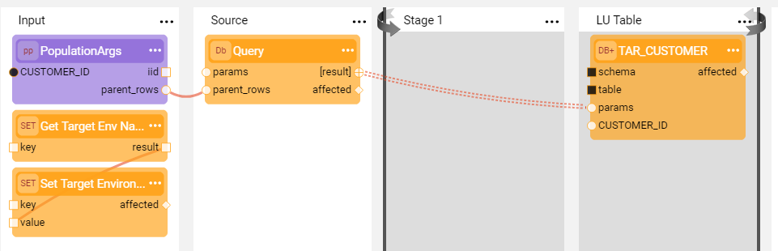

# TDM — Deleting Entities

Every LU must include the capability to **delete entities** from the target environment in order to support the following tasks:

- [Delete and load task](/articles/TDM/tdm_gui/17a_task_target_component_entities.md#delete) — the entities are deleted from and then reloaded into the target environment.
- [Delete task](/articles/TDM/tdm_gui/17a_task_target_component_entities.md#delete) — the entities are deleted (cleaned) from the task's environment (i.e., the target).
- [Load data snapshot (version) task](/articles/TDM/tdm_gui/15_data_flux_task.md#how-do-i-load-a-data-snapshot) — the entities are deleted from and then reloaded into the target environment.

Note that if there is no need to support entity deletion or Data Versioning load tasks, the target tables do not have to be added to the LUs.

## LU Schema — Sync Mode

In the following **scenarios**, task execution is required to synchronize only the target tables, while preserving the source tables as they are:

- Load data snapshot (version) task — the task needs to delete the entities from the target environment and then reload the pre-created data snapshot (version) into the same environment.
- Delete and load task whose [Policy for fetching data](/articles/TDM/tdm_gui/14b_task_source_component_entities.md#policy-for-fetching-data) is set to **Available [source environment name] data in the Test data store**. 

Set the [Sync method](/articles/14_sync_LU_instance/04_sync_methods.md) at the [LU schema level](/articles/14_sync_LU_instance/07_sync_levels.md) to **None** as a way to support these scenarios. This ensures that the source LU tables are synced only once, except for when the task's *Policy of fetching data* field is set to **All data from [source environment name]**. However, the target LU tables are synced whenever the task deletes  entities, as the target LU tables include a [decision function](#adding-a-decision-function-to-the-target-lu-tables) that runs their population for such cases.

Click [here](/articles/TDM/tdm_architecture/04_task_execution_overridden_parameters.md#overriding-the-sync-mode-on-the-task-execution) for more information about task execution sync modes.

## LU Structure — Target Tables

Each LU has two main branches linked to the **FABRIC_TDM_ROOT** table:

- **Source branch** — LU tables that extract an entity's source data. Source LU tables are populated in all cases except for [delete only tasks](/articles/TDM/tdm_gui/19_delete_only_task.md), where no data is extracted from the source.
- **Target branch** — LU tables that extract the target keys (also known as target IDs) of an entity. The keys are extracted from the **target environment** whenever the task needs to delete entities from it.

The target table contains the list of target IDs required for both deleting the data of selected entities from the target environment and populating the [TDM_LU_TYPE_REL_TAR_EID](06_tdm_implementation_support_hierarchy.md#tdm_lu_type_rel_tar_eid) table with the target children IDs. It is recommended to use the **TAR_** prefix for each target table, as per the target table naming convention. 

### Generating Target Tables

Generating target LU tables and delete flows is done automatically by the [**TDMLuInitBasedOnFabric flow**](05_tdm_lu_implementation_general.md#ii-adding-the-tdm-setup-to-the-lu) when its **CREATE_DELETE_TABLES** input parameter is set to **true**. The names of these LU tables are controlled by the **TDM_DELETE_TABLES_PREFIX** shared Global, which uses **TAR_** prefix by default. To change the prefix, update this shared Global and redeploy the LU **before** running the flow.

### Adding a Decision Function to Target LU Tables

Target LU tables must be populated when running a TDM task that deletes entities from the target environment. The target keys are extracted from the target environment in order to enable the deletion of entities and their related data.

If the task does not delete entities from the target environment, extracting the target keys is not required.

The **fnDecisionDeleteFromTarget** [decision function](/articles/14_sync_LU_instance/05_sync_decision_functions.md) **checks** whether the task needs to delete entities from the target. When the task needs to delete entities from the target, the **TDM_DELETE_BEFORE_LOAD** Global is set to **true** by the Broadway [InitiateTDMLoad](10_tdm_generic_broadway_flows.md#initialization) flow (and to **false** otherwise). If the task needs to delete entities, the LUI sync process must repopulate all target IDs in the target LU tables for the entity deletion to occur. 

For this reason, the **fnDecisionDeleteFromTarget** decision function (imported from the [TDM Library](04_fabric_tdm_library.md)) is **automatically added to all target tables** by the flow that generates them (the TDMLuInitBasedOnFabric flow). 

### Populating Target Tables with the Target Environment

The LUI sync process can populate the branches, source environment and target environment when running a load task that requires both entity deletion and loading operations. 

The **source LU tables** must extract data from the **source environment**, whereas the **target LU tables** must extract  data from the **target environment**.

The Broadway [InitiateTDMLoad](10_tdm_generic_broadway_flows.md#initialization) flow sets the active environment to the source environment before syncing the LUI into Fabric.

The **setTargetEnv_Actor** is **automatically added to the generated population flow of the main target LU table**. This Actor sets the active environment based on the **TDM_TARGET_ENV_NAME** key (set by the **InitiateTDMLoad** flow with the task's target environment).

For example:

 

Note that target tables can be populated using **the same interfaces as the source LU tables**. Defining separate target interfaces is not required, since populating of the main target LU table sets the target environment as the active environment. As a result, the population of the target tables uses the target connection details.

