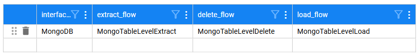
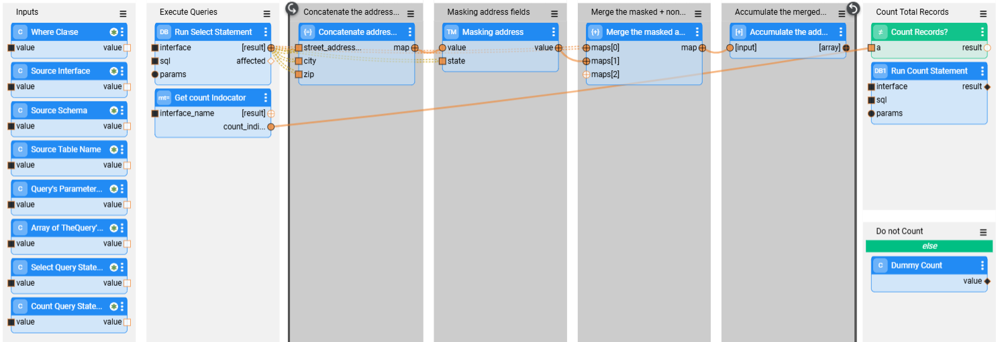
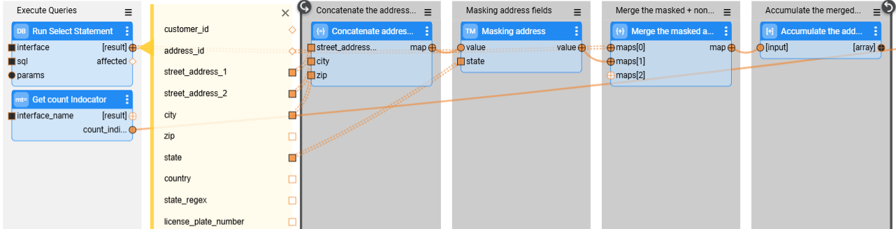

# TDM — Table Implementation

TDM enables users to provision tables in a TDM task. To do this, users can select one of the following two options:

1. Business Entities and referential data. The included tables are related to the task's Business Entities (BEs) and are required in the testing environment.
2. Tables — TDM V9.X provides the option to select a list of tables from multiple DBs that relate to the source environment, without any relation to a Business Entity.

Users can either store the tables in Fabric for later use or set the task's retention period to *Do not retain* in order to load the tables directly to the target environment without saving them to Fabric.

Each table is stored in Fabric, within the **TDM_TableLevel** LU, as a separate LU Instance (LUI). Each execution is stored as a separate LUI (a separate data snapshot), as well as creates a separate LUI (snapshot). For example, running two executions of a task to extract the Product_Mapping table would create two LUIs in the **TDM_TableLevel** LU in Fabric. 

 The LUI format is as follows:

[source environment name]|[DB interface name]|[DB schema name]|[table name]|[task execution id]

Examples:  

- SRC|CRM_DB|public|case_note|102822

- SRC|CRM_DB|public|case_note|102826

- SRC|BILLING_DB|public|contract_offer_mapping|102826

Each LUI contains the following tables:

- TDM_REF_ROOT

- A dynamic SQLite table, which has the same structure as the source table and contains the extracted table records. The naming convention for this table is: 

  ```
  __t_<source table name>
  ```

  

- The following is an example of how a case_note table record is inserted into the SQLite dynamic table:

  ```sqlite
  /*sqlite*/ insert into TDM_TableLevel.__t_case_note (case_id,note_id,note_date,note_text) values(?,?,?,?);
  ```

  

Notes: 

- In previous TDM versions, tables were saved in the TDM_Reference LU. However, as this LU is no longer used (from TDM V9.0), the tables must be re-extracted into the new **TDM_TableLevel LU**. 

A TDM table-level implementation contains the following steps:

## Step 1: Deploy the TDM_TableLevel LU

Import the TDM_TableLevel LU and deploy it. 

## Step 2: Relate Tables to a Business Entity

**This step is required for [Entities & referential data](/articles/TDM/tdm_gui/14b_task_source_component_entities.md) tasks**. The list of available referential tables for a TDM task that contains a Business Entity and referential data is populated in the [RefList](04_fabric_tdm_library.md#reflist) MTable object. Populate the **RefList** with a list of all available related tables for each LU. The following settings should be populated for each record:

- **lu_name** — populated by the LU name to allow selection of the related table in a TDM task based on the task's LUs.

- **id** — an incrementing number.

- **reference_table_name** — populated with the table name in the source environment.

- **schema_name** — populated with the name of the source DB schema that stores the table.

- **interface_name** — the table's source interface.

- **target_ref_table_name** — an optional parameter. Populate it when the table names in the source and target differ. If not provided, the target table name is taken from the **reference_table_name** field.

- **target_schema_name** — populated with the name of the target DB that stores the table.

- **target_interface_name** — the table's target interface. 

- **table_pk_list** — an optional setting. Populated with the list of the target table's PK fields in the RefList object. These fields can be used later for customizing the load flow to run an Upsert on the target table.

- **truncate_indicator** — by default, TDM runs a delete on the table in the target environment before loading it. If you have permission to run a truncate on the target table and need to use the truncate instead of delete (e.g., the target DB is Cassandra), set this indicator to **true**.

- **count_indicator** — this setting is set to **true** by default, enabling counting the number of records in the source or target, as a way to monitor task execution. Set this indicator to **false**, if required, to disable counting records in the target.

Note that from TDM V9.4 onwards, the schema_name and target_schema_name fields can be populated with either of the following options:

- Schema name
- Global name. Add a `@` sign before and after the Global name to indicate that the schema name should be taken from the Global's value. For example: `@CUSTOMER_SCHEMA_NAME@`. Using a Global to populate the schema is useful when different environments have different schema names. 


 Click [here](/articles/09_translations/06_mtables_overview.md) for more information about MTable objects. 

## Step 3: Optional — Configure Different Source and Target Settings for Table-Level Tasks

TDM V9.1 enables adding tables to the **RefList** MTable for the purpose of supporting the setting of different interface, schema name, or table name in the source and target environments for [table-level tasks](/articles/TDM/tdm_gui/14c_task_source_component_tables.md). To configure different settings in the source and target environments for table-level tasks, set the **lu_name** to **TDM_TableLevel**. 

## Step 4: Catalog

### Edit the PII Settings

The TDM table flow uses [Fabric Catalog masking](/articles/39_fabric_catalog/catalog_app/11_catalog_masking.md). You can [edit the PII settings](/articles/39_fabric_catalog/catalog_app/10_catalog_settings.md#classifier-pii--masking-setup) in the Catalog when required.

### Run the Catalog to Identify Table Relations and Order

Run the Discovery job on the table's interfaces. Following the job completion, the interface metadata is retrieved from the Catalog.

## Step 5: Tables — Special Handling and Selection Disabling  

###  TableLevelInterfaces MTable

The **TableLevelInterfaces** MTable enables implementors to control which tables can be selected in a task and allows to define special handling rules for a given DB.

By default, this MTable is populated with the 'TDM' and 'POSTGRESQL_ADMIN' interfaces in order to prevent the TDM tasks from selecting the TDM tables. It is possible to populate additional DB interfaces, either to exclude them from table selection in the TDM task or to apply special handling to their tables. Each DB interface requires its own record. The following settings should be populated for each record:

- **interface_name** — the interface name defined in the TDM project implementation. 

- **suppress_indicator** — when set to **true**, the DB tables are excluded from the selection of tables in a TDM task; when set to **false**, the interface's tables can be selected in a TDM task.

- **truncate_indicator** — by default, TDM runs a delete on the table in the target environment before loading it. If you have permission to run a truncate on the target table and need to use the truncate instead of delete (e.g., the target DB is Cassandra), set this indicator to **true**.

- **count_indicator** — this setting is set to **true** by default, enabling counting the number of records in the source or target, as a way to monitor task execution. Set this indicator to **false**, if required, to disable counting records in the target.

- **order_flow** — an optional setting. Populate this setting to run a project's Broadway flow. The flow defines customized logic for determining the table execution order. The order flow must have an external output **Map** named **result**, which contains the list of tables and their order. An example of an output Map with the execution order:

  ```json
  {
    "customer": 0,
    "address": 1
  }
  ```

  

- **no_schema** — this indicator is used for interfaces without a DB schema, where the JDBC connector adds a schema for them. For example: CSV files. The **CSV JDBC Connector** extension concatenates the 'main' schema name to the file list. Setting this field to **true** would ignore the concatenated schema when accessing the files. 

### TableLevelDefinitions MTable — Customized Logic for Tables 

TDM V9.1 introduces the **TableLevelDefinitions** MTable, which enables setting a customized logic for selected tables.

A customized flow can be added to a table's extract, load or delete processes. The implementor can apply it to all activities - extract, delete, and load - or only to specific ones. Using this feature, you can access the following capabilities:

- Custom masking for selected fields (not Catalog-based).

- Extract or load large volumes of data that requires using third-party party tools, such as DB2move.

- Impact the table execution order.

The following settings should be populated for each record:

- **interface_name** — the interface name defined in the TDM project implementation. 
- **schema_name** — the DB schema. Can be populated with either of the following options:
  - Schema name
  - From TDM V9.4 onwards, the schema name can also be populated with the Global name. Add a `@` sign before and after the Global name to indicate that the schema name should be taken from the Global's value. For example: `@CUSTOMER_SCHEMA_NAME@`. Using a Global to populate the schema is useful when different environments have different schema names. 

- **table_name** — populated with the table name. If this setting is empty, the customized flows will run on all the tables in the interface and schema.
- **extract_flow** — populated with the customized extract flow.
- **table_order** — a numeric value that defines the table’s execution priority. The table order specified in the TableLevelDefinitions MTable has the highest priority and can override the PK/FK relationships between task tables. If any table in a task has a table order defined in this MTable, then all tables in the task must have a table order defined as well. The TDM execution follows PK/FK relationships only when none of the task’s tables has a table order defined.
- **delete_flow** — populated with the customized delete flow. 
- **load_flow** — populated with the load flow.


### Supporting Table-Level Tasks Using Connectors — Update TableLevelDefinitions MTable 

The installment of a K2exchange connector adds a dedicated TableLevelDefinitions file for the connector. 

**Example — TableLevelDefinitions___mongodb**:

 


Note that you must set the task's retention period to *Do not retain*. This ensures that the tables are loaded directly to the target environment, without being saved to Fabric, when the data source is based on a connector. 

### Customized Table Flows — Implementation Guidelines

The customized table flows are Broadway flows. These flows must be added under the Shared Objects in the Project tree.

#### Extract Flow

- The extract flow receives a list of input parameters from the TDM execution processes and returns the number of records in the table and an object's array for the result. Duplicate the **GetSourceDataByQuery** flow (located in the TDM_TableLevel LU) in order to implement the extract template and customize the extract logic. 

##### Customized Masking Logic

The Catalog Masking Actor is invoked **after** the extract flow execution. 

Setting customized masking logic on tables:
- If you need to set customized logic on specific fields, edit the Catalog and remove the PII property from these fields in the Catalog as a way to prevent double-masking them.
- Sometimes, the customized masking logic is based on the Catalog masking output, e.g., building the masked email address based on the masked first and last names. If you need to call the Catalog Masking Actor in the extract flow, proceed as follows: 
  - Add the **CatalogMaskingMapper** Actor to the extract flow. 
  - Add customized Masking Actors to the extract flow to be invoked after the CatalogMaskingMapper Actor.
  - Set the **enable_masking** parameter to **false** at the end of the extract flow as a way to prevent double-masking of the table's record by the TDM execution processes.

##### Customized Extract Flow — Example

The below image depicts an example, which executes the following actions:

- Selecting records from the address table.
- Opening a loop on the extracted records.
- On each record - 
  - Masking the street, city, and zip code fields.
  - Merging the masked fields into the address record. 
  - Accumulating the merged record with the masked fields into an array. The accumulated array is the external **result** field of the flow.




See the loop on the selected address records:



#### Load Flow

- The load flow receives a list of input parameters from the TDM execution processes and returns the number of loaded records. Duplicate the **LoadTableByQuery** flow (located in the TDM_TableLevel LU) in order to implement the load template and customize the load logic.
- Note that if you use **Fabric V8.1.6 and above**, you must manually add the **__active_environment input parameter** to the DbCommand and/or DbLoad Actors; set this parameter as *Const* and populate it with any value (e.g., *target*). Adding the **__active_environment** input parameter enables refreshing the environment, updating it to be the target environment in the load flow, and running the load in the target environment. This parameter is already included in the duplicated **LoadTableByQuery** flow (DbLoad Actor). 

  

#### Delete Flow

- The delete flow receives a list of input parameters from the TDM execution processes and deletes the table before the load. Duplicate the **DeleteTableByDBCommand** flow (located in the TDM_TableLevel LU) in order to implement the delete template and customize the delete logic.


[](11e_pre_and_post_execution_processes.md)[](13_tdm_implementation_supporting_different_product_versions.md)


