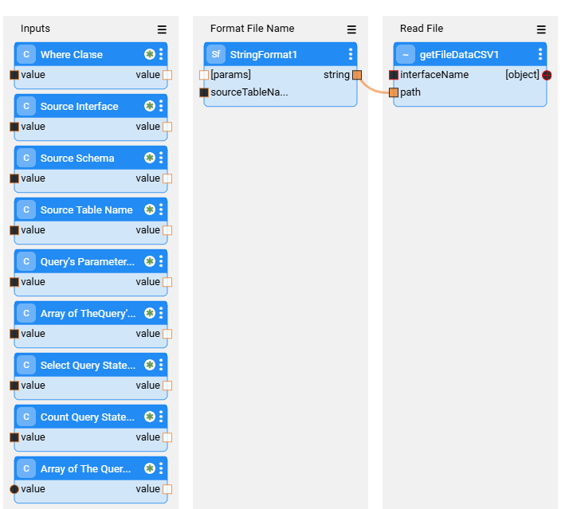
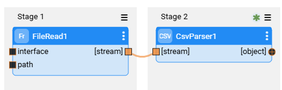
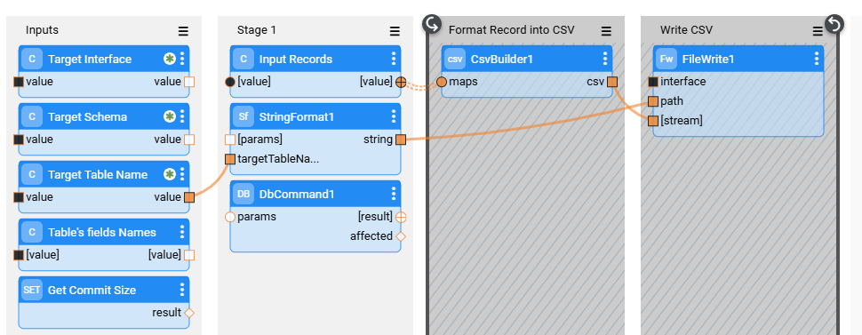
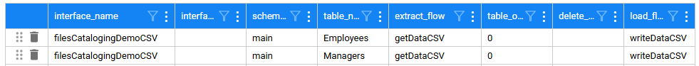
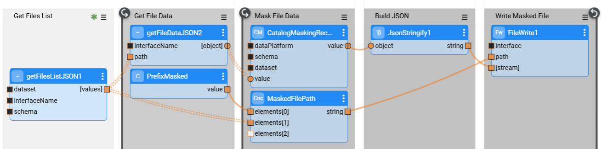

# File Level Masking Implementation

Running TDM table-level tasks on files requires the creation of the file's interface and a customization of the TDM flows (extract, delete, and load flows).

The [Catalog configuration](/articles/39_fabric_catalog/05_cataloging_of_files.md) supports both methods:

- A dataset (table) represents a physical file (1:1 relation between the files and datasets).
- A dataset (table) represents a folder that can have multiple files with the same format. 

Both methods require the following implementation steps:
- Create a file-level interface.
- Open the Environments, edit the interface in the Environments if needed, save the changes, and redeploy the Environments.
- Run discovery on the file-level interface.
    
However, each method requires a different TDM customization. 

To illustrate the E2E process, the *File Cataloging - Demo* extension is available and can be found on the [K2exchange](/articles/04_fabric_studio/28_web_k2exchange.md)'s list of extensions. This extension can be installed into your project, and it offers several comprehensive examples of file cataloging. The extension includes the flow examples for CSV, XML, JSON, Avro, and HTTP formats. Instructions on how to use the extension can be found in its README file.

## A Dataset (table) Represents a Physical File

- Create customized extract and load flows. Optional - create a customized delete flow. Note that if you do not create a customized delete flow, you must clear the Delete checkbox in the task.

- The customized flows extract flows must be based on **GetSourceDataByQuery**  flow (extract) and **LoadTableByQuery**  flow (load). 

  Click [here](09_tdm_reference_implementation.md#customized-table-flows---implementation-guidelines) for more information on how to build customized flows for table-level tasks. 

### Extract Customized Flow - 1:1 Relation of Dataset and File

- The extract flow must be based on **GetSourceDataByQuery**  flow, but the flow needs to read from the file instead of using the DbCommand Actor.

- You can get an example of the custom flows from the **File Cataloging - Demo** extension.

- See an example of a CSV extract flow - **getDataCSV** flow (taken from the File Cataloging - Demo extension) :

  

- The getFileDataCSV1 Actor is based on **getFileDataCSV** flow (taken from the File Cataloging - Demo extension):

  

### Load Customized Flow - 1:1 Relation of Dataset and File	

- The extract flow must be based on **LoadTableByQuery**  flow, but the flow needs to write the file instead of using the DbLoad Actor.
- You can get an example of the custom flows from the **File Cataloging - Demo** extension.
- See an example of a CSV load flow - **writeDataCSV** flow (taken from the File Cataloging - Demo extension):

### TableLevelDefinitions MTable - 1:1 Relation of Dataset and File	

- Add the interface, tables, and custom flows to the TableLevelDefinitions MTable.

- Set the execution order to 9 for all files if they can be processed in parallel. 

- See an example:

  

## A Dataset (table) Represents a Folder with Multiple Files

- Data selected Table (dataset) in the task may contain multiple files to be processed.

- The extract custom flow must get all the files for each table. Each file must be read, masked, and written to the target. See an example of a JSON processing flow - **readJsonAndMask** (taken from the File Cataloging - Demo extension):

  

- The delete and load flows should do nothing (dummy flows). The task must be created with *Do not retain* option (set the task's retention period to *Do not retain* in order to load the tables directly to the target environment without saving them to Fabric). 

- Populate the **TableLevelDefinitions** MTable with the interface, tables, and custom flows.

​	
