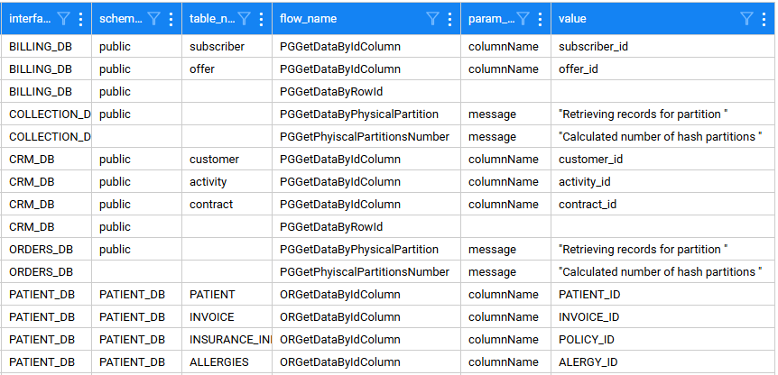

#  Concurrency Processing of  Table Partitions 

- Starting with **TDM 9.5** onwards, the  performance of table-level tasks has been improved by processing table partitions in parallel, significantly reducing execution time for large tables.

- Each table partition is handled as a **separate LUI** by the task execution batch process for extract or extract & load processes.

## TableLevelDefinitions MTable 

- The following fields have been added to **TableLevelDefinitions** to support table concurrency:

  - **partition_count_source** - the number of the table's partitions. Populated with a numeric value or a name of the flow that returns the number of table partitions. 
  - **partition_records_flow** - populated with the flow that returns all table records for a given partition.

## TableLevelPartitionFlow MTable

This table stores optional input parameters for the partition flows. Add a record to this MTable and populate the **param_name** and **value** fields for each partition flow's input parameter.

**Example:** 

## TableLevelDefinitionsInterfacesTypesDefaults MTable

- This table contains **default flows** for the following interface types:

  - PostgreSQL

  - Oracle

- Copy the relevant record from this MTable into the **TableLevelDefinitions MTable** to use the default partitioning flows for these databases.

