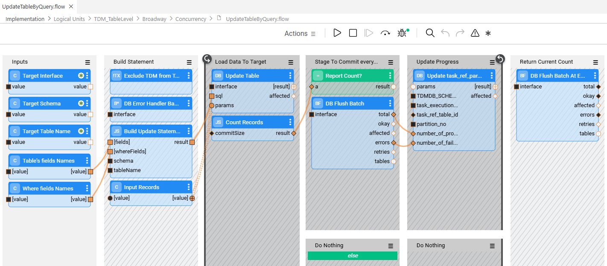

# In-place Masking Customization  — Implementation Guidelines

## In-place Masking Flow

- Starting with **TDM 9.5** onwards,  the TDM supports in-place masking task updates the PII fields on the selected tables. The in-place masking flow  receives a list of input parameters from the TDM execution processes and updates the table: replaces the PII values with masking values. Duplicate the **UpdateTableByQuery**  flow (located in the TDM_TableLevel LU)  to implement the customization of the in-place masking flow.

#### In-place Masking Flow - Error Handler

Starting with **TDM 9.5**, the [**DbErrorHandlerBatch** and **DbFlushBatch** Actors](/articles/19_Broadway/actors/05_db_actors.md) are added to the **UpdateTableByQuery** flow. These Actors provide enhanced batch-level error handling and enable task execution to **ignore predefined database errors**—such as unique constraint violations—while continuing to process subsequent records without interruption. In addition, **successfully processed records are committed to the target database even when some records fail**, preventing a full task rollback due to partial errors.

Within the **UpdateTableByQuery** flow, the **DbErrorHandlerBatch** actor suppresses **unique constraint errors** and reports them to the TDM database using the **PopulatePartitionTableErrorsOnly** inner flow.

To include error handling in a **customized load flow**, add a **DbErrorHandlerBatch** actor for each interface. The actor must be included in the same transaction as the **DbLoad** or **DbCommand** actor.

See the example below:

- **Note**:
  - In databases that automatically abort a transaction when an error occurs (for example, PostgreSQL), further processing within the same transaction is not possible. As a result, the affected table partition is not loaded.

## In-place Masking - MTables

### TableLevelDefinitions

The following field has been added for in-place masking:

- **inplace_masking_update_flow** —  populated with the in-place masking flow name.

Click [here](09a_table_level_customized_flows_implementation.md) for more information about the TableLeveDefinitions fields.

### TableLevelInPlaceMasking

The **MTable** defines which table fields are used as **key fields** during table update operations.

Each record in the MTable represents a single table field. When a **composite key** is required, multiple MTable records must be defined—one for each table field that participates in the composite key.

