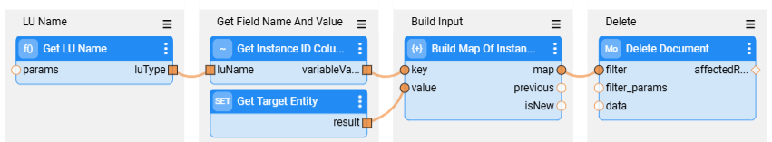
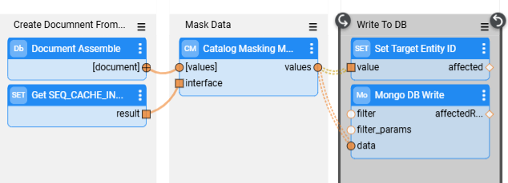

# TDM - Generic Broadway Flows and Templates

The Fabric TDM library has built-in generic Broadway flows that can be easily adapted for the TDM of each specific data model. This article describes the generic flows that are available in a project, following the [TDM Library](04_fabric_tdm_library.md) import. 

The **TDM** folder in the Broadway Shared Objects folder includes generic flows and templates for the task execution activities. These flows run as they are and they do not require a manual update by the implementor.

## TDM Templates

The TDM library holds templates and generic flows that can be used to create a TDM implementation based on a project's data model. The templates are built using the Fabric [Templates](/articles/35_templates/01_templates_overview.md) functionality, which enables creating different project objects based on a predefined structure. The **Templates** folder holds the flows used for creating delete, load, Sequence,  and data generation flows. 

### K2Exchange Connectors

A [k2exchange connector](/articles/04_fabric_studio/28_web_k2exchange.md) can have its own TDM templates. The connector's installation also imports the related TDM templates into the TDM project.  The connector's templates are imported into a sub-folder under the *Implementation/SharedObjects/Templates* folder. For example: the MongoDB connector's templates are imported into *Implementation/SharedObjects/Templates/MongoDB* folder.

The [TDMLuInitBasedOnFabric flow](05_tdm_lu_implementation_general.md#ii-adding-the-tdm-setup-to-the-lu) checks the LU schema's source interface, and uses the connector's templates if exist.  

## TDM Entity Orchestration Flows

The TDM orchestration flows manage the execution on each task's entity. The following orchestration flows are executed by the [TDM execution process](/articles/TDM/tdm_architecture/03_task_execution_processes.md#main-tdm-task-execution-process-tdmexecutetask-job) on each task's entity:

- **TDMOrchestrator** - this flow runs on every LU instance of a [load and/or delete task](/articles/TDM/tdm_gui/14_task_overview.md#task-types)  execution. It encapsulates all Broadway flows of the TDM task into a single flow. It includes the invocation of all steps such as initiation activities, running the delete and/or load flows, [error handling and statistics gathering](12_tdm_error_handling_and_statistics.md). All the activities on the LUI are included one transaction, except the *get LUI* from Fabric. The get LUI in excluded from the transaction to support an entity clone, as all replicas work on **one** single LUI. Fabric cannot open parallel transactions on the same LUI and therefore needs to be excluded from the delete and load Broadway transaction in order to have better parallelism when processing the entity’s replicas.

- **TDMExtractOrchestrator** - this flow runs on every LU of an extract task execution.

- **TDMGenerateOrchestrator** - this flow runs on every LU of a [rule-based generation](/articles/TDM/tdm_gui/19_task_synthetic_data_generation.md#generating-rule-based-entities) task execution.

- **TDMReserveOrchestrator** - this flow runs on a [Reserve only task](https://github.com/k2view-academy/K2View-Academy/blob/Academy_8.1/articles/TDM/tdm_gui/17a_task_target_component_entities.md#reserve) execution. Unlike the TDMOrchestrator flow that runs on each LU, this process is executed only once by each task execution, and it marks the root entities as a [reserved](/articles/TDM/tdm_architecture/08_entity_reservation.md) in the TDM DB.

- **Table level orchestrator** flows - these flows run a [Table level](/articles/TDM/tdm_gui/14c_task_source_component_tables.md) task executions.

## Initialization Flow

TDM task initialization is performed using the **InitiateTDMLoad** flow, which includes several steps such as:

* Setting the values of global variables on a session level and setting a sync mode.
* Setting the source environment based on the task's source before getting the LUI.
* Getting the LUI from Fabric.
* Setting the target environment as a preparation step for Delete and Load.

The **InitiateTDMLoad.flow** is performed as the 1st step of the **TDMOrchestrator** task's flow.

## Table-level Flows

The TDM library includes a set of flows that handle tables.

[Click here to learn more about TDM Tables Implementation](09_tdm_reference_implementation.md).

## LU - Load and Delete Flows

The load and delete flows are created for each LU by the [TDMLuInitBasedOnFabric flow](05_tdm_lu_implementation_general.md#ii-adding-the-tdm-setup-to-the-lu) execution based on the TDM templates and the LU structure.

By default, the following flows are created:

- DeleteFromTarget — runs all the delete flows. The execution order is defined based on the LU structure.
- LoadToTarget — runs all the load flows. The execution order is defined based on the LU structure.
- A separate delete and load flows are created for each LU table except the ones that are [excluded (filtered out)](05b_filter_out_lu_tables.md) from the load and delete flows' creation.

### Delete and Load Flows for Complex Documents

- **Delete flow**:  a single delete flow now deletes the document from the target environment. See an example of a delete flow for an LU based on MongoDB connector:

  

- **Load flow**:  a single load flow runs the following activities:

  - Assembles the complex document structure based on the LU tables. The assemblement is done using the **DocumentAssemble** Actor. 
  - Runs the **CatalogMaskingMapper** Actor to execute the Catalog-based masking and sequence replacement on the assembled document.  
  - Loads the entire masked document to the target environment.

  See an example of a load flow for an LU based on MongoDB connector:

  

  

Click [here](/articles/03_logical_units/22_native_support_for_NoSQL.md) for more information about how Fabric handle complex documents. 

## Error Handling and Statistics

The TDM library offers a generic error handling and statistics gathering mechanism based on Broadway capabilities that are tailored for TDM business requirements. 

[Click here to learn more about TDM error handling and statistics flows](12_tdm_error_handling_and_statistics.md).

## Data Generation Flow

New templates, flows and Actors have been added in TDM 8.0 to support a synthetic data generation of entities.

Click [here](16_tdm_data_generation_implementation.md) to learn more about TDM data generation implementation.

