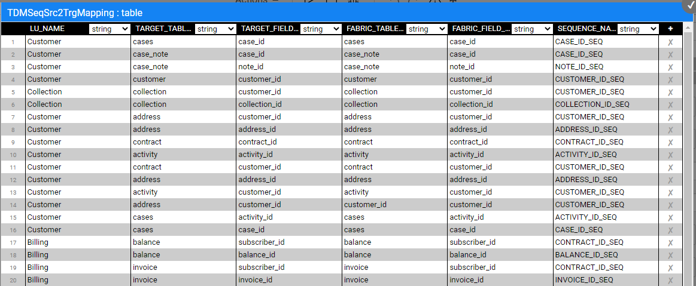
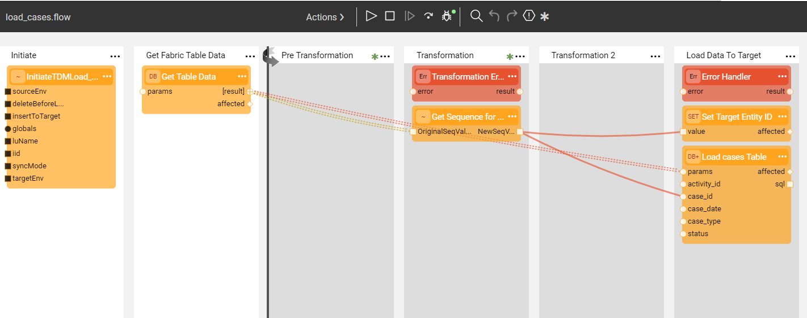
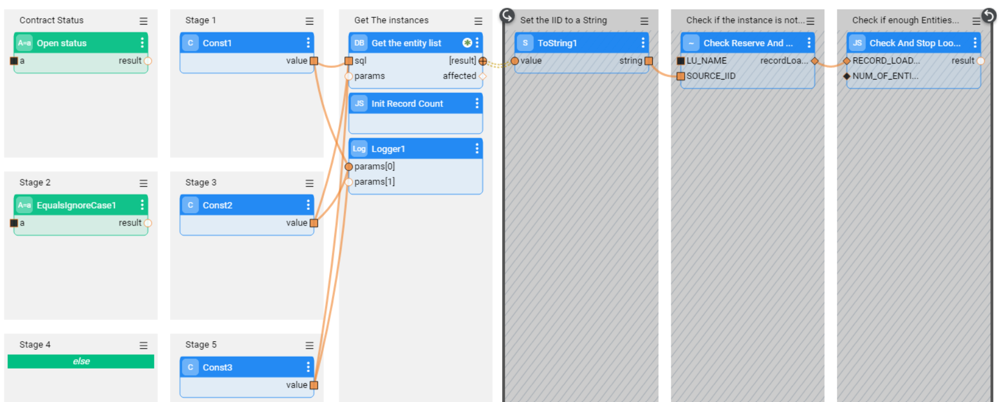
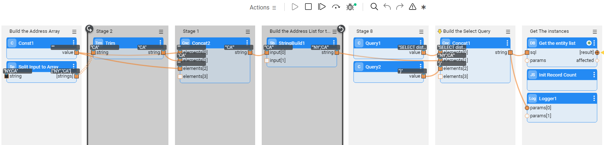
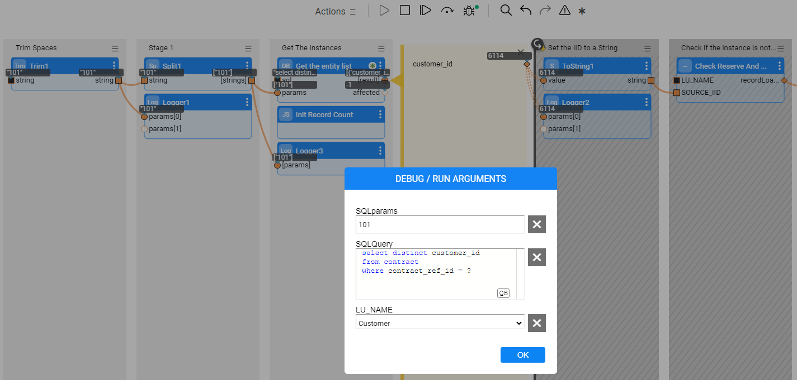
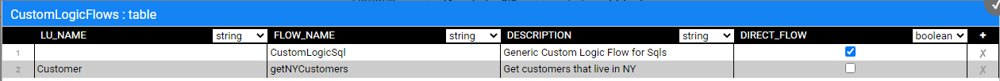

# Broadway Flows Implementation

The TDM library has sets of generic flows that allow you to create a standard TDM implementation in just a few minutes. Once a standard implementation has been created, its flows can be edited and tailored to your project's needs.

## How Do I Create TDM Broadway Flows?

## Step 1 - Define Tables to Filter Out

Before beginning to create Broadway flows, define the tables that are filtered out by the Broadway template, which generates the DELETE and LOAD flows. The library includes settings for the following filtered auxiliary tables:

This setting is implemented using the **TDMFilterOutTargetTables** Actor. To filter more tables, open the **TDMFilterOutTargetTables** Actor and edit its **table** object. The **lu_name** column should be populated as follows:

* ALL_LUS - when a filtered table is relevant for all TDM LUs.
* [LU name] - when a table belongs to a specific LU. In some cases you may need to add tables to the LU schema in order to get the child IDs and to populate the TDM_LU_TYPE -RELATION_EID TDM DB table. For example, the addition of the Orders table to the Customer LU generates a list of customer's orders. 

These tables should be added to the **TDMFilterOutTargetTables** Actor as it would prevent the load/delete flows creation for the tables; these tables are already loaded/deleted by the child LUs. 

Following the Actor's update completion, refresh the project by clicking the  button (top of the Project Tree). This act applies the changes in the **TDMFilterOutTargetTables** Actor and deploys the LU. 

## Step 2 - Create Sequences

When populating a target database, sequences are required. Therefore, setting and initiating sequences is mandatory when implementing TDM. 

If the **k2masking** keyspace does not exist in the DB interface, which is defined for caching the masked values, create it using either the **masking-create-cache-table.flow** from the Broadway examples library or the **create_masking_cache_table.sql** from the TDM Library.  

Note: The k2masking can also be created by the deploy.flow of the TDM LU.

Take the following steps in order to create the sequences for your TDM implementation:

### Generate the Sequence Actors

A. The TDM library includes a **TDMSeqList** Actor that holds a list of sequences. Populate the Actor's  **table** object with the relevant information for your TDM implementation as follows:
   - **SEQUENCE_NAME** - the sequence name must be identical to the DB's sequence name if the next value is taken from the DB.
   - **CACHE_DB_NAME** - populate this setting using **DB_CASSANDRA**, where the Sequence Cache tables are stored.
   - **SEQUENCE_REDIS_OR_DB** - indicates whether the next value is taken from Redis or from the target DB interface. Populate this setting using the **FabricRedis** interface (imported from the TDM library) or with the **target DB interface name**. Getting the next value from the DB sequence is supported for Oracle, DB2 and PostgreSQL DBs. 
   - **INITIATE_VALUE_OR_FLOW** - set an initial value for the sequence or populate the name of an inner flow to apply logic when getting the initial value. For example, you can set the initial value from the max value of the target table. The initial value is only relevant when getting the next value from **FabricRedis**. Otherwise, the next value is taken from the target system.

   An example of the **TDMSeqList** Actor:

   

   An example of an inner flow for getting the initial sequence value:

   

   The table values are used by the **createSeqFlowsOnlyFromTemplates** flow that generates the Sequences' Actors. 

   Following the Actor's update completion, refresh the project by clicking the  button (top of the Project Tree). This act applies the changes in the **TDMSeqList** Actor and deploys the **TDM LU**.

B. Run **createSeqFlowsOnlyFromTemplates.flow** from the Shared Objects ScriptsforTemplates folder. The flow has 2 [Inner Flows](/articles/19_Broadway/22_broadway_flow_inner_flows.md) that first create a Broadway flow for each sequence in the **TDMSeqList** Actor and then create an Actor from each flow. The generated sequence flows invoke the [MaskingSequence Actor](/articles/19_Broadway/actors/07_masking_and_sequence_actors.md) to get the new sequence value and populate the source and target IDs in the TDM_SEQ_MAPPING table under the k2masking keyspace.

   Note: This flow should run once per TDM implementation and not per each LU, as the sequences are used across several LUs in the TDM project.
   The sequences' flows and Actors are created under **Shared Objects**, enabling several LUs to use a Sequence Actor.

### Populate the Sequence Mapping Table to Add the Sequence Actors to the Load Flows

The **TDMSeqSrc2TrgMapping** table has been added in TDM 7.3 to automatically add the sequence actors to the load flows. Populate **TDMSeqSrc2TrgMapping** table to map between the generated sequence actors and the target tables' columns. A sequence actor can be mapped into a different table and a different LU.

See the below example:

### Customize the Sequence Logic
Fabric supports sending a [category](/articles/19_Broadway/actors/07_masking_and_sequence_actors.md#how-do-i-set-masking-input-arguments) parameter to the masking actors.
This capability enables you to create your own function or Broadway flow in order to generate a new ID using the **MaskingLuFunction** or **MaskingInnerFlow** actors in the Sequence actor. It works as follows: 

- Set the category to **enable_sequences** in order to use the actor for sequence (ID) replacement. 
- The [TDM task execution processes](/articles/TDM/tdm_architecture/03_task_execution_processes.md) set the **enable_masking** and **enable_sequences** session level keys to either **true** or **false** based on the TDM task attributes. 
  - If the task requires a sequence replacement, the masking actors generate a new ID (sequence), and the TDM process sets the **enable_sequences** session level keys to **true**.
  - If the task does not require a sequence replacement, the original value is returned by the masking actors.

Click for more information about [customizing the replace sequence logic](/articles/19_Broadway/actors/08_sequence_implementation_guide.md#custom-sequence-mapping).

## Step 3 - Create, Load, and Delete Flows

- In this step you will run the generic **createFlowsFromTemplates.flow** from the Shared Objects Broadway folder in order to create the delete and load flows under the LU. The flow gets the following input parameters:

  -  **LU name**

  - **Target Interface**

  - **Target Schema**

  - **Override Existing Flows** - when set to **true**, the flow deletes and recreates existing load and delete flows. When set to **false**, the flow skips existing load and delete flows and creates only new flows if needed. The **default** value is **false**.

- Note: If the target table name is not identical to the related LU table name, you must populate the mapping of the LU table name to the target table name in **TDMTargetTablesNames** actor (imported from the TDM Library) and redeploy the LU to the debug server before running the **createFlowsFromTemplates** flow.

###  createFlowsFromTemplates Flow Logic

The **createFlowsFromTemplates.flow** executes the inner flows listed below (A-D). These inner flows generate the load and delete flows in the input LU. The LU source table names must be identical to the table names in the target environment in order to generate the load and delete flows with the correct table names.

Note that the **input LU must be deployed to Fabric debug before running the createFlowsFromTemplates.flow**.  

**A. Create a LOAD flow per table**

The load flows are generated by the **createLoadTableFlows.flow**, that receives the following input parameters: Logical Unit name, target interface and target schema. It then retrieves the list of tables from the LU schema, and creates a separate Broadway flow on each table in order to load its data into the related target table in the target DB. The name of each newly created flow is **load_[Table Name].flow**, e.g. load_Customer.flow. The tables defined in Step 1 are filtered out and the flow is not created for them.

### Update the Load Flows with the Sequence Actors 
The sequence actors are added automatically to the load flows based on the **TDMSeqSrc2TrgMapping** table.

Additionally, the  **createFlowsFromTemplates.flow** adds the **setTargetEntityId_Actor** to the Load flow of the **main target table** in order to populate the **TARGET_ENTITY_ID** key by the target entity ID. For example, add the  **setTargetEntityId_Actor** to **load_cases** flow and send the target case ID as an input parameter to the actor:  

   

**B. Create the main LOAD flow**

The main load flow is generated by the **createLoadAllTablesFlow.flow** that receives the following input parameter: Logical Unit name. It then creates the  **LoadAllTables.flow** Broadway flow. The purpose of this flow is to invoke all load flows based on the LU Schema's execution order.

**C. Create a DELETE flow per table**

Performed by the **createDeleteTableFlows.flow** that receives the Logical Unit name, target interface, and target schema and retrieves the list of tables from the LU Schema. It then creates a Broadway flow in order to delete the data from this table in the target DB. The name of each newly created flow is **delete_[Table Name].flow**, e.g. delete_CUSTOMER.flow. The tables defined in Step 1 are filtered out and the flow is not created for them. 

The following updates must be performed manually:

* Populate the **sql** input argument of the **Get Table Data** Actor with the SELECT query that retrieves the keys of the data to be deleted. For example, in the delete_ACTIVITY.flow, write the following query as the CUSTOMER_ID and ACTIVITY_ID are the keys of the ACTIVITY table.

  ~~~sql
  SELECT CUSTOMER_ID, ACTIVITY_ID FROM TAR_ACTIVITY;
  ~~~

  

* Populate the **keys** input argument of the **DbDelete** Actor. These should correlate with the table's keys.

  

**D. Create the main DELETE flow**

Performed by the **createDeleteAllTablesFlow.flow** that receives the Logical Unit name and creates an envelope **DeleteAllTables.flow** Broadway flow. The purpose of this flow is to invoke all DELETE flows in the opposite order of the population order, considering the target DB's foreign keys. 

### Debug the Load Flows

You can run each one of the load flows in debug mode. Normally, when running a task, the **InitiateTDMLoad_Actor** gets the task's attributes and sets the execution parameters accordingly. When running a load flow in a debug mode without executing a TDM task, the **InitiateTDMLoad_Actor** sets the execution's parameters based on the TDM Globals. 

## Step 4 - TDM Orchestration Flows

### Create the TDMOrchestrator.flow from the Template

Once all LOAD and DELETE flows are ready, create an orchestrator. The purpose of the **TDMOrchestrator.flow** is to encapsulate all Broadway flows of the TDM task into a single flow. It includes the invocation of all steps such as:

* Initiate the TDM load.
* Delete the target data, if required by the task's [operation mode](/articles/TDM/tdm_gui/19_load_task_request_parameters_regular_mode.md#operation-mode) or the [Data Versioning load task](/articles/TDM/tdm_gui/18_load_task_data_versioning_mode).
* Load the new data into the target, if required by the task's [operation mode](/articles/TDM/tdm_gui/19_load_task_request_parameters_regular_mode.md#operation-mode) or the [Data Versioning load task](/articles/TDM/tdm_gui/18_load_task_data_versioning_mode). 
* Manage the TDM process as one transaction. Note that the TDM 7.5.1 excludes Fabric from the transaction using the new Fabric 6.5.8 Broadway actor: NoTx. This fix is needed for the entity clone as all replicas work on one single LUI. Fabric cannot open parallel transactions on the same LUI and therefore needs to be excluded from the delete and load Broadway transaction in order to have a better parallelism when processing the entity’s replicas.
* Perform [error handling and gather statistics](12_tdm_error_handling_and_statistics.md). 

The **TDMOrchestrator.flow** should be created from the Logical Unit's Broadway folder; it is built for each Logical Unit in the TDM project. [Deploy the Logical Unit](/articles/16_deploy_fabric/01_deploy_Fabric_project.md) to the debug server and then create the Orchestrator flow using a template as shown in the figure below:

### TDMReserveOrchestrator Flow

The **TDMReserveOrchestrator** runs the [reserve only tasks](/articles/TDM/tdm_gui/20_reserve_only_task.md). Import the flow from the TDM Library into the Shared Objects and redeploy the TDM LU. 

## Step 5 - Mask the Sensitive Data

TDM systems often handle sensitive data. Complying with data privacy laws and regulations, Fabric enables masking sensitive fields such as SSN, credit card numbers and email addresses before they are loaded either to Fabric or into the target database.

* In order to mask a sensitive field - prior to loading it into Fabric - create a Broadway population flow for the table that contains this field and add one or more **Masking** actors. 

  

  If the masked field is used as an [input argument](/articles/03_logical_units/12_LU_hierarchy_and_linking_table_population.md) that is linked to another LU table, add the masking population that masks the fields in all LU tables to the last executed LU table in order to have the original value when populating the LU tables. 
  
* To mask a sensitive field as part of a load to the Target DB, add a masking actor to the relevant **load_[Table Name].flow**. The TDM infrastructure controls masking enablement or disablement based on the settings of the global variables. 

  There are 3 possible scenarios for handling masking:

  * When the TDM task clones an entity, masking is always enabled.
  * When the TDM task loads a data version, masking is always disabled.
  * In all other scenarios, masking behavior depends on the MASK_FLAG settings.
  
* Note that from TDM 7.3 and onwards, the task that clones an entity creates only **one LUI instance for all clones**. Therefore, you must add masking on both processes (LUI Sync and Load flows) in order to get different data in the masked fields on each clone.

[Click here to learn how to use Masking Actors](/articles/19_Broadway/actors/07_masking_and_sequence_actors.md#).

[Click here to learn how the TDM task execution process builds the entity list](/articles/TDM/tdm_architecture/03a_task_execution_building_entity_list_on_tasks_LUs.md).

## Step 6 - Optional - Get the Entity List for an Extract All Task Using a Broadway Flow

The entity list of the full entity subset can be generated either by using an SQL query on the source DB or by running a Broadway flow. A Broadway flow is needed when running an extract on a non JDBC data source.  

Create a Broadway flow under the related root LU or the shared objects. It is recommended to locate the Broadway flow under the shared objects to enable running the flow on several root LUs of a given Business Entity. The Broadway flow must include the following stages: 
- Stage 1: Get the list of entities.
- Stage 2: Call the **insertToLuExternalEntityList**  actor (imported from the TDM library) in a loop (iteration) to insert all entities into an entity list table  created in Cassandra DB:
   - Set the input LU_NAME to be external and get its value from the task execution process.  
   - Set a [Transaction](/articles/19_Broadway/23_transactions.md#transaction-in-iterations) in the loop to have one commit on all iterations.  

Populate the Broadway flow in the [trnMigrateList](/articles/TDM/tdm_implementation/04_fabric_tdm_library.md#trnmigratelist) translation.

Redeploy the related LUs and the TDM LU.

### Debugging the Broadway Flow
1. Run the **createLuExternalEntityListTable** TDM flow (imported from the TDM Library) and populate the input **luName** patameter to create the Cassandra table, if needed.
2. Populate the input parameters and run the customized Broadway flow flow. 

### How does the Broadway Flow Generate an Entity List for the Task Execution? 

The TDM library provides a list of Broadway actors and flows to support generating an entity list by a project Broadway flow. The project Broadway flow gets the entity list and calls the TDM library actors to insert them into a dedicated Cassandra table in **k2view_tdm** keyspace. A separate Cassandra entity table is created on each LU and it has the following naming convention: [LU_NAME]_entity_list. 

The [TDM task execution process](/articles/TDM/tdm_architecture/03_task_execution_processes.md) runs the [batch process](/articles/20_jobs_and_batch_services/11_batch_process_overview.md) on entities in the Cassandra table that are a part of current task execution, having the current task execution id.

Click [here](14_tdm_implementation_supporting_non_jdbc_data_source.md) for more information about TDM implementation on non JDBC Data Source.

##  Step 7 - Optional - Build Broadway Flows for the [Custom Logic ](/articles/TDM/tdm_architecture/03a_task_execution_building_entity_list_on_tasks_LUs.md#custom-logic) Selection Method

You can build one or multiple Broadway flow/s in order to get a list of entities for a task execution. These Broadway flows are executed by the TDM task execution process in order to building the entity list for the task. The project Broadway flow needs to select the entity list and call the TDM library actors in order to insert them into a dedicated Cassandra table in **k2view_tdm** keyspace. A separate Cassandra entity table is created on each LU and has the following naming convention: [LU_NAME]_entity_list. 

The [TDM task execution process](/articles/TDM/tdm_architecture/03_task_execution_processes.md) runs the [batch process](/articles/20_jobs_and_batch_services/11_batch_process_overview.md) on the entities in the Cassandra table that belong to the current task execution (have the current task execution id).

### Step 7.1 - Create the Custom Logic Flow

The Custom Logic Broadway flow can be created in either the **Shared Objects** or **a given LU**.

The Custom Logic Broadway flow always has **2 external input parameters** and it gets their values from the task execution process:

- LU_NAME
- NUM_OF_ENTITIES - the maximum number of entities to be processed by the task execution. The number is set either in the task or in the task's [overridden parameters](/articles/TDM/tdm_architecture/04_task_execution_overridden_parameters.md#overriding-additional-task-execution-parameters) .

TDM 7.5 supports the creation of **additional external parameters** in the flow, enabling the user to send the values of these parameters in the TDM task; e.g., you can add an external parameter name customer_status to the flow. The flow selects the customers for the task based on the input customer_status parameter. This way you can filter the selected customers by their status and still use the same flow to select them.

**Notes:** 

- The input parameter name must **not contain spaces or double quotes**.

- Sending multiple values in one single parameter - you can define a String input parameter in order to get a list of values into the parameter and split it into an array in the flow, e.g. "CA,NY". The Broadway flow can split this string by the delimiter. The values must be delimited by the delimiter, which is set in the Split actor in Broadway flow.

- You can get an input Select statement with binding parameters. The parameters' values can be either sent into a separate input parameter or added to the select statement. 

  **Examples of input Select query**:

  1. An example of a Select query and its parameters:

     - **SQLQuery**: 

       select distinct cust.customer_id from customer cust, activity act, cases cs  where cust.customer_id = act.customer_id and act.activity_id = cs.activity_id and cs.status = ?  and cs.case_type = ? 

     - **SQLParams:**
  
       Open,Billing Issue
  
  2. An example of a Select query with concatenated parameters: 
  
     - **SQLQuery:**
  
       Select Distinct act.customer_id From activity act,   cases ca Where act.activity_id = ca.activity_id And ca.status <> 'Closed' And   ca.case_type  in  ('Device Issue', 'Billing Issue');
  
     

### Custom Logic High Level Structure

- **Stage 1**: 

  - Add a logic, requiring the entities - e.g. a DbCommand actor that runs a select statement on the CRM DB. The actor needs to return the list of the selected entity IDs.
  - Initialize the entities' number counter for execution - add the **InitRecordCount** TDM actor (imported from the TDM Library).
  - Note: If the flow needs to get an array of parameters, it is recommended to define the input external parameter as a String and add a **Split** actor to the flow in order to split the values by the delimiter and populate them into a String's array.

- **Stages 2-4**: **Loop on the selected entities** - set a [Transaction](/articles/19_Broadway/23_transactions.md#transaction-in-iterations) in the loop in order to have one commit for all iterations: 

  1. Stage 2: Set the selected entity ID, returned by the actor of Stage 1, to a String using the **ToString** actor.

  2. Stage 3: Call **CheckReserveAndLoadToEntityList** TDM Broadway flow (imported from the TDM Library):

     - **Input** - **LU_NAME** parameter. This is an **external parameter** and gets its value by the task execution process.
     - **Output** - **recordLoaded**. This is the counter of the number of entities , loaded into the Cassandra table.
     - This flow executes the following activities on each selected entity ID: 
       - Checks if the entity is reserved for another user in the task's target environment when running a load task without a sequence replacement, a delete task, or a reserve task. If the entity is reserved for another user, skips it, as it is unavailable.
       - Loads the available entities into the **[LU_NAME]_entity_list Cassandra** table in **k2view_tdm** keyspace (this table is also populated by the  Extract All Broadway flow), and updates the counter of the number of entities. 

  3. Stage 4: Calls **CheckAndStopLoop** TDM actor (imported from the TDM Library). The **NUM_OF_ENTITIES** is an **external input parameter** and it gets its value from the task execution process. It checks the number of entities inserted to the Cassandra table, and stops the loop if the custom flow reaches the task's number of entities. 

     **Example**:

     The task needs to get 5 entities. The select statement gets 20 entities. The first 2 selected entities are reserved for another user. The 3rd, 4th, 5th, 6th and 7th entities are available and are populated in the Cassandra table; then the entities' loop stops.

Below are examples of a Custom Logic flow:

**Example 1 - get a the Contract status as an input parameter and build the Select statement accordingly:** 

**Example 2 - get an input String of States, separated by a comma. Split the input string into and array and send it to the SQL query**:

Example of the input States: 

- NY,CA

**Example 3 - get an input Select Statement with parameters for the Select Statement:**

### Debugging the Customized Flow

1. Run the **createLuExternalEntityListTable** TDM flow (imported from the TDM Library) and populate the input **luName** patameter to create the Cassandra table, if needed.
2. Populate the input parameters and run the customized flow. 

### Step 7.2 - Populate the Custom Logic Flow in the Custom Logic Table

Add the LU name and Custom Logic flow name to the **CustomLogicFlows** constTable TDM actor (imported from the TDM Library).

See example:

Redeploy the Web-Services.

