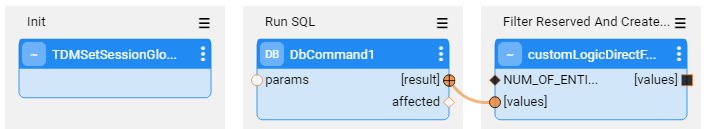

# Broadway Flows Implementation

The TDM library contains sets of generic flows that allow you to create a standard TDM implementation in just a few minutes. Once such implementation has been created, its flows can be edited and tailored to your project's needs.

## How Do I Create the TDM Broadway Flows?

## Step 1 - Define Tables to be Filtered Out

Before starting to create Broadway flows, define the tables that should be filtered out by the Broadway flow, which generates the **delete** and **load** flows. The **TDMFilterOutTargetTables** Actor contains a list of LU tables that do not require the creation of load and delete flows. By default, is it populated by both the TDM tables and the [target LU tables](/articles/TDM/tdm_implementation/08_tdm_implement_delete_of_entities.md#lu-structure---target-tables) added to the LU to enable a delete of the entity:

To filter out additional tables, open the **TDMFilterOutTargetTables** Actor and edit its **table** object. The **lu_name** column should be populated as follows:

* ALL_LUS - when a filtered-out table is relevant for all TDM LUs.
* LU name - when a table belongs to a specific LU. In some cases, you may need to add tables to the LU schema in order to get the child IDs and to populate the TDM_LU_TYPE_RELATION_EID TDM DB table. For example, the addition of the Orders table to the Customer LU generates a list of customer's orders.

 If a [data generation flow](16_tdm_data_generation_implementation.md) should not be generated for the table, the **generator_filterout** column box needs to be checked (true).

These tables should be added to the **TDMFilterOutTargetTables** Actor as it would prevent the load/delete flows creation for the tables; these tables are already loaded/deleted by the child LUs. 

Following completion of the Actor's update, refresh the project by clicking the  button (top of the Project Tree). This act applies the changes in the **TDMFilterOutTargetTables** Actor and deploys the LU. 

## Step 2 - Create Sequences

When populating a target database, sequences are required. Therefore, setting and initiating sequences is mandatory when implementing TDM. 

Deploy the TDM LU to Fabric. The TDM deploy.flow creates the k2masking keyspace.

Alternatively, run the **masking-create-cache-table.flow** from the Broadway examples to create the k2masking keyspace. 

Notes: 

- The k2masking keyspace can also be created by the deploy.flow of the TDM LU.

- Starting from Fabric V7.2, SQLite and PostgreSQL are also supported as System DBs. The settings are done via the new [internal_db section](/articles/02_fabric_architecture/06_cassandra_keyspaces_for_fabric.md#how-to-switch-to-sqlite-or-postgresql) of Fabric config.ini file. Before deploying the TDM LU, verify that the **SEQ_CACHE_INTREFACE** Shared Global is set with the proper interface. By default, it is populated with **DB_CASSANDRA**. If you wish the create the k2masking on PostgreSQL DB, set a PG DB interface name in the SEQ_CACHE_INTREFACE Global.

  

Take the following steps in order to create the sequences for your TDM implementation:

### Generate the Sequence Actors

**A.** The TDM library includes a **TDMSeqList** Actor that holds a list of sequences. Open this Actor and populate it with the relevant information for your TDM implementation as follows:
   - **SEQUENCE_NAME** - the sequence name must be identical to the DB's sequence name if the next value is taken from the DB.

   - **SEQUENCE_REDIS_OR_DB** - indicates whether the next value is taken from Redis, memory, or from the target DB interface. Populate this setting using either one of the following:
     
      - **FabricRedis** interface (imported from the TDM library).
      
      - **IN-MEMORY** - useful for testing only, as it can only be used in a single node configuration. 
      
      - **DB interface name** - can be populated by either the target DB interface in order to get the next value from the DB sequence, or **TDM** in order to create a new DB sequence in the TDM DB. The DB interface name is supported for Oracle, DB2 and PostgreSQL DBs. The sequence Actors get the sequence name from the SEQUENCE_NAME column of the tdmSeqList. If the sequence does not exits in the DB, it creates it.  
      
        ***Note:*** If the target DB does not have a sequence, or if it is neither Oracle, DB2 nor PostgreSQL, you can populate the **Target DB interface name** with **TDM**. The sequence will automatically be created in the TDM DB.
      
   - **INITIATE_VALUE_OR_FLOW** - set an initial value for the sequence or populate the name of an inner flow to apply logic when getting the initial value. For example, you can set the initial value from the max value of the target table. The initial value is **only relevant when getting the next value from FabricRedis, IN-MEMORY, or from a newly created DB sequence**. Otherwise, the next value is taken from the existing DB sequence.

      Notes:

      - Define an init flow to set the initial value for the newly created sequence based on the maximum value in the environment to avoid a collision. The init flow must return an external parameter named **initialValue** for the sequence Actor.
      - Use the 'IF NULL' function such as COALCASE in PG and NVL in Oracle when getting the initial value for the newly created sequence. For example: Select COALESCE(max(activity_id),0) + 100000 as init_activity_id from activity;

​		   

 Click [here](/articles/19_Broadway/actors/08_sequence_implementation_guide.md) for more information about the sequence Actors.

   An example of the **TDMSeqList** Actor:

   

   An example of an inner flow for getting the initial sequence value:

   

The table values are used by the **createSeqFlowsOnlyFromTemplates** flow that generates the Sequences' Actors. 

Following completion of the Actor's update, refresh the project by clicking the  button (top of the Project Tree). This act applies the changes in the **TDMSeqList** Actor and deploys the **TDM LU**.

**B.** Run either one of the following flows to create the sequence Actors based on the populated **TDMSeqList** Actor:

I. Run the **createSeqFlowsOnlyFromTemplates** flow to generate the sequence Actors.

II. Run the [TDMInitFlow](05_tdm_lu_implementation_general.md#ii-run-the-tdmluinit-flow) flow to generate the sequence Actors, and add the TDM setup to the input LU.

III. Run the **createAllFromTemplates** flow. Populate the **LU_NAME** input parameter with one of the project's LUs and set the **CREATE_SEQUENCES** input parameter to **true**. Set the **OVERRIDE_EXISTING_FLOWS** input parameter to **false** to avoid overriding the existing sequence Actor. 

Each generated sequence Actor includes a flow that invokes the [MaskingSequence Actor](/articles/19_Broadway/actors/07_masking_and_sequence_actors.md) to get the new sequence value and populate the source and target IDs in the TDM_SEQ_MAPPING TDM DB table.

Notes:  

- The sequence creation should run once per TDM implementation and not per each LU, as the sequences are used across several LUs in the TDM project.
- The sequence flows and Actors are created under **Shared Objects**, enabling several LUs to use a sequence Actor.

### Populate the Sequence Mapping Table

The **TDMSeqSrc2TrgMapping** table maps between the generated sequence Actors and the target tables' columns. A sequence Actor can be mapped into multiple tables and LUs.

View the below example:

This table serves 2 purposes: 

1.  It has been added in TDM 7.3 to automatically add the sequence Actors to the load flows. Populate **TDMSeqSrc2TrgMapping** table to map between the generated sequence Actors and the target tables' columns. A sequence Actor can be mapped into a different table and a different LU.

2. From TDM 8.0 onwards, this table is used for adding the sequence Actors to the data generation flow that generates synthetic data for the LU table.

     

Click [here](16_tdm_data_generation_implementation.md) for more information about the synthetic data generation implementation.

### Custom Sequence Logic

By default, the generated sequence Actors and flows use the [MaskingSequence](/articles/19_Broadway/actors/07_masking_and_sequence_actors.md) Actor. Fabric enables you to create your own function or Broadway flow in order to generate a new ID using either **MaskingLuFunction** Actor or **Masking** Actor instead of the default MaskingSequence Actor. 

Follow these steps to set a custom logic for a given sequence:

- Open the generated sequence flow and replace the MaskingSequence Actor with **MaskingLuFunction** Actor or **Masking** Actor. 
- Set the **category** input parameter of the Masking or MaskingLuFunction to **enable_sequences** in order to use the Actor for sequence (ID) replacement.  
- Save the updated sequence flow as an Actor.

Click for more information about [customizing the replace sequence logic](/articles/19_Broadway/actors/08_sequence_implementation_guide.md#custom-sequence-mapping).

### Set the Sequence Report Global

A new Global has been added to the Shared Globals in TDM 8.1 - **TDM_SEQ_REPORT**. When set to **true** (the default value), the task execution populates the **TDM_SEQ_MAPPING** table and adds the **Replace Sequence Summary Report** to the [task execution report](/articles/TDM/tdm_gui/27_task_execution_history.md#generating-a-task-execution-summary-report).

For a better performance, set the **TDM_SEQ_REPORT** Global to **false** to prevent the population of TDM_SEQ_MAPPING and the generation of the **Replace Sequence Summary Report**. Note that the replace sequence report will not be available for a task that is executed with the TDM_SEQ_REPORT as **false**.

## Step 3 - Create, Load and Delete Flows

In order to create the load and delete flows, run either:

I. [TDMInitFlow](05_tdm_lu_implementation_general.md#ii-run-the-tdmluinit-flow) flow. Note that this flow is designed to run one time when creating an LU and it also adds the TDM tables to the LU. If the LU already contains the TDM tables, it is recommended to run the **createAllFromTemplates** flow (see the below line) to add the target tables to the LU.

II. **createAllFromTemplates** flow. This flow:

- 1. Creates and adds the [delete entity's target LU tables](08_tdm_implement_delete_of_entities.md#lu-structure---target-tables) to the LU, if needed.

  2. Creates and adds the [data generation flows](16_tdm_data_generation_implementation.md) to the LU tables, if needed.

  3. Creates the delete and load flows based on the updated LU.  

- The flow gets the following input parameters:

  - **CREATE_DELETE_TABLES** - valid values: true/false. When true, the flow creates and adds the target tables to the LU in order to support the delete entity. The default value is false.

  - **LU_NAME** - the input LU must be deployed to Fabric debug server before running the createAllFromTemplates flow.

  - **TARGET_SCHEMA**

  - **TARGET_INTERFACE**

  - **OVERRIDE_EXISTING_FLOWS** - valid values: true/false. When set to **true**, the flow deletes and recreates existing objects. When set to **false**, the flow skips existing objects and creates new ones, if needed. This indicator is checked by all 3 parts of the flow (adding target LU tables, adding data generation flows, and adding the delete and load flows). The **default** value is **false**.

  - **TARGET_ENVIRONMENT**

  - **CREATE_GENERATE_FLOWS** - valid values: true/false. When true, the flow creates and adds data generation flows to the LU. The default value is false.

    

​	Notes: 

- If the target table name is not identical to the related LU table name, you must populate the mapping of the LU table name with the target table name in **TDMTargetTablesNames** Actor (imported from the TDM Library) and redeploy the LU to the Fabric debug server before running the **createAllFromTemplates** flow.

- From Fabric 7.1 onwards, physical folders are supported in the Studio. Therefore, the flows are created under dedicated directories. If your LUs already have load and delete flows, you need to move your existing flows and locate them in the following folders, in order to enable overriding them:

  - Load flows: LoadFlows
  - Delete flows: DeleteFlows

- From TDM 8.1 onwards, the generated delete flows do not require a manual update of the Get Table Data SQL query and the Delete key.

###  Load and Delete Flows

The createAllFromTemplates creates a separate flow per table on each type - load and delete. In addition, it creates a *load all flow* to run all table-level load flows in the right order, and a *delete all flow* to run all table-level delete flows in the right order.

The sequence Actors are added automatically to the load flows based on the **TDMSeqSrc2TrgMapping** table.

Additionally, the **createAllFromTemplates** flow adds the **setTargetEntityId_Actor** to the load flow of the **main target table** in order to populate the **TARGET_ENTITY_ID** key with the target entity ID. 

### Debug the Load and Delete Flows

You can run each one of the load flows in debug mode. Normally, when running a task, the **InitiateTDMLoad_Actor** gets the task's attributes and sets the execution parameters accordingly. When running a load flow in a debug mode without executing a TDM task, the **InitiateTDMLoad_Actor** sets the execution's parameters based on the TDM Globals. 

## Step 4 - TDM Orchestration Flows

### TDMOrchestrator Flow

The **TDMOrchestrator** flow orchestrates all the processes related to the **executed entity** in **one single flow** and in **one transaction**. A separate TDMOrchestrator flow runs on each task's LU. This flow includes the invocation of all steps such as:
 
- Initiates the TDM task execution keys.
- Syncs the entity into the Fabric, if needed.
- Deletes the entity from the target environment, if the task requires it.
- Loads the entity to the target, if the task requires it.
- Performs [error handling and statistics gathering](12_tdm_error_handling_and_statistics.md). 

Note that from TDM 7.5.1 onwards the TDM excludes Fabric from the transaction using the new Fabric 6.5.8 Broadway Actor: NoTx. This fix is needed for the entity clone as all replicas work on **one** single LUI. Fabric cannot open parallel transactions on the same LUI and therefore needs to be excluded from the delete and load Broadway transaction in order to have better parallelism when processing the entity’s replicas.

TDM 8.1 added the **TDMOrchestrator.flow** to the Shared Objects, thus avoiding the need to generate this flow on each LU separately. 

### TDMReserveOrchestrator Flow

The **TDMReserveOrchestrator** runs the [reserve only tasks](/articles/TDM/tdm_gui/20_reserve_only_task.md). Import the flow from the TDM Library into the Shared Objects and redeploy the TDM LU. 

## Step 5 - Mask the Sensitive Data

TDM systems often handle sensitive data. Complying with data privacy laws and regulations, Fabric enables masking sensitive fields such as SSN, credit card numbers and email addresses before they are loaded either to Fabric or into the target database.

* **LU population flows** - in order to mask a sensitive field, prior to loading it to Fabric, add the masking logic to the LU population flow using **Masking** Actors. 

  

  If the masked field is used as an [input argument](/articles/03_logical_units/12_LU_hierarchy_and_linking_table_population.md) that is linked to another LU table, add the masking population that masks the fields in all LU tables to the last executed LU table in order to have the original value when populating the LU tables. 

   <web>
  
  ### Catalog Masking Integration
  
  Fabric 7.2 introduced the [Fabric's Discovery and Catalog solution]((/articles/39_fabric_catalog/01_catalog_overview.md)), which provides an insight into the Fabric interfaces, starting with the RDBMS interface types in the MVP version. The Fabric Catalog supports a [catalog-based masking](/articles/39_fabric_catalog/09_build_artifacts.md) of PII fields. 
  
  TDM 8.1 adds new templates to integrate with the Catalog masking. These templates add the **CatalogMaskingMapper** Actor to the LU population flows to run the Catalog-based masking on the identified PII fields before loading them into the LU table. 
  
  Perform the following acts in order to use the new TDM templates for the Catalog masking:
     
  - Create the population flows for the source LU tables based on the new templates. Verify that the **CatalogMaskingMapper** Actor is added to the population flows.
  - Optional: Edit the population flows to override the Catalog’s masking for some of the PII fields: add [Masking Actors](articles/19_Broadway/actors/07_masking_and_sequence_actors.md) after the **CatalogMaskingMapper** Actor and link them to the relevant fields in the **DbLoad** Actor.
     - Note: If you need to send the original (source) values for the Masking Actors in the LU population, move the Query result to an ArrayBuilder and connect the ArrayBuilder output to the CatalogMaskingMapper Actor instead of connecting the Query result to it. This is needed in order to invoke the Query output twice – sending it to the CatalogMaskingMapper Actor and to the Masking Actor.
  
  </web> 

* **Load flows** - to mask a sensitive field as part of a load to the target DB, add a masking Actor to the relevant **load_[Table Name].flow**. The TDM infrastructure controls masking enablement/disablement based on the settings of the global variables. 

  ### TDM - Masking Categories

  One of the masking Actors' input parameters is named **category**. This parameter indicates *when* the masking Actor needs to generate a new value, e.g., when masking sensitive data or replacing the ID (sequence). The following values can be set in the category:

  - **enable_sequences**, which generates a new ID value
  - **enable_masking**, which masks sensitive data
  - Any custom string value

  A new custom value has been added by TDM 8.1:  **enable_masking_uniqueness**. This category is set to true if the **enable_sequences** or the **enable_masking** categories are set to true by the TDM task execution process.

  By default, the category is set to **enable_masking** on all masking Actors except for the **MaskingSequence** Actor, in which case the default category is set to **enable_sequences**. The main use of the  **enable_masking_uniqueness** category is for PII fields that must have unique values, such as SSN. For these fields, it is recommended to set the **category** of the masking Actor to **enable_masking_uniqueness**.

  #### Setting the Mask Categories by the TDM Task Execution Processes

  The TDM execution processes sets the masking categories to true/false based on the TDM task execution settings:

  

  <table width="900pxl">
  <tbody>
  <tr>
  <td width="250pxl">
  
<strong>Category</strong>

  </td>
  <td width="300pxl">
  
<strong>LU Population (extract part)</strong>

  </td>
  <td width="350pxl">
  
<strong>Load Process</strong>

  </td>
  </tr>
  <tr>
  <td width="250pxl">
  
enable_masking

  </td>
  <td width="300pxl">
  
Set by the task&rsquo;s attribute: <a href="/articles/TDM/tdm_gui/16_extract_task.md#mask-sensitive-data">Mask Sensitive data</a>.

      
Note that this attribute is set based on the  <a ref="/articles/TDM/tdm_gui/08_environment_window_general_information.md#mask-sensitive-data">source environment's setting</a>. The user can add masking to the task even if the source environment is not defined as a sensitive data source.

  </td>
  <td width="350pxl">
  
Will be set to true for the following tasks:
    
  <ul>
  <li>The task's selection method = Entity clone</li>
  </ul>
  
&nbsp;

  </td>
  </tr>
  <tr>
  <td width="250pxl">
  
enable_sequences

  </td>
  <td width="300pxl">
  
N/A

  </td>
  <td width="350pxl">
  
Will be set to true for the following tasks:
    
  <ul>
  <li>The task's selection method = Entity clone.</li>
  <li>The task replaces the entities' sequences (IDs).</li>
  <li>Load synthetically generated entities (the source environment is Synthetic).</li>
  </ul>
  </td>
  </tr>
  <tr>
  <td width="250pxl">
  
enable_masking_uniqueness

  </td>
  <td width="300pxl">
      
Set by the task&rsquo;s attribute: <a href="/articles/TDM/tdm_gui/16_extract_task.md#mask-sensitive-data">Mask Sensitive data</a> (set to true if the enable_masking or enable_sequences are true).

  </td>
  <td width="350pxl">
  
Will be set to true for the following tasks:
    
  <ul>
  <li>The task's selection method = Entity clone.</li>
  <li>The task replaces the entities' sequences (IDs).</li>
  <li>Load synthetically generated entities (the source environment is Synthetic).</li>
  </ul>
  </td>
  </tr>
  </tbody>
  </table>
  
  
* Notes:

  *  From TDM 7.3 onwards, the task that clones an entity creates only **one LUI instance for all clones**. Therefore, you must add masking on both processes (LUI Sync and load flows) in order to get different data in the masked fields on each clone. The clone_id is included in the [masking caching key](/articles/26_fabric_security/06_data_masking.md#masking-flow).

  * TDM 8.0 added the **root_iid** to the caching key in order to maintain the **referential integrity on PII fields across different LUs of the task’s BE**.

    For example, CRM and Billing LUs keep the Customer's data. The customer name needs to be identical in both LUs for a given customer. Setting the root_iid with the customer ID enables keeping the referential integrity between the CRM and Billing LUs. It is recommended to set the **useInstanceId** input argument of the masking Actors to **true** for keeping the PII fields' referential integrity within the Business Entity LUs.

[Click here to learn how to use masking Actors](/articles/19_Broadway/actors/07_masking_and_sequence_actors.md#).

[Click here to learn how the TDM task execution process builds the entity list](/articles/TDM/tdm_architecture/03a_task_execution_building_entity_list_on_tasks_LUs.md).

## Step 6 - Optional - Get the Entity List for a 'Select a predefined entity list' Task’s Selection Method

The entity list of the full entity subset can be generated by either using an SQL query on the source DB or running a Broadway flow. A Broadway flow is needed when running an extract task on a [non-JDBC data source](14_tdm_implementation_supporting_non_jdbc_data_source.md).  

### Implementation Guidelines

Create a Broadway flow under the related root LU or the Shared Objects. It is recommended to locate the Broadway flow under the Shared Objects to enable running the flow on several root LUs of a given Business Entity. The Broadway flow must include the following stages: 

- Stage 1: Get the list of entities.
- Stage 2: Call the **insertToLuExternalEntityList** Actor (imported from the TDM library) in a loop (iteration) to insert all entities into the entity table created in the TDM DB:
   - Set the input LU_NAME to be external and get its value from the task execution process.  
   - Set a [Transaction](/articles/19_Broadway/23_transactions.md#transaction-in-iterations) in the loop to have one commit on all iterations.  

Populate the Broadway flow in the [MigrateList MTable](/articles/TDM/tdm_implementation/04_fabric_tdm_library.md#migratelist).

Redeploy the related LUs and the TDM LU.

### How does the Broadway Flow Generate an Entity List for the Task Execution? 

The TDM library provides a list of Broadway Actors and flows to support generating an entity list by a project's Broadway flow. The project's Broadway flow gets the entity list and calls the TDM library Actors to insert them into a dedicated table in the TDM DB. A separate entity table is created upon a task execution and has the following naming convention: `entity_list_<task exe_id>`. 

The [TDM task execution process](/articles/TDM/tdm_architecture/03_task_execution_processes.md) runs the [batch process](/articles/20_jobs_and_batch_services/11_batch_process_overview.md) on entities in the entity table that are a part of the current task execution, having the current task execution id. The table is dropped at the end of the task execution.

Note that previous TDM versions populated the entities into a dedicated Cassandra table in **k2view_tdm** keyspace. From TDM 8.1 onwards, the entity table is created in the TDM DB.

### Debugging the Broadway Flow

1. Run the **createLuExternalEntityListTable** TDM flow (imported from the TDM Library) and populate the input **taskExecutionId** parameter to create the entity table in the TDM DB.
2. Populate the input parameters and run the customized Broadway flow. 

##  Step 7 - Optional - Build Broadway Flows for the [Custom Logic ](/articles/TDM/tdm_architecture/03a_task_execution_building_entity_list_on_tasks_LUs.md#custom-logic) Selection Method

You can build one or multiple Broadway flows to get a list of entities for a task execution. These Broadway flows are executed by the TDM task execution process, building the entity list for the task. 

### Custom Logic - TDM 8.1 Improvements

TDM 8.1 enables **2 execution modes** for the Custom Logic flows:

1. **Direct Call** - a newly added mode, where the batch process calls the Custom Logic flow directly, **getting the entity list without pre-populating the entities in a dedicated table**. This approach is **available only when the flow is based on one single DbCommand**, i.e., runs one Select query to get the required entities, and the **Business entity has only one root LU**.

   The Direct Call mode performs rather better: it does not need to complete the population of all entities in a predefined table before starting the task execution. The task execution consumes the output cursor of the    Select statement and executes the task on any chunk of consumed entities. Due to this behavior, **the Direct Call mode does not fit a Business Entity with multiple root LUs that must run on the same entity list**.

3. **Indirect call** - the indirect call **creates and populates a dedicated table in the TDM DB**. The table is created per execution with the following naming convention: `entity_list_<task exe_id>`. The task execution's batch process runs a Select query from the newly created table to get the task's entities. The table is dropped from the DB when the task execution is completed.  

   Note that previous TDM versions populated the entities into a dedicated Cassandra table in **k2view_tdm** keyspace. From TDM 8.1 onwards, the entity table is created in the TDM DB.

#### CustomLogicSql Flow

A new generic Custom Logic flow has been added to the TDM library in TDM 8.1 - **CustomLogicSql**. This flow gets an SQL query to run on a given DB interface. 
Edit the flow in order to use it in the TDM tasks:
 - Populate the **interface** input parameter in the **Run Input SQL** Actor (currently it is defined as an empty linked field).
 - It is recommended to update the external name of the **sql** input parameter in the **Run Input SQL** Actor to a meaningful name (currently it is populated with SQL). For example, SQL_query_on_CRM. 
 - Add the CustomLogicSql flow to the **CustomLogicFlows** Actor. Populate the new record as follows:
   -  LU_NAME: optional. Can be left empty.
   -  FLOW_NAME: CustomLogicSql
   -  DESCRIPTION: populated with a free text.
   -  DIRECT_FLOW: true
  - Redeploy the Web-Services to Fabric.
  - If the LU_NAME field is populated with an LU name, redeploy the LU name to Fabric. Else (if the LU_NAME field is empty), redeploy the TDM LU to Fabric.
    
The following parameters can be set by the user that creates the task:

- **sql** - mandatory parameter defining the Select query to run on the TDM DB and to get the task's entity list.
- **sqlParams** - optional parameter to set parameters for the Select query. You can set multiple parameters separated by a comma.

The customLogicSql flow runs in a **direct call** mode. 

##### Examples of an input SELECT query:

1. Populating both parameters - the **sql** and the **sqlParams**: 

   - **sql**: 

     select distinct cust.customer_id from customer cust, activity act, cases cs  where cust.customer_id = act.customer_id and act.activity_id = cs.activity_id and cs.status = ?  and cs.case_type = ? 

   - **SqlParams:**

     Open,Billing Issue

2. Populate only the **sql** parameter: 

   - **sql:**

     Select Distinct act.customer_id From activity act,   cases ca Where act.activity_id = ca.activity_id And ca.status <> 'Closed' And ca.case_type  in  ('Device Issue', 'Billing Issue');

### Step 7.1 - Create a new Custom Logic Flow

The Custom Logic Broadway flow can be created in either the **Shared Objects** or **a given LU**.

The Custom Logic Broadway flow always has **2 external input parameters** and it gets their values from the task execution process:

- LU_NAME
- NUM_OF_ENTITIES - the maximum number of entities to be processed by the task execution. The number is set in either the task or the task's [overridden parameters](/articles/TDM/tdm_architecture/04_task_execution_overridden_parameters.md#overriding-additional-task-execution-parameters).

TDM supports the creation of **additional external parameters** in the flow, enabling the user to send the values of these parameters in the TDM task; e.g., you can add an external parameter name - customer_status - to the flow. The flow selects the customers for the task based on the customer_status input parameter. This way you can filter the selected customers by their status and still use the same flow to select them.

**Notes:** 

- The input parameter name must **not contain spaces or double quotes**.

- TDM 8.0 added an integration of **Broadway editors** into the TDM portal when populating either the data generation parameters or the Custom logic parameters in the task’s tabs. This integration enables the user to select a valid value from a list, to set dates, and to set distributed parameters. 

  Click [here](15_tdm_integrating_the_tdm_portal_with_broadway_editors.md) for more information about the TDM integration with the Broadway editors and related implementation instructions.

- Sending multiple values in one single parameter - you can define a String input parameter in order to get a list of values into the parameter and split it into an array in the flow, e.g., "CA,NY". The Broadway flow can split this String by the delimiter. The values must be delimited by the delimiter, which is set in the split Actor in Broadway flow.

- You can get an input Select statement with binding parameters. The parameters' values can be either sent into a separate input parameter or added to the Select statement.  See the [CustomLogicSql flow's examples](#examples-of-an-input-select-query) above.

  

### Custom Logic High-Level Structure

#### Direct Call Flow

The [direct call](#custom-logic---tdm-81-improvements) Custom Logic flow must have the following structure:

1. Init - calls the **TDMSetSessionGlobals** Actor to run the initial setting for the custom logic flow execution.

2. **DbCommand** - defines the Select statement to select the task's entities. The Select statement must return only the entity IDs. 

3. **customLogicDirectFlowUtil** - filters out the reserved entities if needed,  and formats the entity IDs for the task execution. Set the **NUMBER_OF_ENTITIES** input parameter to be external, and link the DBCOmmand result to the **input values** parameter.  The **output values** parameter must be external.

#### Indirect Call Flow

- **Stage 1**: 

  - Add a logic, requiring the entities - for example, a DbCommand Actor that runs a Select statement on the CRM DB. The Actor needs to return the list of the selected entity IDs.
  - Initialize the entities' number counter for execution - add the **InitRecordCount** TDM Actor (imported from the TDM Library).
  - Notes: 
      - If the flow needs to get an array of parameters, it is recommended to define the external input parameter as a String and add a **Split** Actor to the flow in order to split the values by the delimiter and populate them into a String's array.
      - It is recommended to add a limit to the SQL query if you do not need to filter out reserved entities when running this flow. This way the query returns a limited size of records.

- **Stages 2-4**: **Loop on the selected entities** - set a [Transaction](/articles/19_Broadway/23_transactions.md#transaction-in-iterations) in the loop in order to have one commit for all iterations: 

  1. Stage 2: Set the selected entity ID - returned by the Actor of Stage 1 - to a String using the **ToString** Actor.

  2. Stage 3: Call **CheckReserveAndLoadToEntityList** TDM Broadway flow (imported from the TDM Library):

     - **Input** - **LU_NAME** parameter. This is an **external parameter** and it gets its value by the task execution process.
     - **Output** - **recordLoaded**. This is the entity number counter, loaded into the entity table.
     - This flow executes the following activities on each selected entity ID:
   - Checking whether the entity is reserved for another user in the task's target environment when running a load task without a sequence replacement, a delete task, or a reserve task. If the entity is reserved for another user, it skips it, as it is unavailable.
   - Loading the available entities into the entity table in the TDM DB and updating the entities number counter.

  3. Stage 4: Calls **CheckAndStopLoop** TDM Actor (imported from the TDM Library). Set the **NUM_OF_ENTITIES** to be an **external input parameter** to get its value from the task execution process. It checks the number of entities inserted to the entity table, and stops the loop if the custom flow reaches the task's number of entities. 

     **Example**:

     The task needs to get 5 entities. The Select statement gets 20 entities. The first 2 selected entities are reserved for another user. The 3rd, 4th, 5th, 6th, and 7th entities are available and are populated in the entity table; then the entities' loop stops.

Below are examples of a Custom Logic flow:

**Example 1 - get the Contract Status as an input parameter and build the Select statement accordingly:** 

**Example 2 - get an input String of States, separated by a comma. Split the input String into an array and send it to the SQL query**:

Example of US states input: 

- NY,CA

**Example 3 - get an input Select statement with parameters for the Select statement:**

Note: When exposing the SQL statement as an external parameter for the user, verify that it runs on a read-only DB connection; this would prevent a DB update.

### Debugging the Customized Flow

1. Run the **createLuExternalEntityListTable** TDM flow (imported from the TDM Library) and populate the input **taskExecutionId** parameter to create the entity table in the TDM DB.
2. Populate the input parameters and run the customized flow. 

### Step 7.2 - Populate the Custom Logic Flow in the Custom Logic Table

Add the LU name and Custom Logic flow name to the **CustomLogicFlows** constTable TDM Actor (imported from the TDM Library).

View the below example:

Check the **DIRECT_FLOW** checkbox to enable a [direct call](#custom-logic---tdm-81-improvements) of the Custom Logic flow.

Redeploy the Web-Services.

