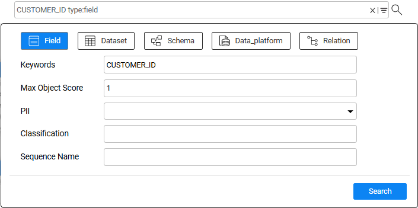
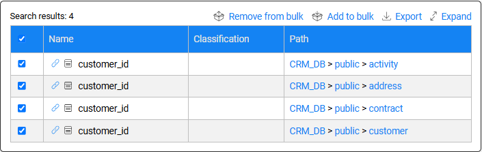
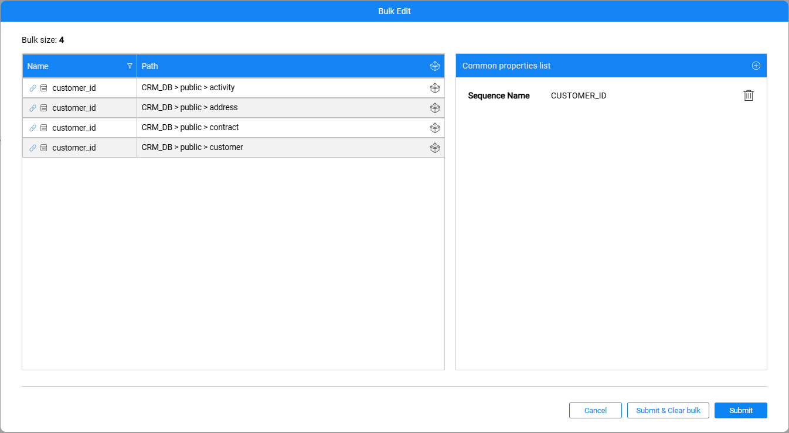

# TDM — Catalog-based Sequence Implementation

Fabric has added the [Sequences tab](/articles/39_fabric_catalog/catalog_app/10_catalog_settings.md#sequences-tab) to the Catalog. This tab allows to set up the sequences that can be generated in a project by population flows or other flows. 

## Steps for Catalog-based Sequence Implementation

### I. Catalog — Populating the Sequences Tab

Populating the Sequences tab involves adding the Sequence Classification and setting the data Generator for each sequence. 

Click [here](/articles/39_fabric_catalog/catalog_app/10_catalog_settings.md#sequences-tab) for instructions.

### II. Catalog — Adding Sequence Classification to Tables

Currently, the Catalog does not automatically identify the sequence fields. Therefore, after a list of sequences is set in the **Sequences** tab, the relevant Catalog fields should be manually marked as sequences. Build the Catalog artifacts when completing the manual updates.

Note that you must run the discovery on the interface that is populated in the [TDMLUInitBasedOnFabric flow's](05_tdm_lu_implementation_general.md#tdmluinitbasedonfabric-flow-execution) TARGET_INTERFACE input parameter, since the load flow, created by the TDMLUInitBasedOnFabric flow, sends the TARGET_INTERFACE value to the [HandleMaskAndSeqFields flow](05d_tdm_sequence.md), which applies masking and sequence replacements to every record before loading it into the target environment.   

Click [here](/articles/39_fabric_catalog/catalog_app/10_catalog_settings.md#sequences-tab) for instructions.

The Catalog feature of [Bulk Edit](/articles/39_fabric_catalog/catalog_app/14_1_bulk_creation.md) is supported from Fabric V8.3 onwards. This feature simplifies adding a **Sequence Name** property to specified fields (such as unique IDs), since you can create a bulk of fields for each Sequence Name and update the fields accordingly. A separate bulk needs to be created for each Sequence Name.

**Example: Adding the CUSTOMER_ID Sequence to all fields named 'CUSTOMER_ID' in the CRM DB**:

- Search for fields named CUSTOMER_ID:

  

- Select the relevant fields and add them to the bulk:

  

- Close the Search window (click the X on the Search box) and edit the bulk: Add the CUSTOMER_ID Sequence to this bulk and click the *Submit & Clear bulk* button. 

  

- The CUSTOMER_ID Sequence is added to all the bulk's fields and the bulk is cleared. 

- You can now repeat these steps for additional Sequences (such as CONRTACT_ID).

Click [here](/articles/39_fabric_catalog/catalog_app/14_2_bulk_edit.md) for additional instructions on how to edit a bulk of entities in the Catalog.

### III. TDM Implementation Changes

- Run the [TDMLUInitBasedOnFabric](05_tdm_lu_implementation_general.md#ii-adding-the-tdm-setup-to-the-lu) flow to regenerate the load and rule-based data generation flows.

- For each LU that requires sequences to be populated by the Catalog, add the **TDM_USING_CATALOG_SEQUENCES** Global. Set this Global to **true**. Verify that the updated Global is reflected in the **Environments** file, and then redeploy the Environments.
    
#### Using a Custom Sequence Generator

To use a custom flow as a sequence generator, add an external parameter named **category** with the default value **enable_sequences** to the flow. This parameter is required for catalog masking to activate the custom sequence for tasks that replace entity IDs.

**Implementation guidelines:**

1. Add an external parameter named **category** to the flow and set its default value to **enable_sequences**.
2. Deploy the changes and open the Catalog. On the **Sequences** tab, edit or create the sequence that uses the custom flow. Select the custom flow as the generator and verify that the **category** parameter is displayed and populated with the default value `enable_sequences`.
3. Save the sequence and return to the Studio. Open the **catalog_classification_generators** MTable and verify that the sequence entry for the custom flow contains the parameter `{category: "enable_sequences"}`.
