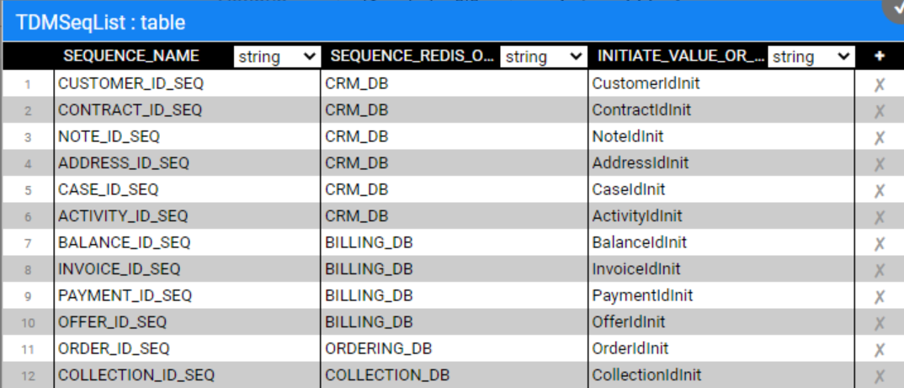
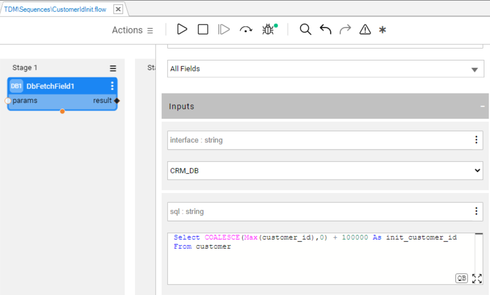
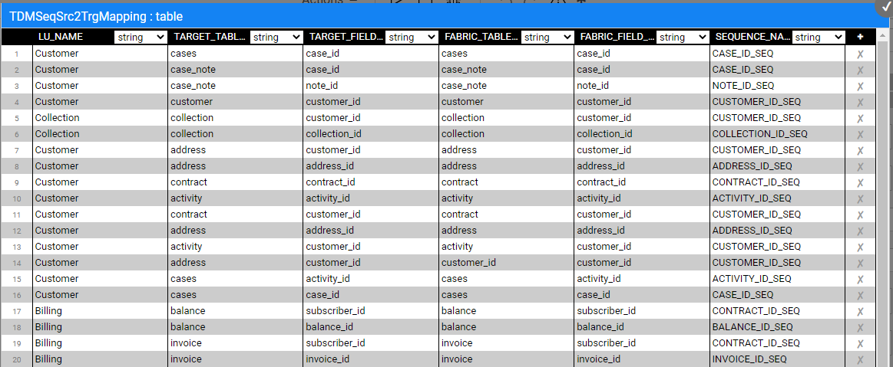

# TDM — Sequence Implementation Without Catalog

To create the sequences for your TDM implementation, follow these steps:

## Generate Sequence Actors

The TDM library includes a **TDMSeqList** Actor that holds a list of sequences. Open this Actor and populate it with the relevant information for your TDM implementation as follows:

   - **SEQUENCE_NAME** — the sequence name must be identical to the DB sequence name if the next value is taken from the DB.

   - **SEQUENCE_REDIS_OR_DB** — indicates whether the next value is taken from Redis, memory, or from the target DB interface. Populate this setting using one of the following:

     - **IN-MEMORY** — this parameter is useful for testing only, as it can only be used in a single-node configuration. 

     - **DB interface name** — this parameter can be populated with either the target DB interface (to get the next value from the DB sequence), or **TDM** (create a new DB sequence in the TDM DB). The DB interface name is supported for Oracle, DB2 and PostgreSQL DBs. Sequence Actors obtain the sequence name from the SEQUENCE_NAME column of tdmSeqList. If the sequence does not exits in the DB, the sequence Actor creates it.  

       ***Note:*** If the target DB does not have a sequence, or if it is neither Oracle, DB2 nor PostgreSQL, you can populate the **Target DB interface name** with **TDM**. The sequence will then be automatically created in the TDM DB.

   - **INITIATE_VALUE_OR_FLOW** — this parameter defines either an initial value for the sequence or the name of an inner flow (e.g., customerInitValue) to apply logic when retrieving the initial value. For example, the initial value can be set to the maximum value of the target table. The initial value is **relevant only when the next value is retrieved IN-MEMORY or from a newly created DB sequence**. Otherwise, the next value is taken from the existing DB sequence.

     Notes:

     - Define an init flow to set the initial value for a newly created sequence based on the maximum value in the environment, to avoid collision. The init flow must return an external parameter named **initialValue** for the sequence Actor.
     - Use the 'IF NULL' function — such as COALCASE in PG or NVL in Oracle — when retrieving the initial value for the newly created sequence. For example: Select COALESCE(max(activity_id),0) + 100000 as init_activity_id from activity;		   

   Click [here](/articles/19_Broadway/actors/08_sequence_implementation_guide.md) for more information about the sequence Actors.

   An example of the **TDMSeqList** Actor:

   

   An example of an inner flow for getting the initial sequence value:

   

Following completion of the Actor's update, refresh the project by clicking the  button (top of the Project tree). This act applies the changes in the **TDMSeqList** Actor and deploys the **TDM LU**.

## Populate the Sequence Mapping Table

The **TDMSeqSrc2TrgMapping** table maps between the generated sequence Actors and the target tables' columns. A sequence Actor can be mapped into multiple tables and LUs.

View the below example:

This table serves 2 purposes: 

1. Adding the sequence Actors to the load flows. Populate **TDMSeqSrc2TrgMapping** table to map between the generated sequence Actors and the target tables' columns. A sequence Actor can be mapped into a different table and a different LU.

2. Adding the sequence Actors to the data generation flow that generates synthetic data for the LU table. 

Click [here](16_tdm_data_generation_implementation.md) for more information about the rule-based synthetic data generation implementation.

## Custom Sequence Logic

By default, the generated sequence Actors and flows use the [MaskingSequence](/articles/19_Broadway/actors/07_masking_and_sequence_actors.md) Actor. Fabric enables you to create your own function or Broadway flow in order to generate a new ID using either **MaskingLuFunction** Actor or **Masking** Actor instead of the default MaskingSequence Actor. 

Follow these steps for setting custom logic for a given sequence:

- Open the generated sequence flow and replace the MaskingSequence Actor with **MaskingLuFunction** Actor or **Masking** Actor. 
- Set the **category** input parameter of the Masking or MaskingLuFunction to **enable_sequences** in order to use the Actor for sequence (ID) replacement.  

Click for more information about [customizing the replace sequence logic](/articles/19_Broadway/actors/08_sequence_implementation_guide.md).
