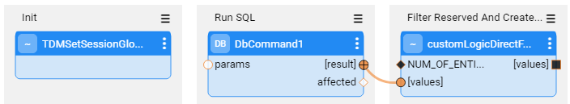
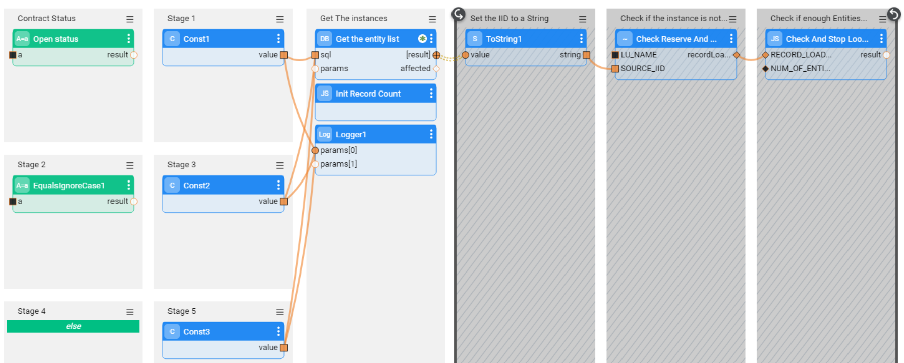
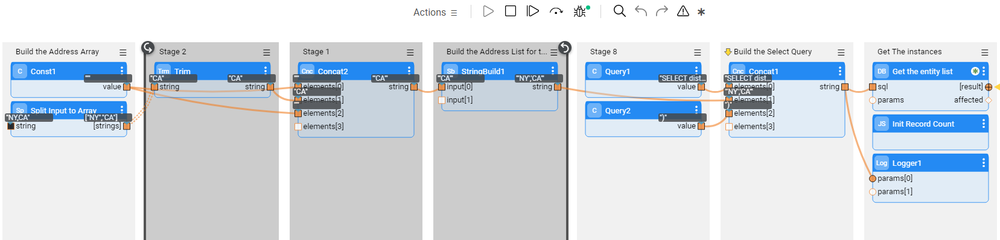
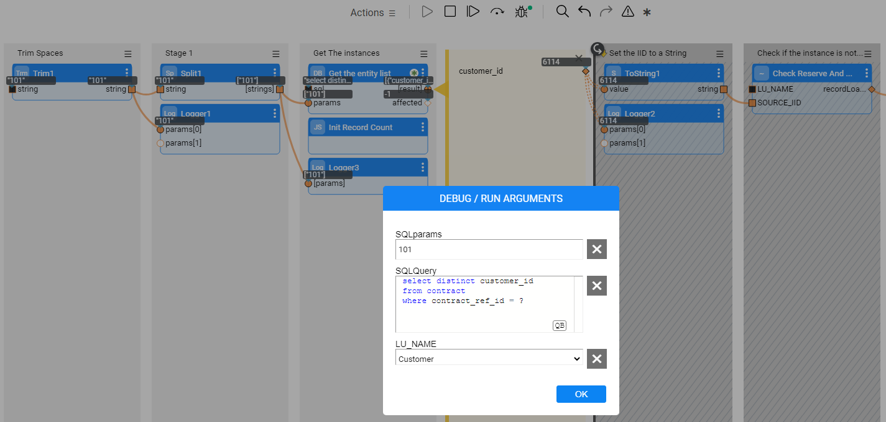
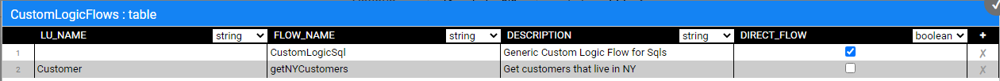

#  Custom Logic Implementation

This article outlines the implementation of a Custom Logic flow that generates an entity subset for task execution.
One or more Broadway flows can be designed to define the logic, which ultimately produces an output list of entity IDs. During task execution, this list is returned and used by the TDM process to extract or load data. 

TDM enables **two execution modes** for the Custom Logic flows:

1. **Direct Call** — a newly added mode in which the batch process calls the Custom Logic flow directly **to obtain the entity list, without pre-populating the entities in a dedicated table**. This approach is **available only when the flow is based on a single DbCommand** — that is, when it runs one SELECT query to get the required entities — and the **Business entity contains only one root LU**.

   The Direct Call mode performs rather better: It does not need to complete the population of all entities in a predefined table before starting the task execution. The task execution consumes the output cursor of the SELECT statement and executes the task on any chunk of consumed entities. Due to this behavior, **the Direct Call mode is not suitable for Business Entities with multiple root LUs that must run on the same entity list**.

2. **Indirect call** — the indirect call **creates and populates a dedicated table in the TDM DB**. The table is created for each execution using the naming convention: `entity_list_<task exe_id>`. The task execution's batch process runs a SELECT query from the newly created table to get the task's entities. Once the task execution is completed, the table is dropped from the DB.  

   Note that previous TDM versions populated the entities into a dedicated Cassandra table in **k2view_tdm** keyspace. From TDM V8.1 onwards, the entity table is created in the TDM DB.

## Custom Logic Flow — Implementation Steps

1. Create the Custom Logic Broadway flow.
2. Add the flow to **CustomLogicFlows** Actor.

## 1. Create the Custom Logic Flow

The Custom Logic Broadway flow can be created in either the **Shared Objects** or **a given LU**.

The Custom Logic Broadway flow always has **two external input parameters** and it gets their values from the task execution process:

- LU_NAME
- NUM_OF_ENTITIES — the maximum number of entities to be processed by the task execution. The number is set in either the task or the task's [overridden parameters](/articles/TDM/tdm_architecture/04_task_execution_overridden_parameters.md#overriding-additional-task-execution-parameters).

TDM supports the creation of **additional external parameters** in the flow, enabling the user to send the values of these parameters in the TDM task; e.g., you can add an external parameter name - customer_status - to the flow. The flow selects the customers for the task based on the customer_status input parameter. This way you can filter the selected customers by their status and still use the same flow to select them.

**Notes:** 

- The input parameter name must **not contain spaces or double quotes**.

- TDM 8.0 added an integration of **Broadway editors** into the TDM portal when populating either the data generation parameters or the Custom logic parameters in the task’s tabs. This integration enables the user to select a valid value from a list, to set dates, and to set distributed parameters. 

  Click [here](15_tdm_integrating_the_tdm_portal_with_broadway_editors.md) for more information about the TDM integration with the Broadway editors and related implementation instructions.

- Sending multiple values in one single parameter — you can define a String input parameter in order to get a list of values into the parameter and split it into an array in the flow, e.g., "CA,NY". The Broadway flow can split this String by the delimiter. The values must be delimited by the delimiter, which is set in the split Actor in Broadway flow.

- You can get an input Select statement with binding parameters. The parameters' values can be either sent into a separate input parameter or added to the Select statement. See the [CustomLogicSql flow's examples](#examples-of-an-input-select-query) above.

  

### Custom Logic High-Level Structure

#### Direct Call Flow

The [direct call](#custom-logic---tdm-81-improvements) Custom Logic flow must have the following structure:

1. Init — calls the **TDMSetSessionGlobals** Actor to run the initial setting for the custom logic flow execution. The SESSION_GLOBALS input parameter must be defined as an external parameter. The external parameter name must be SESSION_GLOBALS.

2. **DbCommand** — defines the Select statement to select the task's entities. The Select statement must return only the entity IDs. 

3. **customLogicDirectFlowUtil** — filters out the reserved entities if needed, and formats the entity IDs for the task execution:
   - Set the **NUMBER_OF_ENTITIES** input parameter to be external.
   - Link the DBCommand result to the **input values** parameter.
   - Set the **innerFlowClose** input parameter to **false** in order to support the streaming of the resultSet by the inner flow and avoid the Broadway limitation of the maximum number of records (set to 100K by default).
   - The **output values** parameter must be external.

#### Indirect Call Flow

- **Stage 1**: 

  - Add a logic, requiring the entities - for example, a DbCommand Actor that runs a Select statement on the CRM DB. The Actor needs to return the list of the selected entity IDs. 
  - Initialize the entities' number counter for execution - add the **InitRecordCount** TDM Actor (imported from the TDM library).
  - Notes: 
    - If the flow needs to get an array of parameters, it is recommended to define the external input parameter as a String and add a **Split** Actor to the flow in order to split the values by the delimiter and populate them into a String's array.
    - It is recommended to add a limit to the SQL query if you do not need to filter out reserved entities when running this flow. This way, the query returns a limited number of records.

- **Stages 2-4**: **Loop on the selected entities** — set a [Transaction](/articles/19_Broadway/23_transactions.md#transaction-in-iterations) in the loop in order to have one commit for all iterations: 

  1. Stage 2: Set the selected entity ID - returned by the Actor of Stage 1 - to a String using the **ToString** Actor.

  2. Stage 3: Call **CheckReserveAndLoadToEntityList** TDM Broadway flow (imported from the TDM library):

     - **Input** — **LU_NAME** parameter. This is an **external parameter** and it gets its value by the task execution process.
     - **Output** — **recordLoaded**. This is the entity number counter, loaded into the entity table.
     - This flow executes the following activities on each selected entity ID:

   - Checking whether the entity is reserved for another user in the task's target environment when running a load task without a sequence replacement, a delete task, or a reserve task. If the entity is reserved for another user, it skips it, as it is unavailable.
   - Loading the available entities into the entity table in the TDM DB and updating the entity number counter.

  3. Stage 4: Calls **CheckAndStopLoop** TDM Actor (imported from the TDM library). Set the **NUM_OF_ENTITIES** to be an **external input parameter** to get its value from the task execution process. It checks the number of entities inserted to the entity table, and stops the loop if the custom flow reaches the task's number of entities. 

     **Example**:

     The task needs to get 5 entities. The Select statement gets 20 entities. The first 2 selected entities are reserved for another user. The 3rd, 4th, 5th, 6th, and 7th entities are available and are populated in the entity table; the entity loop then stops.

Below are examples of a Custom Logic flow:

**Example 1 — get the Contract Status as an input parameter and build the Select statement accordingly:** 

**Example 2 — get an input String of States, separated by a comma. Split the input String into an array and send it to the SQL query**:

An example of the US states' input: 

- NY,CA

**Example 3 — get an input Select statement with parameters for the Select statement:**

Note: When exposing the SQL statement as an external parameter for the user, verify that it runs on a read-only DB connection; this would prevent a DB update.

### Example — CustomLogicSql Flow

A new generic Custom Logic flow has been added to the TDM library: **CustomLogicSql**. This flow gets an SQL query to run on a given DB interface. 
Edit the flow in order to use it in the TDM tasks:

 - Populate the **interface** input parameter in the **Run Input SQL** Actor (currently it is defined as an empty linked field).
 - It is recommended to update the external name of the **sql** input parameter in the **Run Input SQL** Actor to a meaningful name (currently it is populated with SQL). For example, SQL_query_on_CRM. 
 - Add the CustomLogicSql flow to the **CustomLogicFlows** Actor. Populate the new record as follows:
   -  LU_NAME: optional. Can be left empty.
   -  FLOW_NAME: CustomLogicSql
   -  DESCRIPTION: populated with free text.
   -  DIRECT_FLOW: true
  - Redeploy the Web Services to Fabric.
  - If the LU_NAME field is populated with an LU name, redeploy the LU name to Fabric. Else (if the LU_NAME field is empty), redeploy the TDM LU to Fabric.

The following parameters can be set by the user who creates the task:

- **sql** — mandatory parameter defining the Select query to run on the TDM DB and to get the task's entity list.
- **sqlParams** — optional parameter to set parameters for the Select query. You can set multiple parameters separated by a comma.

The customLogicSql flow runs in a **direct call** mode. 

##### Examples of an input SELECT query:

1. Populating both parameters — the **sql** and the **sqlParams**: 

   - **sql**: 

     select distinct cust.customer_id from customer cust, activity act, cases cs  where cust.customer_id = act.customer_id and act.activity_id = cs.activity_id and cs.status = ?  and cs.case_type = ? 

   - **SqlParams:**

     Open,Billing Issue

2. Populate only the **sql** parameter: 

   - **sql:**

     Select Distinct act.customer_id From activity act,   cases ca Where act.activity_id = ca.activity_id And ca.status <> 'Closed' And ca.case_type  in  ('Device Issue', 'Billing Issue');

### Debugging the Custom Logic Flow

1. Run the **createLuExternalEntityListTable** TDM flow (imported from the TDM library) and populate the input **taskExecutionId** parameter to create the entity table in the TDM DB.
2. Populate the input parameters and run the customized flow. 

## 2. Add the flow to **CustomLogicFlows** Actor

Add the LU name and Custom Logic flow name to the **CustomLogicFlows** constTable TDM Actor (imported from the TDM library).

View the example below:

Check the **DIRECT_FLOW** checkbox to enable a [direct call](#custom-logic---tdm-81-improvements) of the Custom Logic flow.

Redeploy the Web Services.

