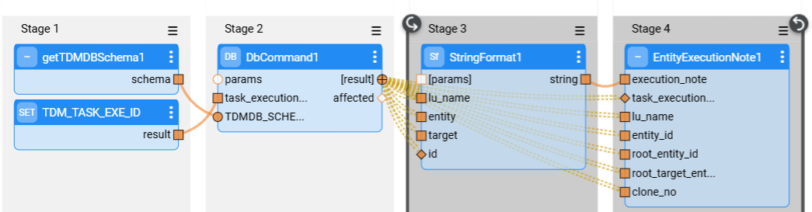

# Implementation of Pre and Post Execution Processes

The TDM task enables adding **Pre-** and **post-execution processes** in the task's [Advanced settings](/articles/TDM/tdm_gui/21_task_pre_and_post_execution_processes.md). The pre-execution processes run in the beginning of the task execution, before all related LUs have been executed. The post-execution processes run at the end of the task execution, after all related LUs have been executed.

Examples:

- Running a cleanup flow prior to executing the task's LUs.
- Sending an email to the tester to notify them that the task execution has ended.
- Adding an execution note to the task's entities (some or all entities). The execution note can be viewed later in the self-service application.

## Implementation Steps

### 1. Create the Pre or Post Execution Flow

The pre- and post-execution processes are Broadway flows. These flows can have external parameters that can be overridden by the task creator. 

#### Adding an Execution Note to the Task's Entities

A new Actor has been added in TDM V9.4: **EntityExecutionNote**. This Actor updates the relevant records in task_execution_entities TDM DB table to populate the execution_note field for the required entities.

See an example below:

  

### 2. Add the Flow to PostAndPreExecutionProcess MTable

- The **PostAndPreExecutionProcess** MTable defines the list of pre-execution and post-execution flows to run before or at the end of a task's execution. 
- Populate the list of Broadway flows, the flow's LU, and the process type (pre/post). The pre/post execution flows can be defined under the Shared Objects to be available for multiple LUs. In such case, the TDM execution process attaches the TDM LU to these processes. 
- Redeploy the LUs populated in this table, the TDM LU, and the Web-Services.

### 3. TDM Self-Service Application — Add the Flow to the Business Entities

- TDM self-service application setup — add the pre- and post-execution processes to the relevant Business Entities.
- Click [here](/articles/TDM/tdm_gui/04_tdm_gui_business_entity_window.md#pre-and-post-execution-processes-tabs) for instructions.

###  

