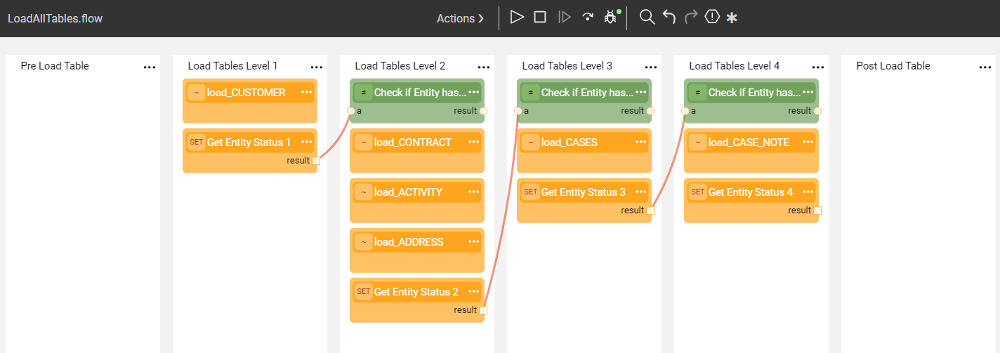
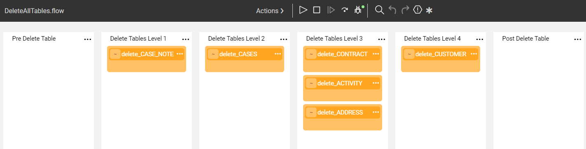

# TDM Implementation - Supporting Non JDBC Data Sources

## How Do I Define the Entity List?

### Extract All Entities Tasks

Create a Broadway flow to get the list of entities from the data source and populate it in the [trnMigrateList](/articles/TDM/tdm_implementation/04_fabric_tdm_library.md#trnmigratelist) translation.

For more information on how to populate the entity list based on a non JDBC data source, read [Step 6 -Get the Entity List for an Extract All Task Using a Broadway Flow](/articles/TDM/tdm_implementation/11_tdm_implementation_using_generic_flows.md#step-6---optional---get-the-entity-list-for-an-extract-all-task-using-a-broadway-flow) section of the Broadway Flows Implementation article.

### Using a Custom Logic to Select Entities 

Create Broadway flows to be executed by the task execution and get the entity list for the task. 

For more information on how to build Custom Logic flows, read [Step 7 - Optional - Build Broadway Flows for the Custom Logic Selection Method](/articles/TDM/tdm_implementation/11_tdm_implementation_using_generic_flows.md#step-7---optional---build-broadway-flows-for-the-custom-logic--selection-method).

## Building the LU Tables Populations

### Step 1- Main Source LU Table

The population of the main source LU table must be generated based on [populationRootTable.pop.flow template](/articles/TDM/tdm_implementation/05_tdm_lu_implementation_general.md#step-3---add-the-source-lu-tables-to-the-lu-schema) imported from the TDM Library:

- Right click the table name > **New Table Population Flow From Template > populationRootTable.pop.flow**. A popup window is opened.
- Populate the popup window's settings as follows:
  - **File Name**: populate the file name by [LU Table Name].[flow name]
- Do not populate the **TABLE_NAME** , **KEY**, and the **SOURCE_INTERFACE** parameters when populating the main source LU table based on a non JDBC data source.
- The generated flow is created with an empty source query in the **Source** stage. Replace the empty **sourceDbQuery** in the **Source** stage by the updated actor to extract the data from the data source and link it to the main source LU table in the **LU Table** stage.

### Step 2 - Other LU Tables

Create Broadway flows to populate the other LU tables.

## Building the Broadway TDM Flows

### Step 1- Build Load and Delete Flows

The **createLoadTableFlows** and **createDeleteTableFlow** flows call the **getDbTables** function to get the target JDBC structure and therefore cannot be used for a non JDBC target.  Therefore the load and delete flows need to be created manually:

- A separate load flow for each target object. The data is taken from the related LU table. Add [sequence](11_tdm_implementation_using_generic_flows.md#update-the-load-flows-with-the-sequence-actors) and [masking](tdm_implementation/11_tdm_implementation_using_generic_flows.md#step-5---mask-the-sensitive-data) handling if needed.

- A separate delete flow of each target object. The target keys are taken from the [**TAR_** LU tables](08_tdm_implement_delete_of_entities.md).

- **LoadAllTables** flow:  this flow executes the inner load flows on each target object in the correct order. 

  See an example below:

  

​		

​		

​		The **Get Entity Status** actors check the **ENTITY_STATUS** value and the flow runs the load flows of the next stage if the ENTITY_STATUS is not **failed**.

- **DeleteAllTables** flow:  this flow executes the inner delete flows on each target object in the correct order. 

  See an example below:

### 		

### Step 2 - Generate Build Load and Delete Flows 

Once all load and delete flows are ready, create an orchestrator using the [TDMOrchestrator.flow](11_tdm_implementation_using_generic_flows.md#step-4---create-the-tdmorchestratorflow-from-the-template) template.

