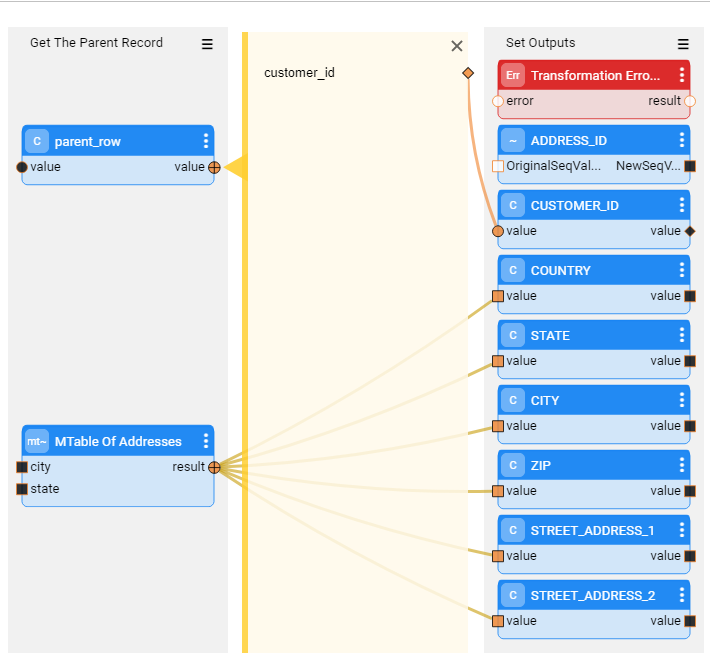
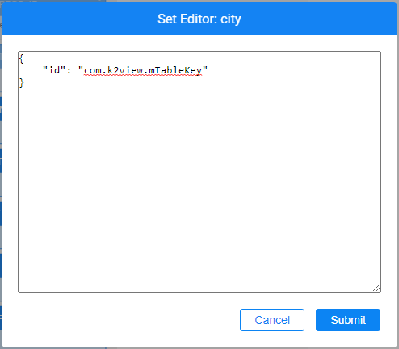
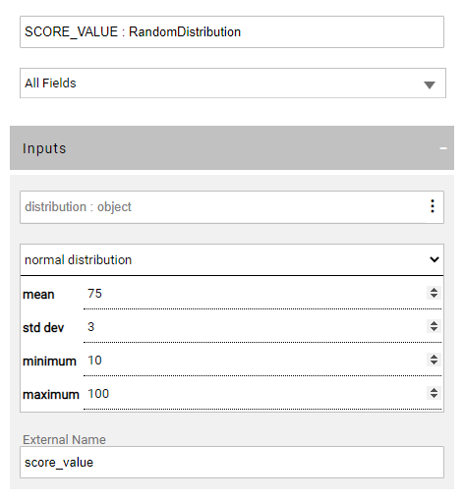
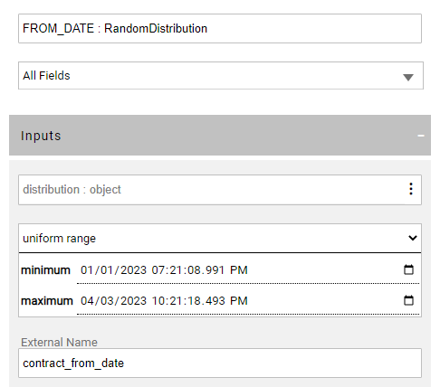

# Integrating the TDM Portal with Broadway Web Editors

TDM 8.0 added integration of Broadway editors into the TDM portal when populating either the [data generation parameters] or the [Custom logic parameters](/articles/TDM/tdm_implementation/11_tdm_implementation_using_generic_flows.md#step-7---optional---build-broadway-flows-for-the-custom-logic--selection-method) in the task’s tabs.

This integration enables the user to select a valid value from a list, to set dates and to set distributed parameters. 

The following web editors have been added to Fabric 7.1 and are also available in the TDM portal:

## MTable Editor

An MTable is an object created in the Fabric memory from a CSV file, upon the deployment. The purpose of an MTable is to keep reference data as part of the Fabric project and to enable a fast in-memory data lookup at run-time. The data lookup can be performed by one or several MTable keys. In other words, the MTable enables defining the valid values on the data generation parameters and enforces a **dependency between multiple parameters.**

The MTable editor enables the user to select the valid values on parameters. If there are multiple parameters that are defined in an MTable, the selected value of each parameter impacts the valid values on the remaining parameters. For example, the user can select a State from a list. If the selected State is ‘NY’, the City editor displays only the NY cities list for the user to choose from.

Click [here](/articles/19_Broadway/actors/09_MTable_actors.md) for more information about the MTables.

### MTables - TDM Implementation Instructions

- Define multiple keys in a single MTable to set a dependency between their values. For example, include the City and State in the Address MTable.

- Use the **MTableRandom**  Actor in the Broadway flow to return values based on MTable. See an example below:

  

 

- When working on the desktop (.Net) Studio - set the **editor** of the key input arguments to {"id": "com.k2view.mTableKey"}. For example, the **city** is an input key field of the Address MTable: 

   

- Set the input keys as **external parameters** in order to display the parameters in the TDM portal task's window and enable the user to set a valid value for them in the TDM task.

##   Distribution editor

- The distribution editor enables the user to define the data type (string/integer/decimal/date), the distribution type (uniform/normal/weighted/constant value) and the distribution parameters.

- **Examples of values distribution for data generation parameters:**

  - Age: set the age to be between 18 and 120 with a normal distribution. Set the mean to 40.

  - State: Generate *30% of the generated customers live in NY, 50% of the generated customers live in CA, and 20% of the generated customers live in TX.*

  - Date: Generate the service start date to be between 01/01/2018 and 01/03/2023. Set a uniform distribution.

  - Product: Generate 2-5 products per customer. Set a uniform distribution. 

Click [here](/articles/19_Broadway/actors/07a_data_generators_actors.md#randomdistribution) for more information about the Distribution Actor.

### Distribution - TDM Implementation Instructions

- Use the **RandomDistribution** Actor to return a value based on the distribution parameters. Set the default distribution parameters.
- Set the distribution's input as **external** in order to display the parameters in the TDM portal task's window and enable the user to override the default distribution values in the TDM task.

- **Examples:**

  

- The **RowsGenerator** Actor as a **distribution** input argument to set the number of generated synthetic records in the LU table. The distribution input object can be set as external in order to enable the user to set the number of records per table in the TDM task.

  Click [here] fore more information about the data generation implementation.

