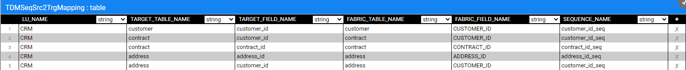
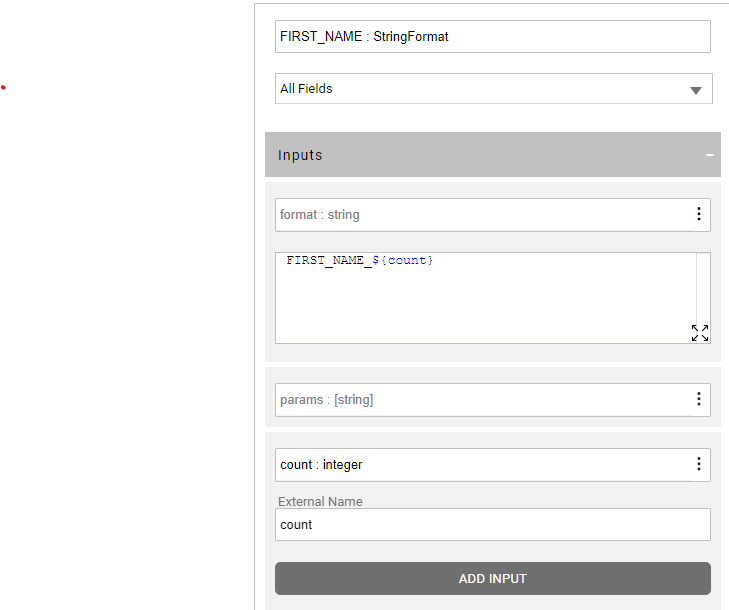
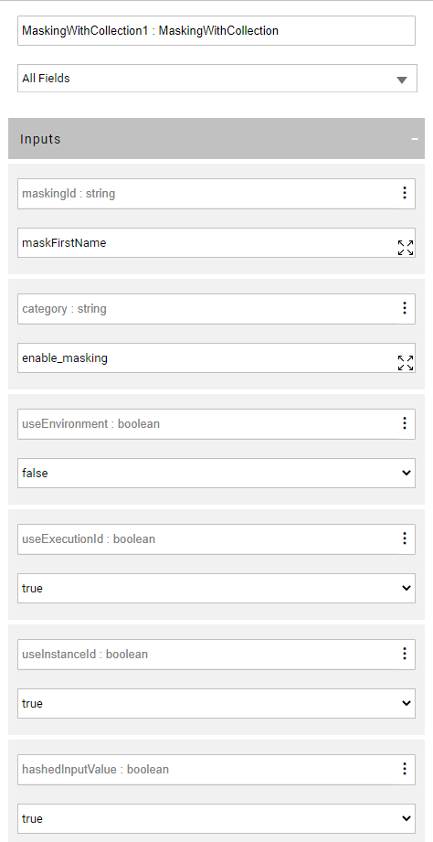

# Data Generation Implementation

The TDM data generation creates synthetic entities. The synthetic data is populated into the LU tables: an LU table can be populated either with a source data or a generated synthetic data.  

## LU Populations Implementation

The LU population must be based on Broadway flow (instead of a DB Query or a root function) to support a synthetic data generation: the **sourceDbQuery** Actor was enhanced by Fabric 7.1 to support both population modes: a DB select from a data source or a synthetic population. The population mode is set based on the **ROWS_GENERATOR** key. If it is set to **true**, the sourceDbQuery runs the data generation inner flow to generate the synthetic records. The number of synthetic records per each parent key is set based on the  **rowsGeneratorDistribution** input actor.

### LU Population Flows - Implementation Steps

1. Generate the LU population Broadway flows on the LU tables. Note that you need to use the **populationRootTable.pop.flow** for the main source LU table. For other LU tables generate thew default population flow.

   #### LU Population - Optional Step:

   The **rowsGeneratorDistribution** input argument of the **sourceDbQuery** Actor is automatically generated as an external parameter with the following naming convention: 

   ```
   [lu name]_[lu table name]_number_of_records
   ```

   For example: crm_activity_number_of_records. 

   This enables the user to edit the number of generated records per LU table in the TDM task. 

   

2. Edit the default number of generated synthetic records: edit the default values of the **rowsGeneratorDistribution** input argument of the **sourceDbQuery** Actor. By default it generates 1 record for the main LU table and 1-3 records for the remaining LU tables.

## Data Generation Flows Implementation

The **sourceDbQuery** Actor runs the inner data generation flow if the **ROWS_GENERATOR** key is **true**. The data generation inner flow must have the following naming convention:

```
${population name}.population.generator
```

For example:  activity.population.generator

### Data Generation Flows - Implementation Steps

#### 1. Sequence handling 

Populate the **tdmSeqList** and **TDMSeqSrc2TrgMapping**  tables before generating the data generation flows. 

Click [here](/articles/TDM/tdm_implementation/11_tdm_implementation_using_generic_flows.md#step-2---create-sequences) for more information about the sequence implementation.

This step is needed in order to add a sequence generation in the data generation flow for fields that are set in the **TDMSeqSrc2TrgMapping**  table. The generated flow creates a DB sequence in the TDM DB for the generated ID.  The created DB sequence has the following naming convention:

```
[gen]_[the sequence name in TDMSeqSrc2TrgMapping]
```


**Example:**

Customer, contract and address CRM LU's tables have the following sequence mapping:      




The data generation flows of these tables create the gen_customer_id_seq, gen_address_id_seq, and gen_contract_id_seq DB sequences in the TDM DB and populate the customer_id, address_id, and contract_id fields based on the generated sequences.


#### 2. Generate the data generation flows for the LU table

- Open the **createGenerateDataTableFlows** flow imported from the TDM library.
- Populate the **LU_NAME** and **OVERRIDE_EXISTING_FLOWS** input parameters.
- Run the flow to create the data generation flows for the LU's tables except the tables populated in the [TDMFilterOutTargetTables](/articles/TDM/tdm_implementation/11_tdm_implementation_using_generic_flows.md#step-1---define-tables-to-filter-out). The data generation flows are automatically created in the **GeneratorFlows** sub directory under the Broadway directory of the LU.

The data generation flows are created with the following logic:

- Parent keys are populated into the LU tables based on the parent-child LU schema definition. For example: the address LU table is linked to the customer LU table by the customer_id field. The customer_id generated for the customer LU table is sent to the address' population in the parent row and is mapped to address.customer_id.

- Sequence actors are set for IDs fields mapped in **TDMSeqSrc2TrgMapping**.

- Other fields are populated with default data generation Actors based on the fields' data type. Note the the default  data generation Actors are set in **GenerateDataDefaultFieldTypeActors** constTable (imported from the TDM library) in the Shared Object. This table can be edited to change the default Actors mapped to the LU table fields by the createGenerateDataTableFlows flow.

-  The data generation flow returns multiple results that serve as the row columns.  It means that the [rowsGenerator Actor](/articles/19_Broadway/actors/07a_data_generators_actors.md#rowsgenerator) handles the loop on parent rows and number of rows per each parent it.

  

#### 3. Edit the data generation flow

 The following manual updates may be required on the data generation flows:

##### Data Generators

- Replacement of the default data generation actors with other [data generators](/articles/19_Broadway/actors/07a_data_generators_actors.md) or custom inner flows.

##### PII Fields

- Populate them with an initial value of the field name + records no. For example: first_name_1. The record number is sent to the data generation flow by the [RowsGenerator](/articles/19_Broadway/actors/07a_data_generators_actors.md#rowsgenerator) Actor in the **count** parameter. These fields will get their value from the PII masking actors in the LU population flow. Using the masking actors on the PII fields ensures the referential integrity of the data, in case this field is set in multiple LU tables or multiple LUs. 

  Example: 

  The first_name is populated with with the concatenation of the filed name the the count external parameter:

  

  


The first_name is masked in the LU population flow before it is loaded to the LU table. The **useInstanceId** is set to **true** to have a different masked value on each generated customer.  Note that the TDM 8.0 added the **root_id** to the caching key, in order to maintain the **referential integrity on PII fields across different LUs of the task’s BE**.




​	Click [here](/articles/19_Broadway/actors/07_masking_and_sequence_actors.md) for more information about the masking Actors.

##### External Business Parameters

- Add external business parameters to the data generation flow to enable the user to set the values for these parameters in the TDM task. parameters. For example: City, State. The editor of the parameter depends on the parameter type.

  Click [here](15_tdm_integrating_the_tdm_portal_with_broadway_editors.md) for more information about the integration of the TDM portal with the Broadway editors and the implementation guides for MTable and Distribution parameters.

##### Handle the Loop over the Number of Records

There are several options for the data generation inner flow:

- **Row by row** - the inner flow can return a single row and let the RowsGenerator Actor handle parent rows and number of rows per parent. The flow can return either multiple results that will serve as the row columns or a single result named **result** of a map type. 
- **Rows per parent** - if the inner flow returns a single result named **result** with a **collection of maps**, the actor will collect them and move to the next parent row.
- **Handle all parent rows** - a flow can traverse the parent_rows and return a **collection of maps**. The actor will return these rows and will not call the inner flow again.

The data generation flow returns multiple results that will serve as the row columns and is executed in the **row by row**. You can edit the data generation flow to by executed in the **rows per parent** or **handle all parent rows** as explained above.

For example, generating 2-5 open cases and 1-6 close cases per activity requires using the 'rows per parent' mode.

Click [here](/articles/19_Broadway/actors/07a_data_generators_actors.md#rowsgenerator) for more information about the RowsGenerator Actor.


[](14_tdm_implementation_supporting_non_jdbc_data_source.md)[](tdm_fabric_implementation_environments_setup.md)