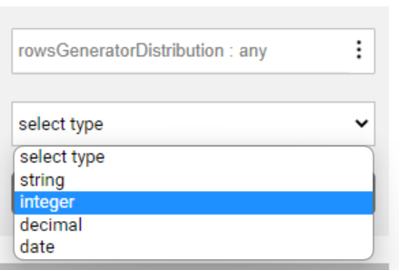
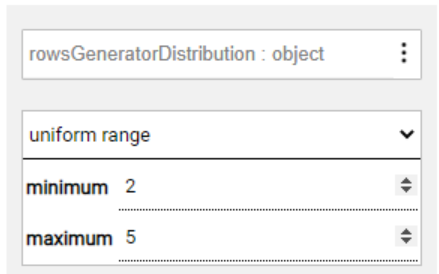
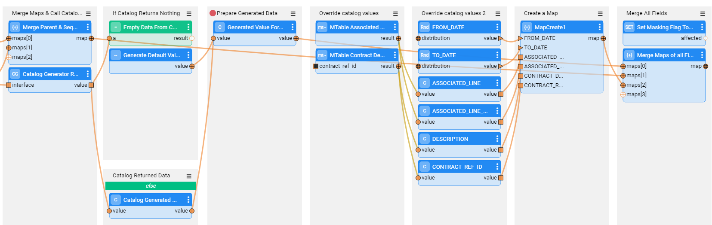

# Rule-Based Data Generation Implementation

The TDM data generation creates synthetic entities based on rules or AI. The synthetic data is populated into the LU tables, where an LU table can be populated with either source data or generated synthetic data.  The following article describes the **rule-based** data generation implementation.

## Implementation of Logical Unit Population 

The LU population must be based on a Broadway flow (instead of on a DB Query or a root function) to support synthetic data generation. Thus, the **sourceDbQuery** Actor was enhanced by Fabric 7.1 to support either one of the following two population modes: a DB Select query from a data source or a synthetic population. The population mode is set based on the **ROWS_GENERATOR** key (session variable). When set to **true**, the **sourceDbQuery** Actor runs the data generation inner flow to generate the synthetic records. The number of synthetic records created for each parent key is set based on the **rowsGeneratorDistribution** input Actor.

### LU Population Flows - Implementation Steps

1. Verify that the LU tables' populations are based on a Broadway flow in order to support the synthetic data generation. Note that you need to use the **populationRootTable.pop.flow** for the main source LU table. For other LU tables, generate the default population flow.


2. **Optional** - **edit the default number of generated synthetic records** - the data generation process needs to 'know' how many records have to be generated on each LU table. For example, indicate how many addresses should be generated for a synthetic customer.
  
   The **rowsGeneratorDistribution** input argument of the **sourceDbQuery** Actor (named *Query*) in each LU table's population flow sets the number of generated records for each table. By default, it generates 1 record for the main LU table and 1-3 records for the remaining LU tables. The values of 1 and 3 are set in **TABLE_DEFAULT_DISTRIBUTION_MIN** and **TABLE_DEFAULT_DISTRIBUTION_MAX** [TDM general parameters](/articles/TDM/tdm_configuration/02_tdmdb_general_parameters.md#data-generation-parameters).

   *Edit options:*

   The following methods can be used to override the number range of generated records in the TDM implementation:
   
   i. Edit the default number range of generated records (set to 1-3 by default): Update the
   **TABLE_DEFAULT_DISTRIBUTION_MIN** and **TABLE_DEFAULT_DISTRIBUTION_MAX** parameters in the TDM DB. This edit will impact the number of generated records on all LU tables, except for the main source LU table.
   
   Example:
   Run the following Update statements in order to set the number of generated records to 2-4:
   
    ```sql
   UPDATE tdm_general_parameters set param_value = '2' where param_name = 'TABLE_DEFAULT_DISTRIBUTION_MIN';
   
   UPDATE tdm_general_parameters set param_value = '4' where param_name = 'TABLE_DEFAULT_DISTRIBUTION_MAX';
    ```
   

   ii. Edit the **rowsGeneratorDistribution** input argument in the LU population flow in order to set a different range (minimum and maximum values) or a distribution type (the default is **Uniform distribution**) of generated records for a given LU table, if needed. For example, generate customers with 3-6 contracts. The data generation randomly generates a number of records within this range:

   - Set the type of the distributed value to **integer**:

     
   
   

   - Then, edit the distribution type and/or the minimum and maximum values, as seen in the below example:

     
   
     
   
   Click [here](/articles/TDM/tdm_implementation/15_tdm_integrating_the_tdm_portal_with_broadway_editors.md#distribution-editor) for more information about the distribution types. 
   
   - If you edit the **rowsGeneratorDistribution** input argument, you must set it to be an **External parameter** with the following naming convention: 
   
   ```
   [lu name]_[lu table name]_number_of_records
   ```
   
   Notes:
   - If the **rowsGeneratorDistribution** input argument is edited, but **not** set to be an **External parameter**, the parameter cannot be overridden by the TDM task.
   
   - If the **rowsGeneratorDistribution** input argument is not edited, it is automatically generated behind the scenes as an [external parameter](#external-business-parameters) with the following naming convention: 
   
       ```
       [lu name]_[lu table name]_number_of_records
       ```
       
       For example: crm_address_number_of_records. 
       
       The external parameter **enables the user to override the number range of generated records** for each table in the TDM task. For example, ask to generate customers with 2-4 addresses and 3-6 contracts each.

3. **Optional** - **exclude the number of records for selected tables from the external parameters that can be set in the task.** For example, always generate 1 address per customer. Do not enable the tester to set the number of generated addresses per customer in the task.  Populate the excluded LU name and LU table in **IgnoreGenerateTableDistList** MTable to disable the number of records for selected tables by the task creator.


## Implementation of Data Generation Flows 

The **sourceDbQuery** Actor (automatically added to the LU population flow and named *Query*) runs an inner data generation flow to generate synthetic records for data generation tasks.
The data generation flows must be created on each source LU table to support synthetic data generation.

The data generation flow must have the following naming convention:

```
${population name}.generator
```

For example: activity.pop.generator

Note that a synthetic data generation task execution sets the **ROWS_GENERATOR** key (session variable) to **true**, which triggers the execution of the data generation inner flow on each LU table.

From TDM 8.1 onwards, the data generation flow is integrated with [Fabric catalog](/articles/39_fabric_catalog/01_catalog_overview.md) to generate synthetic data based on the fields' type. Additionally, TDM supports the data generation of synthetic data without Fabric catalog, in case the catalog is not implemented in the TDM project.


### Data Generation Flows - Implementation Steps

#### 1. Sequence handling 

The **tdmSeqList** and **TDMSeqSrc2TrgMapping** [sequence](11_tdm_implementation_using_generic_flows.md#step-2---create-sequences) tables must be populated before generating the data generation flows. 

This is required in order to add a sequence generation in the data generation flow for sequence fields (set in the **TDMSeqSrc2TrgMapping** table). The generated flow sets the **sequenceId** input argument, which is created in the TDM DB for the generated ID with the following naming convention:

```
Gen_[the sequence name in TDMSeqSrc2TrgMapping]
```

**Example:**

The customer, contract and address tables of the CRM LU have the following sequence mapping: 


The data generation flows of these tables create the gen_customer_id_seq, gen_address_id_seq, and gen_contract_id_seq DB sequences in the TDM DB and populate the customer_id, address_id, and contract_id fields based on the generated sequences.


#### 2. Generate the data generation flows for the LU table

In order to create the data generation flows, run either:

I. [TDMInitFlow](05_tdm_lu_implementation_general.md#ii-run-the-tdmluinit-flow) flow. Set the **CREATE_GENERATE_FLOWS** input parameter to **true**. Note that this flow is designed to run one time, when creating an LU, and it also adds the TDM tables to the LU. If the LU already contains the TDM tables, it is recommended to run the **createAllFromTemplates** flow (see the below line) to add the target tables to the LU.

II. [createAllFromTemplates flow](11_tdm_implementation_using_generic_flows.md#step-3---create-load-and-delete-flows). Set the **CREATE_GENERATE_FLOWS** input parameter to **true**.

III. **createGenerateDataTableFlows** flow:

- Deploy both the **LU**, for which you need to generate the data generation flows, and the **TDM LU** to Fabric debug server.

- Open the **createGenerateDataTableFlows** flow imported from the TDM library.

- Populate the **LU_NAME** and **OVERRIDE_EXISTING_FLOWS** input parameters. 

- Run the flow to create the data generation flows for the LU tables, except for the tables populated in the [TDMFilterOutTargetTables](/articles/TDM/tdm_implementation/11_tdm_implementation_using_generic_flows.md#step-1---define-tables-to-filter-out), whose **generator_filterout** checkbox is checked (true). The data generation flows are automatically created in the **GeneratorFlows** subdirectory, under the Broadway directory of the LU.

  

The following data generation flows are created for each LU table:

1. Data generation flow. This flow has the following naming convention:  `${population name}.generator` .

    Example: contract.pop.generator

2. From TDM 8.1 onwards, the template also creates an inner flow that sets default values on the table fields based on their types. This inner flow is called when Fabric catalog is not implemented in the TDM project. The inner flow has the following naming convention: `${table name}.typeDefaultsGenerator` .

    Example: contract.typeDefaultsGenerator


##### 	Data Generation Flow Logic

​	The data generation flows are created with the following logic:

- IDs:
  - The data generation flow sends the parent IDs to the child table's population based on the parent-child LU schema definition.
  For example, the Address LU table is the child of the Customer LU table. It is linked to the Customer LU table by the customer_id field. A new customer_id sequence is generated for the Customer LU table. The Address' data generation flow gets the **parent_row** as the input, and it maps the parent customer_id in the Address record.

  - IDs that are not linked to a parent LU table are populated by the Sequence Actors based on the fields mapped in **TDMSeqSrc2TrgMapping**.

- Other fields are populated with synthetic data:

  - By default, this process calls the **CatalogGeneratorRecord** Actor to get the generated values from [Fabric catalog](/articles/39_fabric_catalog/01_catalog_overview.md) based on the fields' catalog specification if set, and the field type (if no specification is set, a default value is generated for the field based on its type).

  - If no data is returned by the CatalogGeneratorRecord Actor (Fabric catalog is not implemented), then the flow calls the `${table name}.typeDefaultsGenerator` inner flow to utilize  data generation Actors based on the fields' data type. Note that these default data generation Actors are selected based on the mapping defined in the **GenerateDataDefaultFieldTypeActors** constTable (imported from the TDM library under the Shared Objects). This table can be edited to change the default Actors' mapping and should be edited before the creation of the data generation flows.

- The data generation flow output contains a **Map** with a list of fields that are sent to the related LU population flow and that are loaded to the LU table as a row column. Note that the data generation flow is called by a loop and returns a single record on each call. The loop on the parent rows as well as the loop on each parent ID is handled by default by the [rowsGenerator Actor](/articles/19_Broadway/actors/07a_data_generators_actors.md#rowsgenerator).

  

#### 3. Edit the data generation flow

 The following manual updates may be required on the data generation flows:

##### Data Generators

- Replacement of the default data generation Actors with other [data generators](/articles/19_Broadway/actors/07a_data_generators_actors.md) or custom inner flows. This needs to be done in later flow stages, after the **Prepare Generated Data** stage (after calling the **CatalogGeneratorRecord** Actor or the `${table name}.typeDefaultsGenerator` inner flow).

- The overridden fields must be added to a Map. The Map needs to be sent as the last parameter to the **Merge Maps of all Fields** Actor in the data generation flow.

  In the below example flow, the logic to generate the Associated_line, Associated_line_fmt, Contract_ref_id, and Description fields is overridden using MTables instead of the default generated values. These fields are added to a Map and are sent to the **Merge Maps of all Fields** Actor:

  

##### PII Fields

- In general, **it is recommended to populate the PII fields in the data generation flow** and to avoid overriding them with the Masking Actors in the LU population flow. Such population enables exposing PII fields as [external business parameters](#external-business-parameters) for the data generation tasks without overriding their values (as set by the user) by the Masking Actors in the LU population.
- Verify that the [Masking Sensitive Data](/articles/TDM/tdm_gui/08_environment_window_general_information.md#masking-sensitive-data) checkbox is clear for the **Synthetic** environment in the TDM Portal, in order to avoid masking PII fields in the LU population flows for data generation tasks.
- TDM 8.1 has added a new Actor: **GenerateConsistent**. This Actor inherits the **Masking** Actor, but it has its own **category** value: **generate_consistent**. Using this Actor in the data generation flow ensures the referential integrity across LUs for the generated field.
- Notes:
    - The TDM execution process sets the **generate_consistent** key to **true** on data generation tasks. 
    - The new Actor does not require having an input value since there is no original value for newly generated synthetic entities.
    - If you have a PII field that exists across LUs and is set in multiple records in the LUI, you need to use a **Masking** Actor instead of the **GenerateConsistent** Actor. For example, a customer can have multiple contracts and each contract needs to have a different name. The contracts exist in both LUs - CRM and Billing. Populate the Masking Actor's input parameters in the data generation flow as follows:
        - **value**: populate it with an initial value of the field name + the record number, e.g., first_name_1, first_name_2, etc. The record number is sent to the data generation flow by the RowsGenerator Actor in the **count** parameter.

      See example below:

      
      
        - **category**: populate it with **generate_consistent** value.
  
- PII fields can vary in their incidence and in their need for referential integrity (consistency). Each scenario requires a different implementation approach.

  Example: The First Name and Last Name are located in both LUs - CRM and Billing. Each LU represents a different system. It is required to keep the same combination of the First and Last Names in both LUs for a given customer.

  The following table describes the implementation recommendations for each scenario: 

<table width="900pxl">
<tbody>
<tr>
<td width="250pxl">
<p><strong>PII field incidence</strong></p>
</td>
<td width="150pxl">
<p><strong>Referential integrity</strong></p>
</td>
<td width="500pxl">
<p><strong>Implementation Recommendation</strong></p>
</td>
</tr>
<tr>
<td width="250pxl">
<p>The PII field exists only in one LU table</p>
</td>
<td width="150pxl">
<p>N/A</p>
</td>
<td width="500pxl">
<p>Use a data generator Actor to generate a random synthetic value</p>
</td>
</tr>
<tr>
<td width="250pxl">
<p>The PII field exists in multiple tables in the LU</p>
</td>
<td width="150pxl">
<p>N</p>
</td>
<td width="500pxl">
<p>Use a data generator Actor to generate a random synthetic value</p>
</td>
</tr>
<tr>
<td width="250pxl">
<p>The PII field exists in multiple tables in the LU</p>
</td>
<td width="150pxl">
<p>Y</p>
</td>
<td width="500pxl">
<p>2 alternatives:</p>
<p>1. Use a data generator Actor for one of the field's instances and then select the generated value and populate it into the remaining instances.</p>
<p>2. Use the new TDM 8.1 Actor - <strong>GenerateConsistent&nbsp;</strong> - for all the field's instances to keep the referential integrity of the instances.</p>
</td>
</tr>
<tr>
<td width="250pxl">
<p>The PII field exists in multiple LUs</p>
</td>
<td width="150pxl">
<p>N</p>
</td>
<td width="500pxl">
<p>Use a data generator Actor to generate a random synthetic value</p>
</td>
</tr>
<tr>
<td width="250pxl">
<p>The PII field exists in multiple LUs</p>
</td>
<td width="150pxl">
<p>Y</p>
</td>
<td width="500pxl">
<p>Use the new TDM 8.1 Actor - <strong>GenerateConsistent&nbsp;</strong> - for all the field's instances to keep the referential integrity of the instances.</p>
</td>
</tr>
</tbody>
</table>


​	Click [here](/articles/19_Broadway/actors/07_masking_and_sequence_actors.md) for more information about the masking Actors.

##### External Business Parameters

- Add external business parameters to the data generation flow, such as City and State, to enable the user to set their values in the TDM task's parameters if the user wishes to override the parameter's default value as set in the TDM implementation. The editor of the parameter depends on the parameter type. Spaces and special characters, except for an underscore, must not be included in the External Name setting. 

  Click [here](15_tdm_integrating_the_tdm_portal_with_broadway_editors.md) for more information about the integration of the TDM portal with the Broadway editors and the implementation guides for MTable and Distribution parameters.

##### Handle the Loop over the Number of Records

There are several optional modes for the data generation inner flow:

- **Row by row** - this is the recommended approach and it is implemented by the data generation flows. The inner flow returns a single row and lets the RowsGenerator Actor handle parent rows and the number of rows per parent ID. The flow can return either multiple results that will serve as the row columns or a single result named **result** of a **Map** type.

Note that you can edit the data generation flow to be executed in different modes if needed: 

- **Rows per parent** - generate all records for each input parent ID. For example, generating 2-5 open cases and 1-6 close cases per each parent activity ID requires using the 'rows per parent' mode.
- **Handle all parent rows** - generate all records for all input parent IDs. The Actor will return these rows and will not call the inner flow again.


Click [here](/articles/19_Broadway/actors/07a_data_generators_actors.md#rowsgenerator) for more information and examples about the RowsGenerator Actor.


[](15_tdm_integrating_the_tdm_portal_with_broadway_editors.md)[](tdm_fabric_implementation_environments_setup.md)
