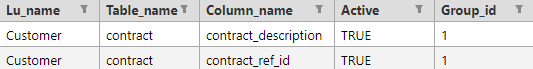

# AI-Based Generation Implementation

TDM 9.0 adds integration with AI-based entities' generation (currently limited to a non-hierarchical BE). K2view TDM supports 2 modes of synthetic entities' generation:

- Rule-based generation
- AI-based generation

The user who creates the task can select either one of these methods to generate synthetic entities by the task. The AI-Based data generation supports only one LU (one schema).

The diagram below describes the TDM and AI integration:

## Training Task

The training task creates the training models on the LU schema tables. This is a pre-requisite for AI-based data generation since the generation is based on a selected training model. 

The following diagram describes the execution of AI training task:

## AI-Based Generation Task

The AI-based data generation task generates synthetic entities based on a selected training model. The generated entities are imported to the Test data store (Fabric) and can be loaded to any target environment.

The following diagram describes the execution of AI training task:

## Implementation Stpes

### AI Globals

The following shared Globals have been added for the AI-based data generation:

- **AI_K2SYSTEM_INTERFACE**  - the name of the AI k2system interface. Default value is **AI_DB**. 
- **AI_ENTITIES_INTERFACE**  - the name of the AI LU schemas interface.  Default value is **AI_DB**. 
- **CREATE_AI_K2SYSTEM_DB** - this Global indicates if the TDM deploy flow needs to create the AI k2system  tables if not exist. The default value is **false**. Set this Global to **true** in order to implement the AI-based data generation.
- **AI_ENVIRONMENT**  -  this is the name of the AI dummy environment. The default value is  **AI**. 

###  AI Interfaces

- **AI_DB** - this interfaces must be active in order to enable the AI-based generation functionality. The TDM portal does not allow to create AI-based training or generation tasks if this interface is inactive. You can set the same connection details as the TDM DB if you wish to include the AI schemas in the TDM DB.
- **AI_Execution** - this interfaces must be active in order to enable the AI-based generation functionality. The TDM portal does not allow to create AI-based training or generation tasks if this interface is inactive. fabirc interacts with k8 server using this HTTP/HTTPS interface for more information check https://github.com/k2view-academy/K2View-Academy/blob/Academy_8.0_TDM_9.0/articles/98_maintenance_and_operational/Installations/Docker/TDM/TDM_AI_Installation_V9.0.md#admin-token 
### AI Environment
Add the AI environment to [Fabric environments](tdm_fabric_implementation_environments_setup.md) and [TDM portal](/articles/TDM/tdm_gui/10_environment_roles_tab.md#ai-environment---permission-set). 

### AI MTables 

The TDM 9 has 2 optional configuration tables for the AI-based training and generation processes:

#### TrainingMappingTables.csv

Mapping fields are more likely to be columns of low cardinality for example  contract_description and contract_ref_id, but also have another property: the pairs or triplets or more connected by group id field in the mtable that are given as mapping_table_columns, are considered to have a one-to-one relationship.
For example for the contract_description-contract_ref_id pair we always ensure that 'Unlimited call' only pairs with 101. That means that is ensures that the generated values for the mapping fields, always come from source data.

#### TrainingSpecialFields.csv

It is optional to add some values to the column_name in TrainingSpecialFields Mtable. The system auto-detects the columns that should be treated as special fields. You can come on top of the auto-detection and, with your business knowledge, override the special fields either by setting any of them as true or false. 
Special fields are considered the columns that have a high cardinality (above the default threshold set in training execution params), for these fields, the data generation generates values that do not come directly from the original data. **The generated values do not need to be real, just look realistic**. In some cases the **definition** of a field as a special param needs to be **overridden**. 

For example, do not define a city as a special param, since the data generation process needs to generate real values for a city:

#### Notes
  - **a special field cannot be a mapping field simultaneously.**
  - **Primary and foreign keys columns as well as columns that are not string type cannot be overridden as being special fields.**

### K2system 
- Creation of the K2system schema/tables: 
     - it will be done by the TDM deploy flow if the AI global is set to true see globals above
     - these created tables are populated by the TDM AI Task and The AI Job: 
              - task_executions: This table holds all the task executions for all the task types.
              - task_execution_stats: A table that should be updated during the job execution. Will be holding any informative statistics/metrics that might be useful for later analysis.
              - entity_list: A table with all the entities relevant to an existing training/generation job.

### Overriding Generated Values

- It is possible to define a post execution flow that gets the generated entities and updates them if needed.

### Cleanup Process 
https://github.com/k2view-academy/K2View-Academy/blob/Academy_8.0_TDM_9.0/articles/98_maintenance_and_operational/Installations/Docker/TDM/TDM_AI_Installation_V9.0.md#manual-cleanup-flow
