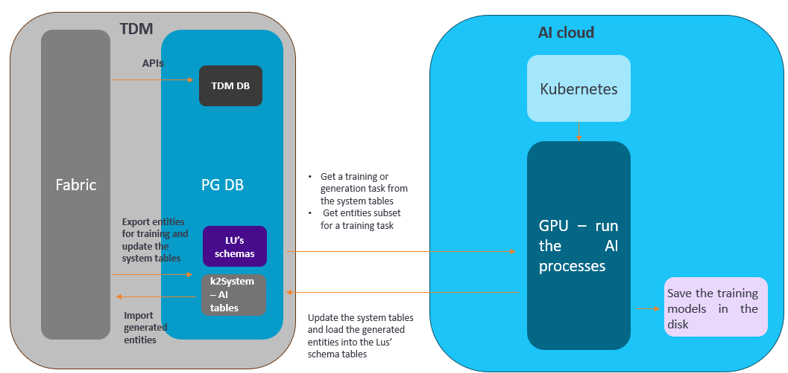
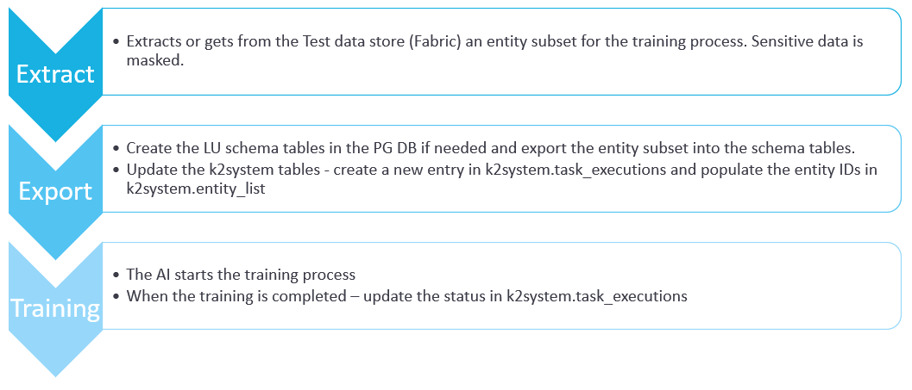
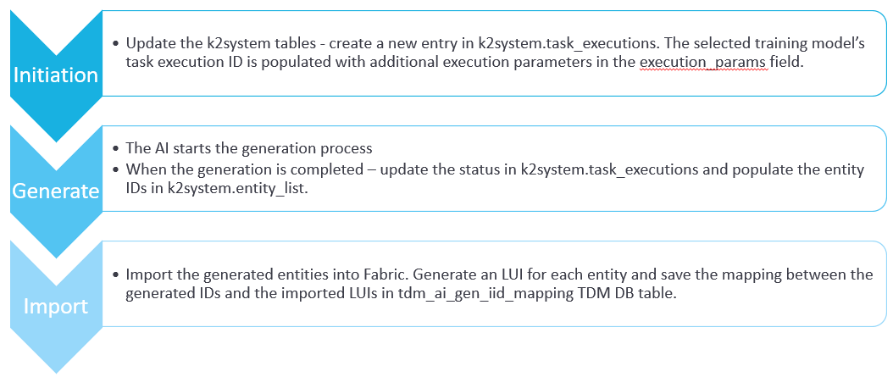
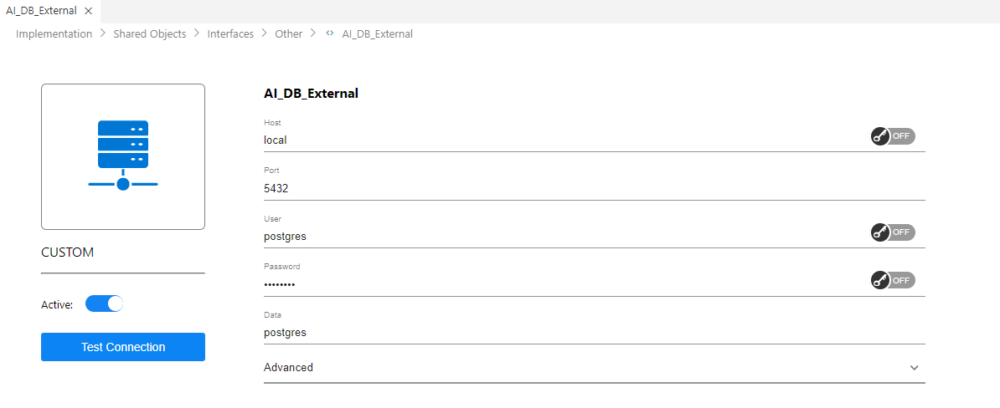
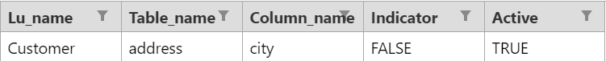

# AI-Based Generation Implementation

TDM 9.0 adds integration with AI-based entities' generation (currently limited to a non-hierarchical BE). K2view's TDM supports 2 modes of synthetic entities' generation:

- Rule-based generation
- AI-based generation

The user, who creates the task, can select either one of these methods to generate synthetic entities by the task. The AI-based data generation supports only one LU (one schema).

The diagram below describes the TDM and AI integration:

## Training Task

The training task creates the training models on the LU schema tables. This is a prerequisite for AI-based data generation since the generation is based on a selected training model. 

The following diagram describes the execution of the AI training task:

## AI-Based Generation Task

The AI-based data generation task generates synthetic entities based on a selected training model. The generated entities are imported to the Test Data Store (Fabric) and can be loaded to any target environment.

The following diagram describes the execution of the AI training task:

## Implementation Steps

### AI Globals

The following shared Globals have been added for the AI-based data generation:

- **AI_DB_INTERFACE** - the name of the AI DB interface. Default value is **AI_DB**. 
- **CREATE_AI_K2SYSTEM_DB** - this Global indicates if the TDM deploy flow needs to create the AI k2system tables if not exist. The default value is **false**. Set this Global to **true** in order to implement the AI-based data generation.
- **AI_ENVIRONMENT** - this is the name of the AI dummy environment. The default value is **AI**. 

###  AI Interfaces

- **AI_DB** - this Postgres interface must be active in order to enable the AI-based generation functionality. The TDM portal does not allow creating AI-based training or generation tasks if this interface is inactive. You can set the same connection details as the TDM DB if you wish to include the AI schemas in the TDM DB.
- **AI_Execution** - this interface must be active in order to enable the AI-based generation functionality. The TDM portal does not allow to create AI-based training or generation tasks if this interface is inactive. 
- **AI_DB_External** - this custom interface must be active in order to enable the AI-based generation functionality. We utilize this custom interface to securely allow Fabric to interact with the [k8 server](/articles/98_maintenance_and_operational/Installations/Docker/TDM/TDM_AI_Installation_V9.0.md#admin-token), this interface should hold the same credentials as AI_DB interface, and the Data field should be populated with your database name.
  
  Click [here](https://support.k2view.com/Academy/articles/24_non_DB_interfaces/07_custom_interface.html) for more information about Custom Interface.
  Click [here](/articles/98_maintenance_and_operational/Installations/Docker/TDM/TDM_AI_Installation_V9.0.md#admin-token) for more information about the TDM with AI installation. 

### AI Environment
Add the AI environment to [Fabric environments](tdm_fabric_implementation_environments_setup.md) and [TDM portal](/articles/TDM/tdm_gui/10_environment_roles_tab.md#ai-environment---permission-set). 

### AI MTables 

#### TrainingSpecialFields.csv

This is an optional table that enables the addition of some values to the column_name in TrainingSpecialFields Mtable. The system auto-detects the columns that should be treated as special fields. You can come on top of the auto-detection and, with your business knowledge, override the special fields either by setting any of them as true or false. 
Special fields are considered the columns that have a high cardinality (above the default threshold set in training execution params), for these fields, the data generation generates values that do not come directly from the original data. **The generated values do not need to be real, just look realistic**. In some cases the **definition** of a field as a special param needs to be **overridden**. 

For example, do not define a city as a special param as the data generation process has to generate real values for a city:

#### Notes
  - **Primary and foreign keys** columns, as well as columns that are **not string type, cannot be overridden as being special fields.**

### K2system schema tables 
- Creation of the K2system schema/tables: 
     - It will be done by the TDM deploy flow if the CREATE_AI_K2SYSTEM_DB global is set to true.
     - These created tables are populated by the TDM AI Task and The AI Job:
       
              - Task_executions: This table holds all the task executions for all the task types.
              - Task_execution_stats: A table that should be updated during the job execution. Will be holding any informative statistics/metrics that might be useful for later analysis.
              - Entity_list: A table with all the entities relevant to an existing training/generation job.
       

### Overriding Generated Values

- It is possible to define a post-execution flow that gets the generated entities and updates them if needed.

### LU Implementation
Verify that all LU source tables have a PK. The PK is required for the AI-based training and generation tasks.

#### LU Schema Update
If the LU schema is updated, the next training task execution will drop and recreated the schema tables for the updated LU.

### Cleanup Process 
The cleanup of the AI execution server and the AI DB is a manual process running a dedicated flow. Click [here](/articles/98_maintenance_and_operational/Installations/Docker/TDM/TDM_AI_Installation_V9.0.md#manual-cleanup-flow) for more information about the AI cleanup process.
