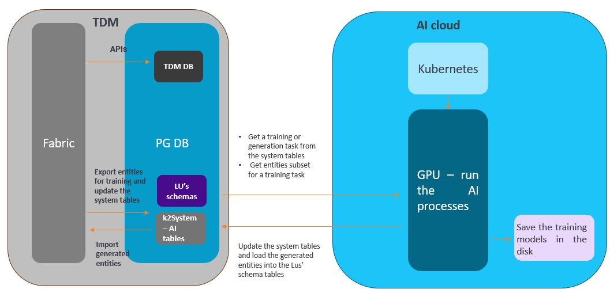
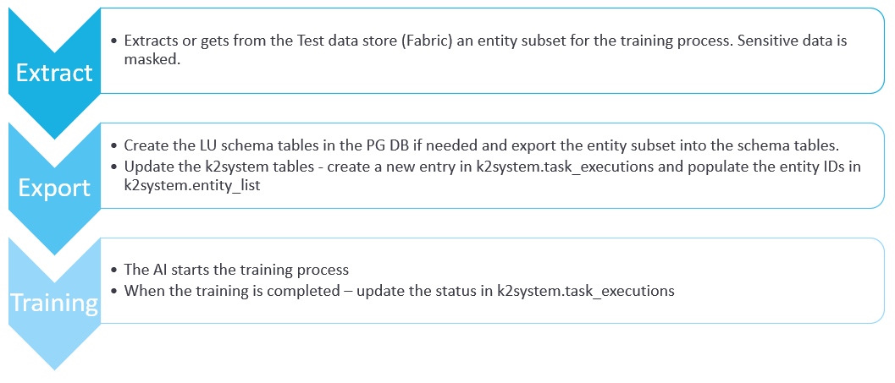
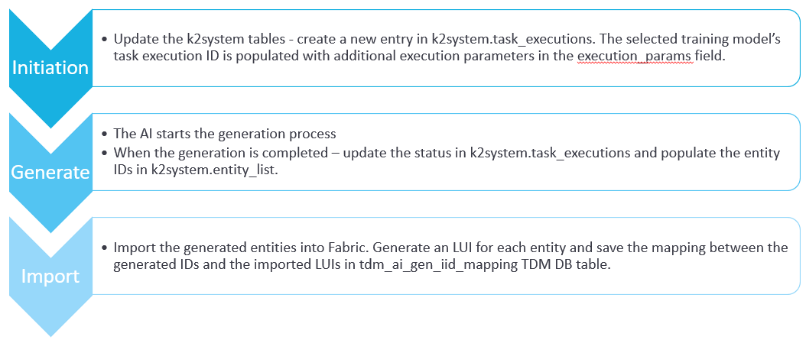
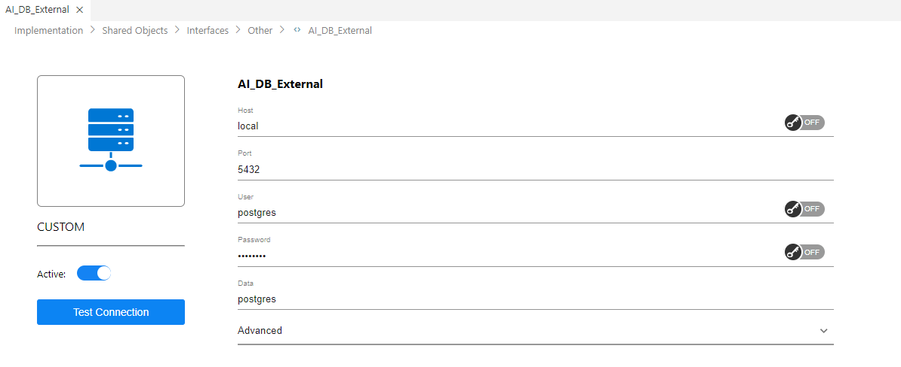
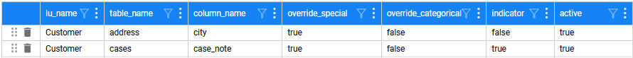
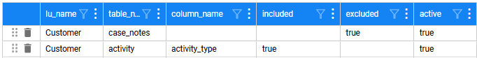
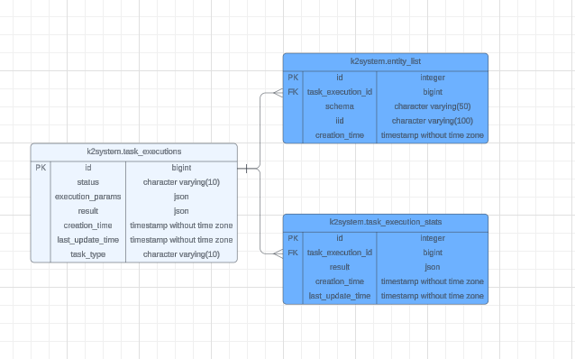

# AI-driven Synthetic Data Generation

TDM V9.0 adds integration with AI-based entities' generation (currently limited to a non-hierarchical BE). K2view's TDM supports two methods of generating synthetic entities:

- Rule-driven generation
- AI-driven generation

The user who creates the task can select either of these methods to generate synthetic entities for the task. The AI-based data generation supports only one LU (one schema).

The diagram below describes the integration between TDM and AI:

## Training Task

The training task creates the training models on the LU schema tables. This is a prerequisite for AI-based data generation, as data generation is based on a selected training model. 

The following diagram describes the execution of the AI training task:

## AI-based Generation Task

The AI-based data generation task generates synthetic entities based on a selected training model. The generated entities are imported into the Test Data Store (Fabric), from which they can be loaded into any target environment.

The following diagram describes the execution of the AI training task:

## Implementation Steps

### AI Globals

The following shared Globals have been added to the AI-based data generation:

- **AI_DB_INTERFACE** — the name of the AI DB interface. The default value is **AI_DB**. 
- **CREATE_AI_K2SYSTEM_DB** — this global indicates whether the TDM deploy flow should create the AI K2system tables if they do not already exist. The default value is **false**. Set this Global to **true** to implement AI-based data generation.
- **AI_ENVIRONMENT** — this is the name of the AI dummy environment. The default value is **AI**. 

###  AI Interfaces

- **AI_DB** — this Postgres interface must be active to enable AI-based data generation. If this interface is inactive, the TDM portal does not allow creating AI-based training or generation tasks. Setting the same connection details as the TDM DB would include the AI schemas in the TDM DB.
- **AI_Execution** — this interface must be active to enable AI-based data generation. If this interface is inactive, the TDM portal does not allow creating AI-based training or generation tasks. 
- **AI_DB_External** — this custom interface must be active to enable AI-based data generation. This custom interface is utilized in order to securely allow Fabric to interact with the Kubernetes server [(K8s server)](/articles/98_installation_and_upgrade/Install_TDM/TDM_AI_Installation_V9.x.md#admin-token). The AI_DB_EXTERNAL custom interface should have the same credentials as the AI_DB interface, and the Data field should be populated with your database name.
  

Note: AI interfaces are disabled (inactive) by default. 

  Click [here](/articles/24_non_DB_interfaces/07_custom_interface.md) for more information about Custom Interface.

  Click [here](/articles/98_installation_and_upgrade/Install_TDM/TDM_AI_Installation_V9.x.md) for more information about installing TDM for AI-driven synthetic data generation. 

### AI Environment
Add the AI environment to:
- [Fabric environments](tdm_fabric_implementation_environments_setup.md)
- [TDM portal](/articles/TDM/tdm_gui/10_environment_roles_tab.md#ai-environment---permission-set). Add the related [Systems](/articles/TDM/tdm_gui/11_environment_products_tab.md) to the AI environment in the TDM portal.

### AI Configuration Table
A new ConstTable Actor has been added in TDM V9.4: **AIConfigParams**. This Actor is located in *Implementation/SharedObjects/Broadway/TDM/TDMImplementorActors/* folder and holds the infrastructure configuration parameters, such as cloud provider (GCP, AWS, Azure), AI training/generation/evaluation images, for the AI processes.
Open the AIConfigParams Actor and click the Input's description to view the detailed description of the table's fields. 
Edit the required parameters in this table.

### AI MTables 

#### AISpecialAndCategoricalFields

- This is an optional table that enables to **override** the default field classification of either **special parameters** or **categorical** in the AI training process:

  - **Special parameters** are **text** fields with **high cardinality** (above the default threshold set in training execution params). For these fields, the data generation produces values that do not directly emerge from the original data. **The generated values do not have to be real, but they should appear realistic**. 

  - **Categorical** data is a type of data that is used for grouping information for values with low cardinality. The synthetic data keeps the source values for these fields. An example for categorical data is **gender**.

    

- The **override_special** and **override_categorical** column headings indicate whether to override the default classification of the fields as special parameters or categorical data. One of these fields must be **true** for each record.

- The **indicator** column heading indicates how to override the default behavior: 

​	**Examples**:

- Do not define a city as a special parameter, as the data generation process has to generate real values for a city. Override the special parameters' default classification and set the indicator to false in order to indicate that the city must not be treated as a special parameter field.

- Force the AI to treat the case_note field as a special parameter and generate a realistic dummy value for it. 

- The MTable will be populated as follows:

  

##### Note:
  - **Primary and foreign keys** columns, as well as columns that are not of string type, **cannot be overridden and populated** in this table.
  - Set the **active** column to **true** to include the selected record in AI processing. 

#### AITableFieldsInclusion

- This optional table specifies which tables and/or fields to include in or exclude from the LU schema export to the PG DB, to be used in the AI training process. See example:

  

### K2system Tables 

- Creation of the K2system tables:
     - This shall be done by the TDM deploy flow if the CREATE_AI_K2SYSTEM_DB global is set to true.
     - The **TDM AI task** and **AI job** populate the following created tables:
       
       - Task_executions: This table stores all task executions for all task types.
       - Task_execution_stats: Updated during job execution, this table stores statistics and metrics for later analysis.
       - Entity_list: A table containing all entities associated with an existing training or generation job.
     

### Overriding AI-Generated Values

- In certain cases, it is necessary to fix or override some AI-generated values. This can be done either by defining a post-execution flow that updates the generated entities, or by adding override logic to the load flows to update the values before loading them into the target environment.

### LU Implementation
- Ensure that linked fields in the LU tables share the same data type. Identical data types are necessary for exporting the LU schema to the TDM DB via MDB [(Micro DB)](https://support.k2view.com/Academy/articles/01_fabric_overview/02_fabric_glossary.html#mdb--microdb).
- Verify that the linked fields are defined as either PKs or unique indexes in the parent LU table to support the MDB export of these tables. All the parent LU table's PK/unique index fields must be linked to the child LU table. This is required for creating the FK relation in the PG DB for the exported LU tables.
- The MDB export does not support multiple populations with different links to parent tables. The LU tables must have one link to a parent LU table.

#### LU Schema Update
If the LU schema is updated, the subsequent training task execution will drop and recreate the schema tables for the updated LU.

### Cleanup Process of AI Execution Server and AI DB
The cleanup process for both the AI execution server and the AI DB is manual and runs a dedicated flow. Click [here](/articles/98_installation_and_upgrade/Install_TDM/TDM_AI_Installation_V9.x.md#manual-cleanup-flow) for more information about the AI synthetic data generation cleanup process.

