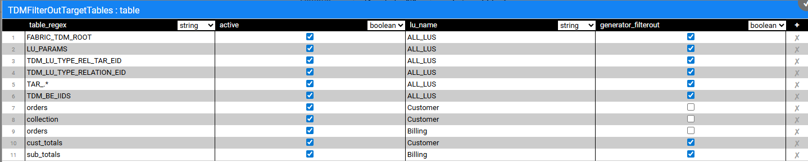

# Exclude LU Tables from Broadway Flow Creation 

The **TDMFilterOutTargetTables** Actor contains a list of LU tables that do not require the creation of load and delete flows. By default, is it populated by both the TDM tables and the [target LU tables](08_tdm_implement_delete_of_entities.md#lu-structure---target-tables) added to the LU for enabling a delete of the entity:

To filter out additional tables, open the **TDMFilterOutTargetTables** Actor and edit its **table** object. The **lu_name** column should be populated as follows:

* ALL_LUS - when a filtered-out table is relevant for all TDM LUs.
* LU name - when a table belongs to a specific LU. In some cases, you may need to add tables to the LU schema in order to get the child IDs and to populate the TDM_LU_TYPE_RELATION_EID TDM DB table. For example, the addition of the Orders table to the Customer LU generates a list of customer orders.

 If a [data generation flow](16_tdm_data_generation_implementation.md) should not be generated for the table, the **generator_filterout** column checkbox needs to be checked (true).

These tables should be added to the **TDMFilterOutTargetTables** Actor as it would prevent the load/delete flows creation for the tables; these tables are already loaded/deleted by the child LUs. 

Following completion of the Actor's update, refresh the project by clicking the  button (top of the Project tree). This act applies the changes in the **TDMFilterOutTargetTables** Actor and deploys the LU. 