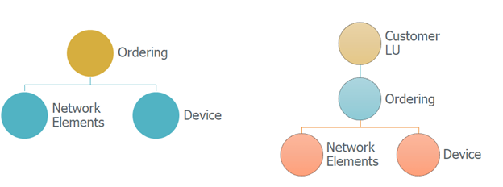

# Business Entity Overview

### What is a Business Entity? 

A Business Entity (BE) represents the central entity of a data selection for provisioning when using the TDM.  A Business Entity can have multiple [LUs]((/articles/03_logical_units/01_LU_overview.md)) with a flat or a hierarchical structure. For example, a Customer Business Entity consists of Customer Care, Billing, Ordering, and Usage LUs.

Each LU can be attached to multiple BEs.

The ability to break a BE into several LUs enables a maximal flexibility and avoiding duplicate development. In addition, defining a hierarchical structure of parent-child LUs enable creating LUs based on the natural root entity of the related data sources instead of forcing a setting of one unified root entities on all the LUs, related to a given BE.

**Example:**

- Customer LU's root entity is Customer ID.
- Ordering LU's root entity is Order ID.
- Network Element LU's root entity is Element ID.
- Device LU's root entity is Device ID.
- Ordering, Network, and Device LUs are attached to two BEs:
  - Customer 
  - Ordering

 

 

- The user can ask to copy a selected list of Customer IDs. The TDM task also copies the related Ordering, Network Elements, and Device data of the selected Customers.
- Alternatively, the user can ask to copy a selected list of Order IDs. The TDM task also copies the related Network Elements and Device data of the selected Orders.

The BEs are defined via the TDM GUI and are saved in the [TDM DB](/articles/TDM/tdm_architecture/02_tdm_database.md).

### Building an LU Hierarchy in a BE

It is possible to define a hierarchy of parent-child LUs under a business entity. The relation between **parent and child** LUs is **one to many**. Each parent LUI can have many children LUIs. 

An LU is called a **Root LU** in a BE if it has no parent LU. In this case, the root entity of this LU equals to the root entity of the BE. 

**Customer #1- Hierarchy – Example:**

 

​                               

Customer LU is the **Root LU** of the Customer BE. Each LU has its own LUs. When creating a TDM task to provision Customer 1,  the TDM task also needs to copy all the related children LUIs the following LUIs are extracted from source and created in Fabric:

 

| LU Name          | Parent LU Name | LU Instances                       |
| ---------------- | -------------- | ---------------------------------- |
| Customer         |                | 1                                  |
| Ordering         | Customer       | 89, 90, 91, 92                     |
| Billing          | Customer       | 10, 11, 12                         |
| Network Elements | Ordering       | 600, 601, 602, 507, 889, 563, 432  |
| Device           | Ordering       | 1000, 1001, 1002, 1003, 1004, 1005 |

 

 <table width="&quot;900">
<tbody>
<tr>
<td valign="top" width="300 pxl">
<strong>LU Name</strong>
</td>
<td valign="top" width="300 pxl">
<strong>Parent LU Name</strong>
</td>
<td valign="top" width="300 pxl">
<strong>LU Instances</strong>
</td>
</tr>
<tr>
<td valign="top" width="300 pxl">
Customer
</td>
<td valign="top" width="300 pxl">
&nbsp;
</td>
<td valign="top" width="300 pxl">
1
</td>
</tr>
<tr>
<td valign="top" width="300 pxl">
Ordering
</td>
<td valign="top" width="300 pxl">
Customer
</td>
<td valign="top" width="300 pxl">
89, 90, 91, 92
</td>
</tr>
<tr>
<td valign="top" width="300 pxl">
Billing
</td>
<td valign="top" width="300 pxl">
Customer
</td>
<td valign="top" width="300 pxl">
10, 11, 12
</td>
</tr>
<tr>
<td valign="top" width="300 pxl">
Network Elements
</td>
<td valign="top" width="300 pxl">
Ordering
</td>
<td valign="top" width="300 pxl">
600, 601, 602, 507, 889, 563, 432
</td>
</tr>
<tr>
<td valign="top" width="300 pxl">
Device
</td>
<td valign="top" width="300 pxl">Ordering</td>
<td valign="top" width="300 pxl">
1000, 1001, 1002, 1003, 1004, 1005
</td>
</tr>
</tbody>
</table>

#### TDM Hierarchy with Several Root LUs 

A TDM BE may include several Root LUs which have the same list of entities. For example, if the entity ID of both LUs- Customer and Billing- is Customer ID, then the BE hierarchy may look as follows:

 

 

 

 

 

 