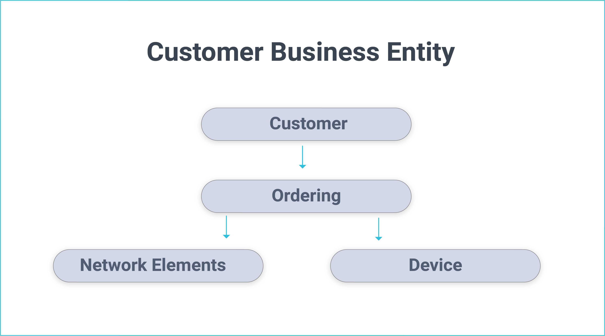
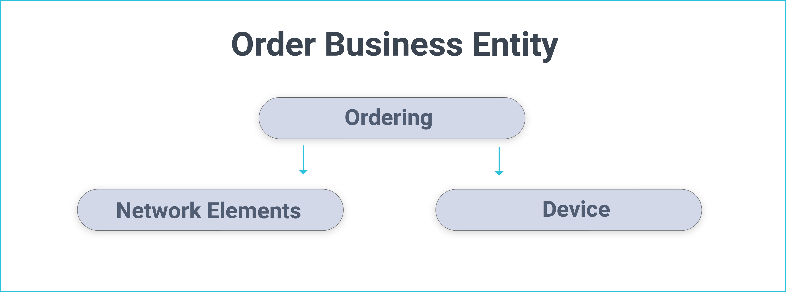
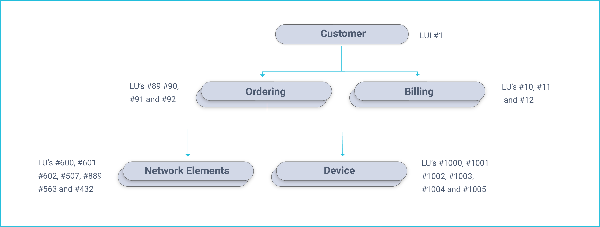
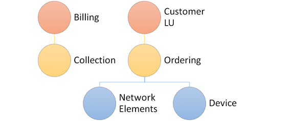

# Business Entity Overview

### What is a Business Entity? 

A Business Entity (BE) represents the main entity of the selected data to be provisioned by TDM. Business Entities can have multiple [LUs](/articles/03_logical_units/01_LU_overview.md) with either a flat or a hierarchical structure. For example, a Customer Business Entity can have Customer, Billing, Ordering and Usage LUs.

-  BEs are defined in the [TDM Portal](/articles/TDM/tdm_gui/04_tdm_gui_business_entity_window.md) and are saved in the [TDM DB](/articles/TDM/tdm_architecture/02_tdm_database.md).
-  Each LU can be attached to multiple BEs. 

Breaking down the BE into several LUs enables maximum flexibility and prevents duplicate development. The hierarchical structure of parent-child LUs enables creating LUs based on the natural root entity of the related data sources instead of forcefully setting unified root entities on all LUs related to a given BE.

**Example**

- Customer LU root entity = Customer ID.
- Ordering LU root entity = Order ID.
- Network element LU root entity = Element ID.
- Device LU root entity = Device ID.
- Ordering, Network and Device LUs are attached to two BEs:
  - Customer 
  - Ordering

 The following BEs are defined in K2view's TDM: 

 

You can request to load a list of selected Customer IDs, whereby the TDM task also copies the related ordering, network elements and device data of the selected customers.
Alternatively, you can request to load a list of selected Order IDs, whereby the TDM task also loads the related network elements and device data of the selected orders.

### Building an LU Hierarchy in a BE

A parent-child hierarchy of LUs can also be defined under a BE. The relationship between the **parent and child** LUs is **one-to-many**. Each parent LUI can have many child LUIs. 

#### Root LU 
If an LU in a BE has no parent LU, it is named **Root LU**, meaning its root entity is the same as the root entity of the BE. A BE must have at least one Root LU. 

**Example of Customer #1 Hierarchy**

 
                                

-  The Customer LU is the **Root LU** of the Customer BE.
-  Each LU has its own LUIs. 

When creating a TDM task to load Customer 1 from the PROD environment, the TDM task must also load the customer's related billing accounts and orders together with the related network elements and devices of the related orders. 

The following LUIs are extracted from the source and created in Fabric for Customer 1:

 <table width="900 pxl">
<tbody>
<tr>
<td valign="top" width="250 pxl">
<strong>LU Name</strong>
</td>
<td valign="top" width="250 pxl">
<strong>Parent LU Name</strong>
</td>
<td valign="top" width="400 pxl">
<strong>LU Instances</strong>
</td>
</tr>
<tr>
<td valign="top" width="250 pxl">
Customer
</td>
<td valign="top" width="250 pxl">
&nbsp;
</td>
<td valign="top" width="400 pxl">
PROD_1
</td>
</tr>
<tr>
<td valign="top" width="250 pxl">
Ordering
</td>
<td valign="top" width="250 pxl">
Customer
</td>
<td valign="top" width="400 pxl">
PROD_89, PROD_90, PROD_91, PROD_92
</td>
</tr>
<tr>
<td valign="top" width="250 pxl">
Billing
</td>
<td valign="top" width="250 pxl">
Customer
</td>
<td valign="top" width="400 pxl">
PROD_10, PROD_11, PROD_12
</td>
</tr>
<tr>
<td valign="top" width="250 pxl">
Network Elements
</td>
<td valign="top" width="250 pxl">
Ordering
</td>
<td valign="top" width="400 pxl">
PROD_600, PROD_601, PROD_602, PROD_507, PROD_889, PROD_563, PROD_432
</td>
</tr>
<tr>
<td valign="top" width="250 pxl">
Device
</td>
<td valign="top" width="250 pxl">Ordering</td>
<td valign="top" width="400 pxl">
PROD_1000, PROD_1001, PROD_1002, PROD_1003, PROD_1004, PROD_1005
</td>
</tr>
</tbody>
</table>

#### TDM Hierarchy with Several Root LUs 

A TDM BE may include several root LUs with the same list of entities. For example, if the entity ID of both the Customer and Billing LUs is Customer ID, then the BE hierarchy may be:

 

### Task Execution of Hierarchical Business Entities

A TDM task can include a BE with a hierarchical structure of several LUs. When processing the TDM task, all related LUs from parent and child LUs must also be processed.

The task execution can be either horizontal or vertical:

- **Horizontal execution** (default mode) - execution of the task, system by system (LU by LU), where all entities are processed in one LU before moving on to the next system in the hierarchy. 
- **Vertical execution** - execution of the entire LU hierarchy for each root entity, before moving on to the next root entity. This execution mode has been added in TDM 9.2.

By default, the task execution mode is taken from the task's [Business Entity (BE)](/articles/TDM/tdm_gui/04_tdm_gui_business_entity_window.md#task-execution-mode). However, you can set the [task's execution mode](/articles/TDM/tdm_gui/14b_task_source_component_entities.md#advanced-be---execution-mode-tab) to be independent of the BE's execution mode. 

Notes:

- The Vertical execution mode is unavailable when the child entity has multiple parent entities in the BE hierarchy. For example: Subscriber => Billing Account hierarchy. The Subscriber is the Billing Account's parent LU. If a Billing Account (i.e., the bill payer) is shared between multiple Subscribers, this BE hierarchy needs to run in a horizontal mode.  
- The Vertical execution mode is unavailable for a task that generates [entity clones](/articles/TDM/tdm_gui/17a_task_target_component_entities.md#generate-clones-for-an-entity) and for synthetic entities generation.
- The Vertical execution mode can be beneficial when running TDM tasks on a large scale of entities as it ensures improved cross-system data consistency and alignment.
- In both execution modes, if the execution of the parent entity fails, the related child entities are consequently not processed and marked as failed.

**Example:**

1. Create a TDM task to load **Customers #1, #2 and #3**, their Orders and their related Network elements. 

2. **Customers' related entities:**

- **Customer #1:** 
  - Order #4: 
    - Network elements #90 and #91.
  - Order #5:
    - Network element #92.

- **Customer #2:**
  - Order #9: 
    - Network element #98.
- **Customer #3:** 
  - Order #10:
    - Network element #99.
  - Order #11:
    - Network element #100.
  - Order #12:
    - This Order has no related Network element.

3. **Task execution order:**

   **Horizontal execution mode:**

   - **Step 1:**
     
     - Run the Customer LU on entities #1, #2 and #3. 
     - Customers #1 and #2 are processed successfully. Customer #3 fails.
     
     - **Step 2:**
       - Run Order LU on entities related to Customers #1 and #2, i.e., Order IDs #4, #5 and #9. The execution of Order #4 fails. The remaining Orders are processed successfully. 
       - Note that Order LU is not executed on Customer #3's Orders since this Customer has failed.
     
   - **Step 3:**
     - Run the Network element LU on the entities related to the successfully processed Orders, i.e., Network element IDs #92 and #98.
   
   
   
   **Vertical execution mode:**
   
   - **Process Customer #1:**
     - Run Customer #1. Then, run Orders #4 and #5. The execution of Order #4 fails. After processing the Customer's Orders, start processing the related Network element #92. Note that Network elements #90 and #91 are not processed since their parent Order ID - #4 - has failed. 
     - Customers #1 and #2 are processed successfully. Customer #3 fails. 
   - **Process Customer #2:**
     - Run Customer #2. Then, run Order #9 and Network element #98.
   
   - **Process Customer #3:**
     - Run Customer #3. The Customer's execution fails, hence, do not run the related Orders and Network elements.

 

 
