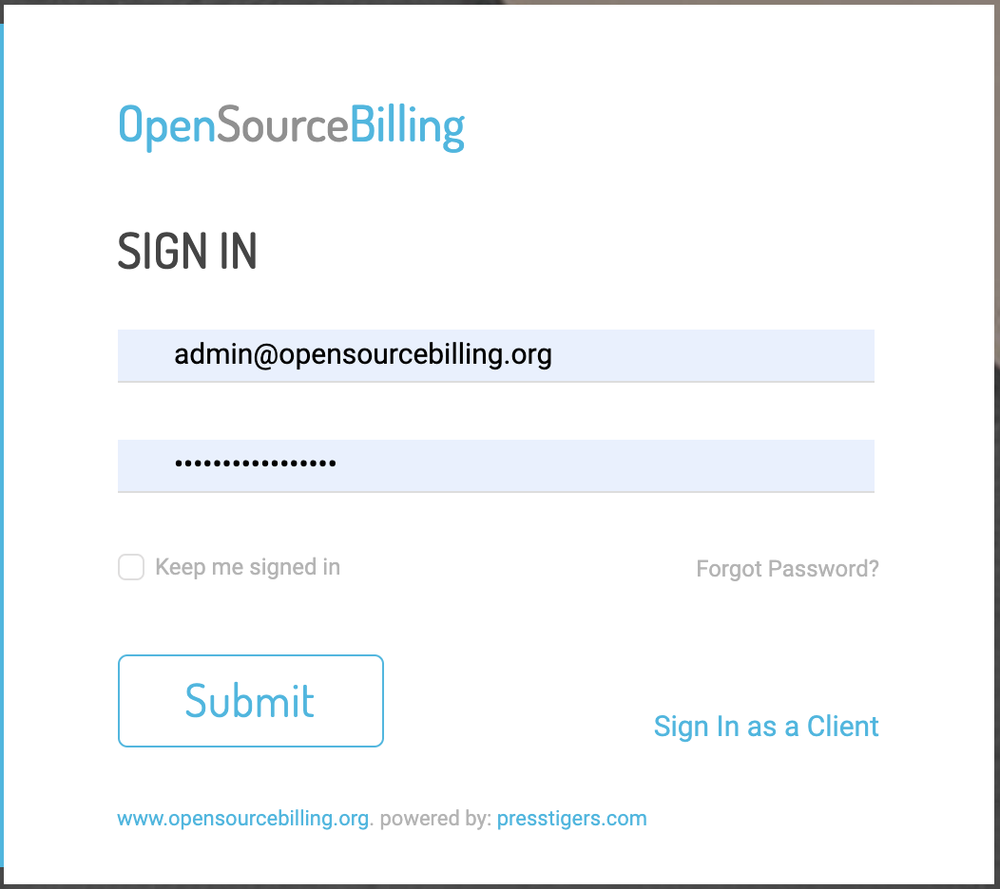
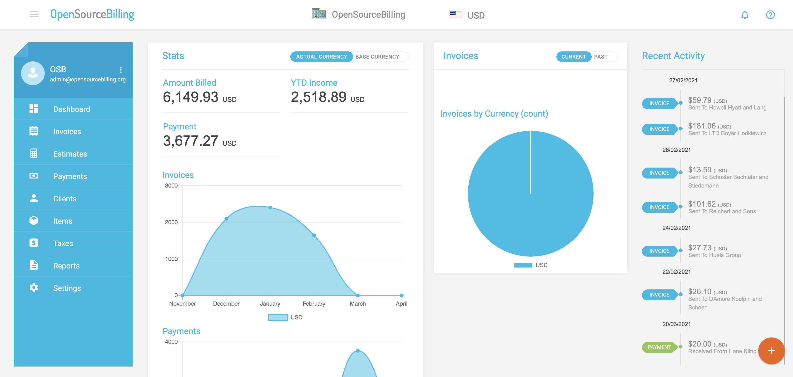
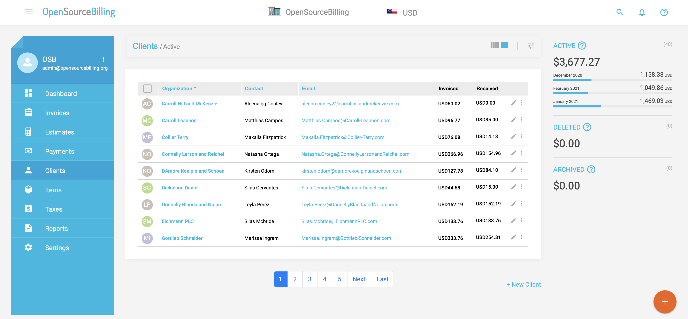
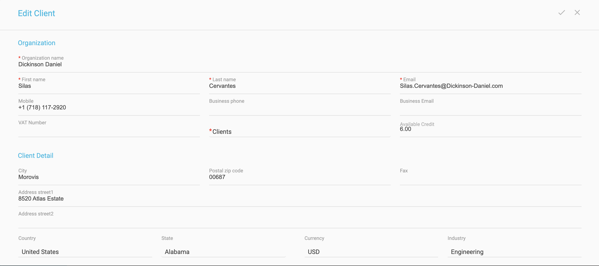

# Access and Use Open Source billing (OSB)

The second application which we use as a source is called Open Source Billing (OSB). 

At your internet navigator, type the URL that was provided to you in the Tutorial welcome email to access the OSB application. 

For example:  http://62.90.46.213:3000/

Use the user and password that was provided to you in the same email. 

 

The OSB landing page is presented:

 

Select the option **Clients** from the menu options on the left bar.

The list of clients is presented:

 

 Use the **Search** option to search for the client that was generated for you, and click the   at the right side of the client's line in order to open its details:

 

Review the client information and when called by the tutorial, alter the client's information and click the   at the top right corner to save the changes.
