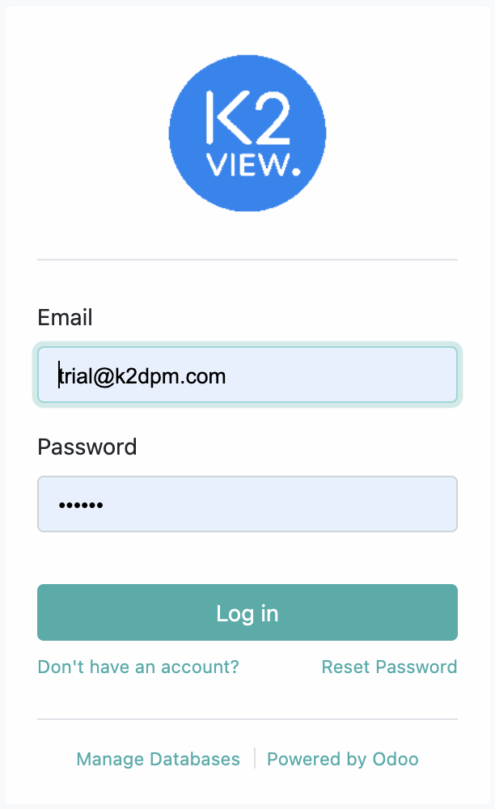
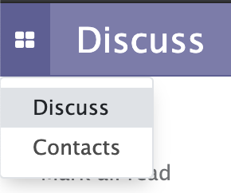
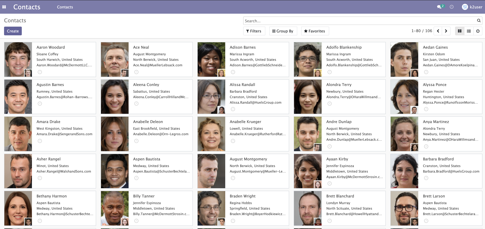

# Access and Use of Odoo

At your internet navigator, use the URL provided to you in the tutorial Welcome e-mail to access the Odoo application. 

For example: http://62.90.46.213:8069/

Use the user and password that was provided to you in the same e-mail. 

Once logged-in, select the  icon at the upper left corner, and select the option **Contacts** from the menu options that are presented: 

As a result, the Contacts screen is presented: 

Use the **search** option in order to find the customer that was generated for you, and open its details. 

In this screen you can review the details as well as use the  and then  option in order to edit the data when requested by the tutorial. 
