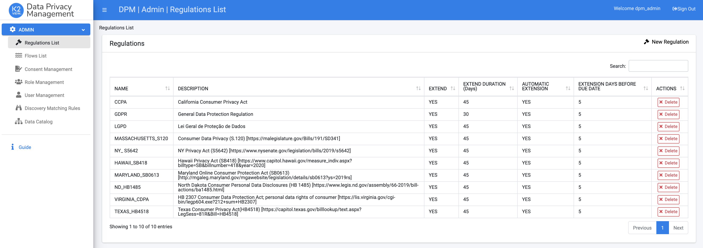

# Login to the DPM System as an Administrator

Login to the DPM online as an Administrator. For that, use the following credentials:

**Username** - k2admin_dpm

**Password** - admin 

As a result, the initial screen of the Admin module displays. 
 

