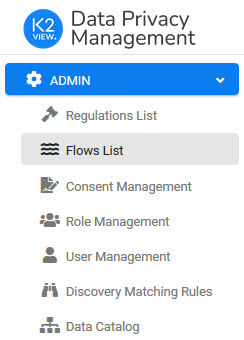
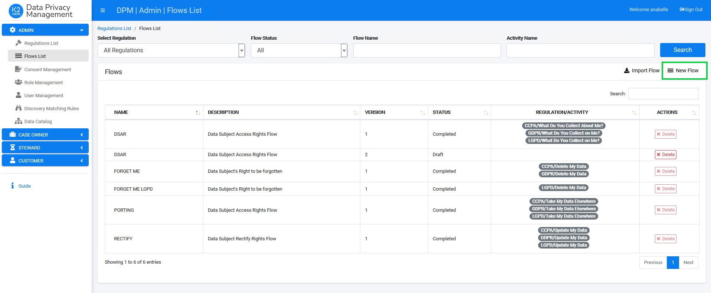
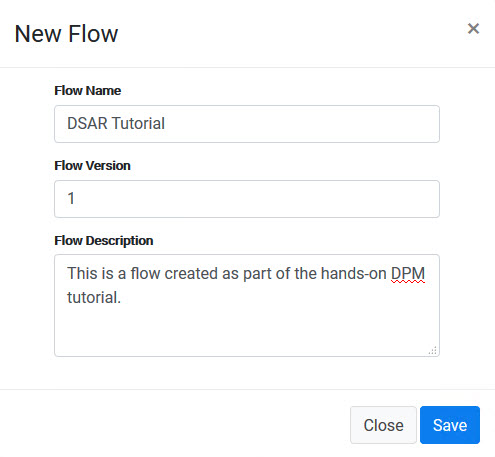
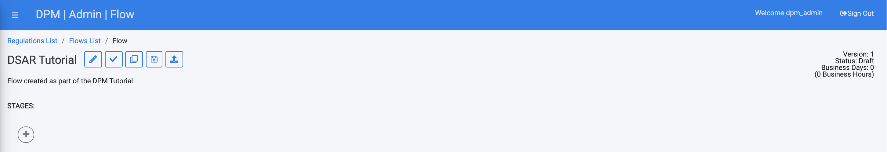
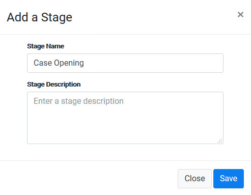
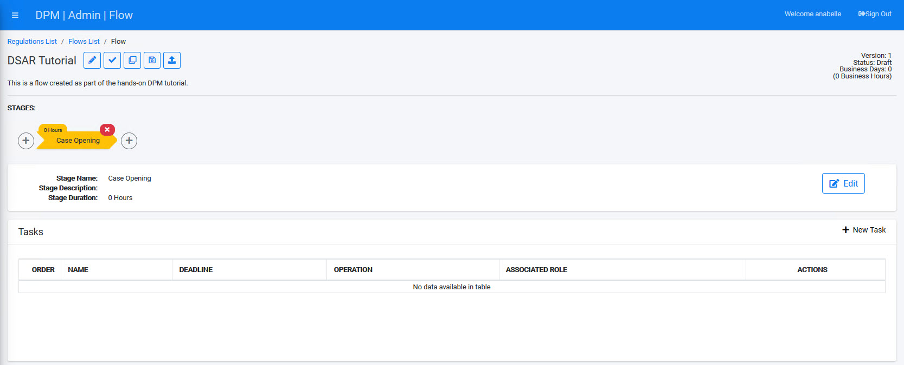

# Create a New Flow and Stage

Create a new Flow using the following steps:

1. From the Admin menu, located on the upper-left corner of the DPM screen, select the **Flows List** menu option.

   

The Flows List screen displays.  

2. Select **New Flow**, located in the upper-right corner of the screen.

The New Flow dialog box displays. 

3. Define the **Flow Name**, **Flow Version number**, and add a **Flow Description**. We entered **DSAR Tutorial** as the Flow Name, and we will refer to it by this name in the tutorial steps:

4. Confirm the creation of the Flow by clicking . 

You can now begin adding Stages to this new Flow, and under each Stage, add Tasks that build the sequence of events to fulfil the Request. 

5. Click the  button to add the first Stage. The Add a Stage dialog box displays.

6. Enter the **Stage Name** and **Stage Description**. The first Stage we create in this tutorial is called **Case Opening**, where we will add Tasks that validate the Request, get the customer identification, and notify the customer about the case opening. 

Once you save the information, the Flow screen is updated to display the new Stage:

In the next steps, you will create the Tasks that perform the actual fulfilment Flow for a specific DSAR Request.

