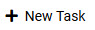
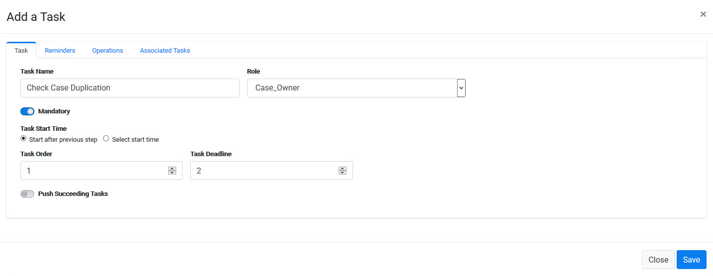
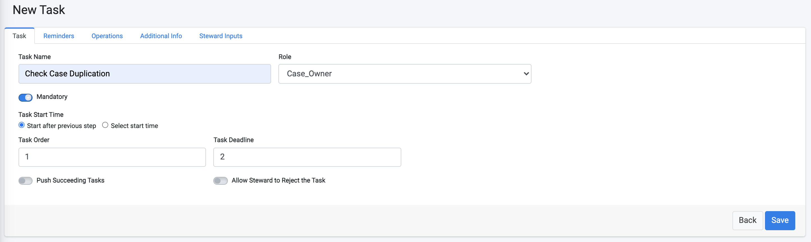
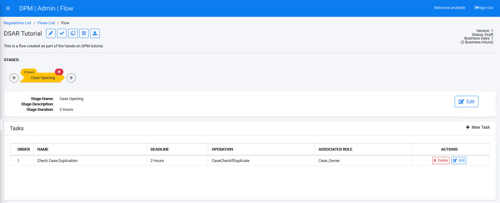
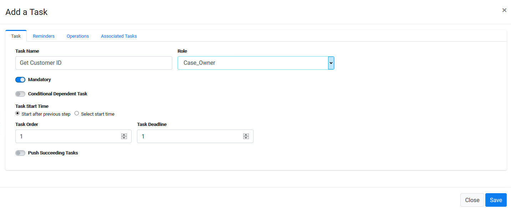
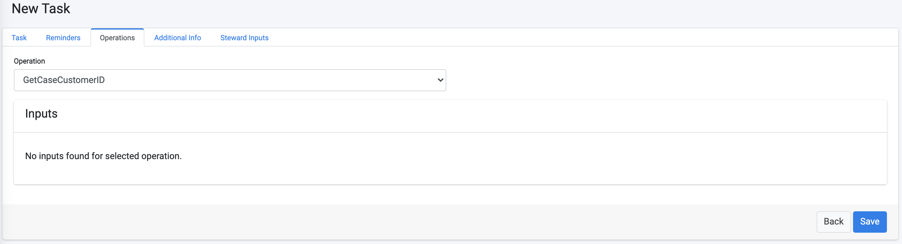
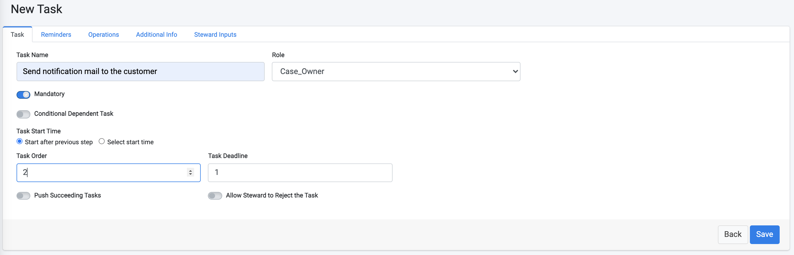
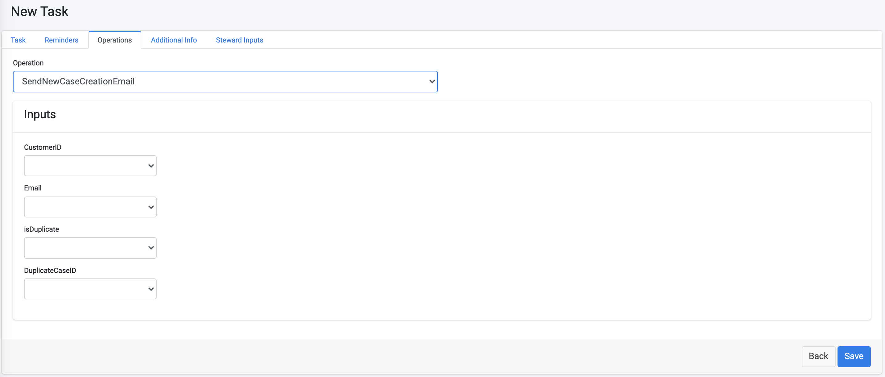
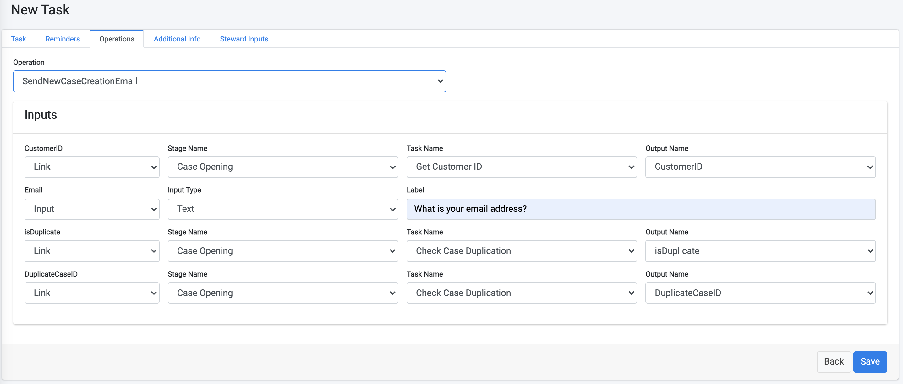
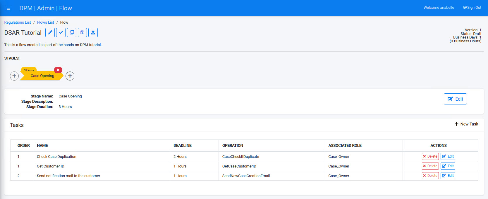

# Case Opening and Customer Notification Tasks

In this tutorial, we will create Tasks within the new Stage you created in the previous step. This exemplifies how a Flow is constructed. When configuring a Flow for your company, the Tasks you create will naturally vary.

The Tasks we will create are: 

- **Check Case Duplication** - a Task that validates whether there is already an open Request of the same type for the same customer. If there is such Request, the new Request will be stopped and a message will be sent to the customer.

- **Get Customer ID**  - a Task that identifies the unique ID of the customer who submitted the Request within each of the systems integrated within the DPM System, so that it can retrieve the data from each of those systems. In our tutorial, those systems are Odoo and Open Source Billing.

- **Send notification mail to the customer** - once the request was validated and the customer identified, this Task sends a message to the customer, informing them that the Request is being processed with the expected due date. 

  **Note**: This section assumes you are now looking at the screen showing the new DSAR Tutorial Flow created in the previous section.

### Check Case Duplication

This task is automatic and verifies whether the customer already has another Request of the same type in process. 

1.  From the DSAR Tutorial Flow screen, click , located at the upper-right side of the screen, to add a new Task.

2. Populate the fields in the **New Task** configuration screen in the same way shown in the image above. Since this will be an automatic activity, we set the Role to be **Case_Owner**. If the automatic process fails, the Case Owner of this request will receive the failure notification. Note that the **Task Order** was set automatically to **1** because this is the first Task you created. The order can be changed later, if necessary.

3. Click the **Operations** tab in the Task configuration screen, and select **caseCheckIfDuplicate** from the **Operation** drop-down list, as shown below. The caseCheckIfDuplicate operation is built-in and performs the Duplicate Case validation. The DPM System includes a long list of similar automatic operations, and any other operation that is specific to your project can be created to meet your needs.

4. The first Task is ready! Click  and you will be directed back to the Flow screen, where you can continue and add the following Tasks. 

### Get Customer ID

The second task is configured similarly to the first. It demonstrates how to set a Task to run parallel to another Task.

1. Add a new Task, and enter **Get Customer ID** in the **Task Name** field. Assign the Role to be a **Case_Owner** again. 
2. Note that the system automatically suggests that the order of this Task will be 2, since this is the second task you have created. Set the **Task Order** to **1**, so that it will be executed in parallel with the first task.

3. Click the **Operations** tab and select the automatic operation called **getCaseCustomerId** from the **Operation** drop-down list.

4. Click  to save the new Task. 

### Send notification mail to the customer

This third task is the last one we will configure within the first Stage. It will demonstrate how to configure operations parameters. 

1. Add a new Task, and enter **Send notification mail to the customer** in the **Task Name** field. 
2. The system automatically suggests that this **Task Order** will be **2**, meaning it will run after the first two tasks were completed. The first two Tasks orders are set to **1**.

3. Click the **Operations** tab and select the automatic operation called **SendNewCaseCreationEmail** from the **Operation** drop-down list. As you can see below, this operation requires few inputs for its execution:

   - The **CustomerID**, which can be obtained from the previous "Get Customer ID" Task output

   - The customer **Email** - to which the case opening confirmation mail should be sent. We will configure the Task so that this information will be collected from the customer at the request submission moment. Set the label to be: **What is your email address?**

   - **is duplicate** - an indicator whether the case is a duplicate, in order to inform the customer that the Request is rejected for this reason. We will get this information from the previous "Check Case Duplication" Task output

   - **Duplicate Case ID** - In the case that the request was identified as a duplicate, then this is the ID of the request that is already open. We get this information from the previous Task output.

          

Use the example below to select a parameter type from the drop-down list. The additional dropdowns for each line will display as you select the input type for each parameter.

 

4. Click  to save the new task. 

 

