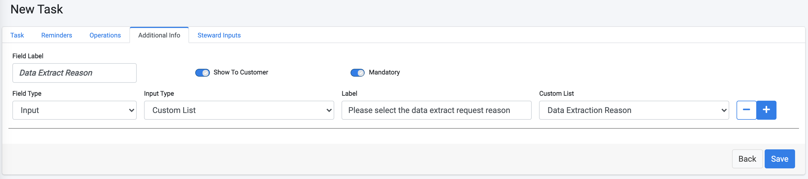
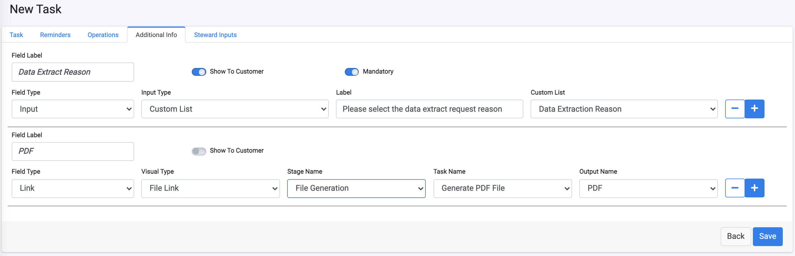
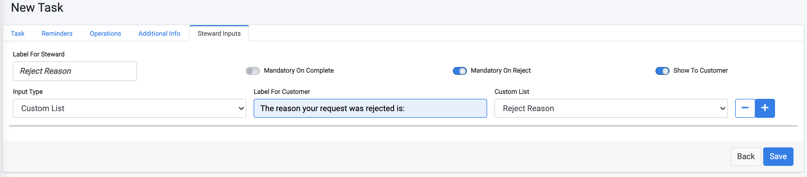
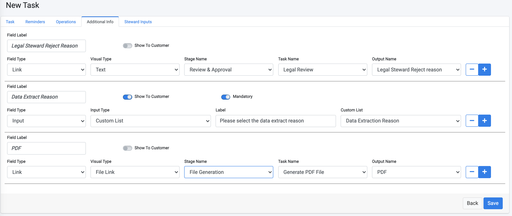
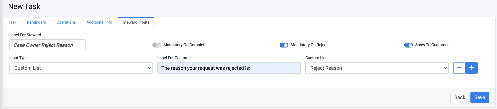

# Review And Approval Tasks

Create a new Stage called **Review & Approval**. 

#### Legal Review Task

1. Add a new Task under this Stage, called **Legal Review**. This is configured as a manual Task where the Legal Data Stewards team should review the PDF that was generated by the previous Task. 

   Being a manual Task, it may take longer to complete, so adjust the **Task Deadline** according to the duration you consider reasonable. We have set it to 48 hours in the example below. 

   The data steward can approve or reject the task according to the review of the generate file and the input from the customer. To allow the data steward to reject the task, mark the "Allow Steward to Reject the Task indicator" to **on**.

   To facilitate the testing process of your flows, the DPM system can be configured to work with different time units such as minutes or hours. During testing, you would normally use the configuration of minutes so that tests can be rapidly concluded. However, in production, you would typically use the hours configuration;  

   

2. Click the **Reminders** tab. Since this is a manual operation, we will also configure reminders in two intervals - one to the Legal team and the other to the Case Owner, so that if this Task is not completed, the relevant users should be notified to take action. 

   

3. Choose the **Additional Info** tab to configure what information should be presented to the data steward for validation. 

   In our example, let's assume that the data steward should validate two types of information: 

   - Validate an input from the customer, which we chose to be the data extract request reason.
   - Validate the PDF that was generated by the previous task. 

   ##### **Data Extract Reason:** 

   To obtain the input from the customer, add a parameter called "Extract Reason" in the Additional Info tab as demonstrated in the following image: 

   

   **Field Label** is the text that the data steward will see when performing the task. This is also the identifier of the data that this field holds, should it be used as input for any other task that follows in this flow. 

   By defining the **Field Type** as "Input" , the DPM knows that this parameter should be obtained from the customer at the time of the request submission.  

   **Input Type** Custom List indicates that this field will be presented to the customer as a dropdown list, to chose one of the options. You can create any other similar lists by using the [Custom Lists](/articles/DPM/02_Admin_Module/16_Custom_Lists.md) functionality.   

   The **Label** field is the text that will be presented to the customer when making a request for this information

    **Custom List** is the name of the list that holds the values for the dropdown list presented to the customer. 

   The indicator **"Show To Customer"** indicates that the value of this field will be presented to the customer at the Request Details screen, when viewing the request response. 

   The indicator **"Mandatory"** means that this field must be filled for every request. 

   

   ##### **PDF file review**

   To allow the data steward to view and validate the PDF that was generated by the system, add another parameter by clicking the plus icon at the right side of the screen.

   Populate the fields for this parameter as demonstrated in the following image. The meaning of this configuration is that when the data steward accesses the review task of a specific customer request, a link is presented for the user to access and review the PDF that was generated in the previous task. 

   

4. Choose the **"Steward Inputs"** tab to configure the information that the data steward should fill as part of the review. In this example we added another field "Legal Steward Reject Reason" that should be populated only if the data steward has decided to reject the task.  The field type is also defined as "Custom List", and in this case we chose the list "Reject Reason". 

   Follow the image below and configure your task in the same way.  In particularly note that we have marked the **"Mandatory on Reject"** to be **on** and the **"Show to Customer"** to be **off**.

   

5. Click  to save the new Task.

#### Case Owner Review Task

1. Create another Task under the same Review Stage: **Case Owner Review**. Assign it to the **Role** of **Case_Owner**. This is also a manual Task that should be executed after the legal review is complete. Therefore, set the **Task Order** to **2**, and give it a **Task Deadline** of **24** hours. 

   The purpose of this task is to allow the Case Owner to validate the decision of the Legal Data Steward. The Case Owner should check if the Legal Data Steward had rejected the previous task, and decide if to accept the data steward rejection or to ignore it and allow the information to be sent to the customer.  For this, mark the **"Allow Steward to Reject the Task"** as well as the **"Reject Task Stops Case"** to be **on**.

   

2. Configure the **Additional Info** tab of this Task in the same way as for the previous Data Steward associated task, so that the Case owner can view the same information that the data steward reviewed. In addition, add another parameter: "Legal Steward Reject Reason" which should be defined as a Link to the value that the Legal Data Steward selected in the previous task.
Make sure that you use the same text for the Label of the "Extract Reason" field - this will result in asking the customer this information only once when submitting the request. 

   

3. Configure the **"Steward Inputs"** tab similarly to the way it was configured for the Legal Review task. In this case, mark both the **"Mandatory on Reject"** and the **"Show to Customer"** to be **"on"**. When **"show to customer"** is set this way, the reject reason that the Case Owner should chose will be presented  to the customer at the Request Details screen, using the text from "Label For Customer" as the label. 

   

4. Save the Case Owner Review task. 

