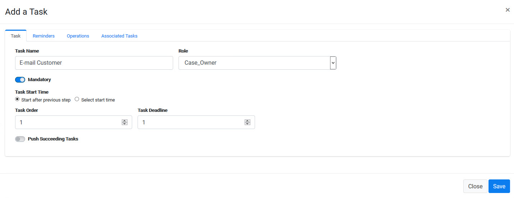
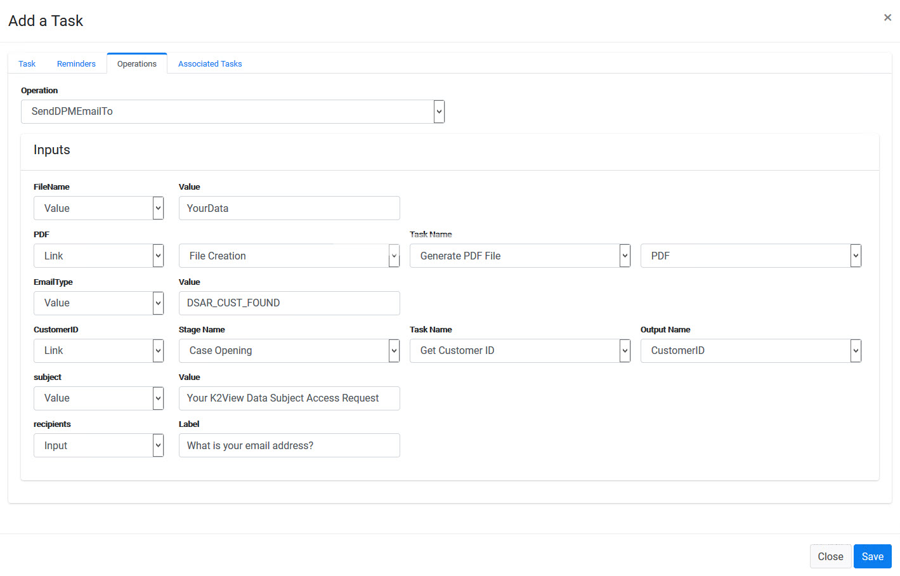
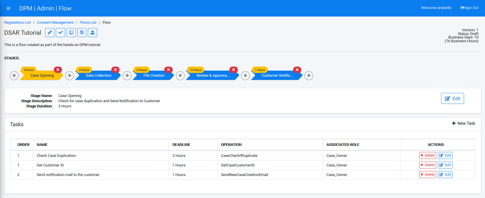
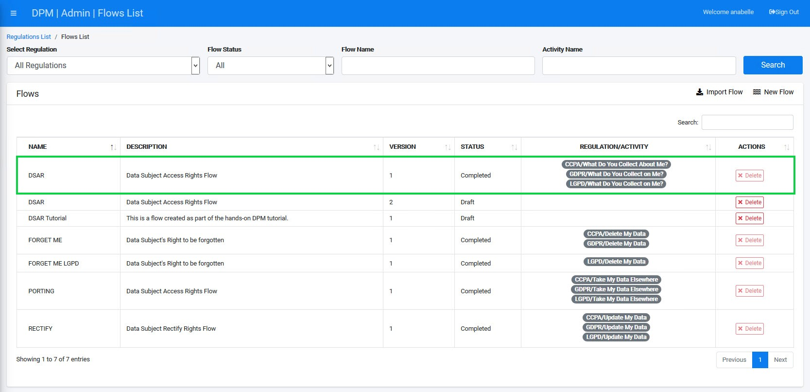

# Customer Notification Task

1. Create a new Stage called **Customer Notification**. 

2. Add a new Task under this Stage, called **E-mail Customer**.

3. Click the **Operations** tab and select the **SendDPMEmailTo** operation. This automatic operation will send a notification to the customer once the Request is successfully completed, and the PDF can be delivered to the customer. Configure the **Inputs** parameters as shown below. 

   
   
   * **File Name** - YourData
   * **PDF** - link to the PDF that was created in the previous steps.
   * **E-mail type** - The value we use here is DSAR_CUST_FOUND, which is the e-mail layout we created for this task (personalized in your real-life implementation).
   * **Customer ID** - is obtained from the task Get Customer ID from the first stage
   * **Subject** - The E-mail subject - set it to be **Your K2View Data Subject Access Request** 
   * **Recipients** - configured to be obtained from the customer when they submit the request. Set the label to be: **What is your email address?**. We use the same text as used in the task of sending confirmation mail to the customer, so that it would be asked only once as input. 

4. Click  to save the new Task.

Your DSAR Flow is now complete. The final result should look similar to the following image.

**Note:** If you have any doubt about the configuration described above, you can also review the DSAR Flow implementation that comes built-in with your DPM installation (with the exception of the review tasks which are not part of the built-in automated flow).

