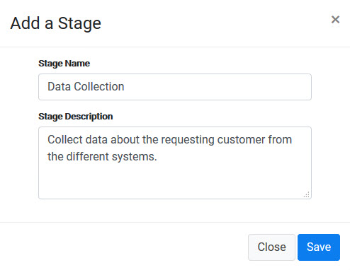
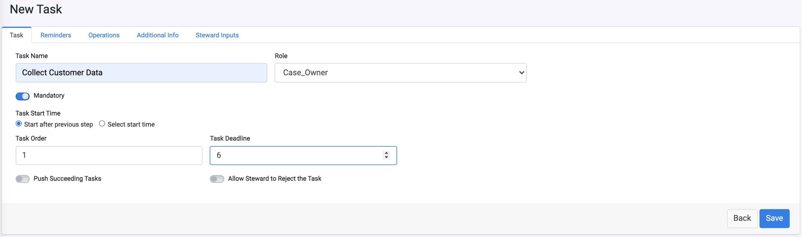
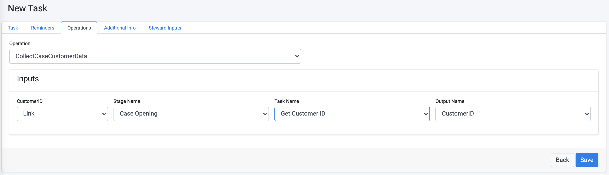
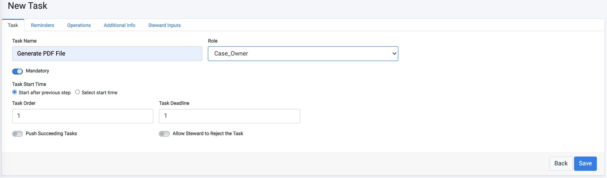
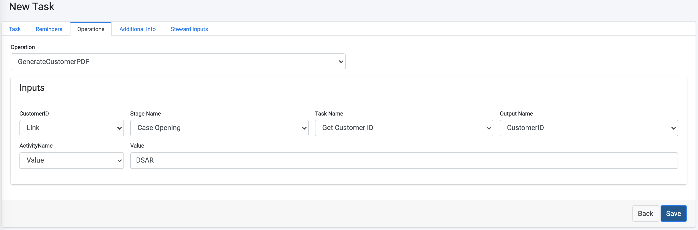

# Data Collection Tasks

In this tutorial, additional Stages and Tasks are created in order to complete the configuration of our DSAR Tutorial Flow. 

The sample Stages we will create include: 

- **Data Collection** - This Stage is an automated task that collects customer data from the different corporate systems. In the sample implementation of this tutorial, the information is collected from Odoo and Open Source Billing systems.
- **File Generation** - Once the information is collected, an automated activity creates a PDF that includes the customer data. 
- **Review and Approval**  - Review of the resulting PDF. In our example, this review should be done by both the Legal Data Steward team and the Case Owner. 
- **Customer Notification** - After the PDF is both generated and reviewed, the Request fulfilment is completed. The customer can then be notified and delivered the results. 

### Data Collection

1. Create a new Stage called **Data Collection**.

2. Add a new Task under this Stage, called **Collect Customer Data**.

3. Click the **Operations** tab and select the **CollectCaseCustomerData** operation. This automatic operation retrieves the customer data from any integrated system. Populate the information for the customer ID field as presented in the image below.

4. Click  to save the new Task.

### File Generation

1. Add a new Stage called **File Creation**. 

2. Add a new Task under this Stage called **Generate PDF File**.

3. Click the **Operations** tab and select the **GenerateCustomerPDF** operation. This automatic operation formats the data that was collected about the customer in a PDF. 

4. Click  to save the new Task.

