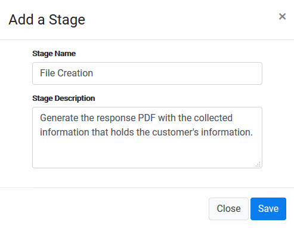
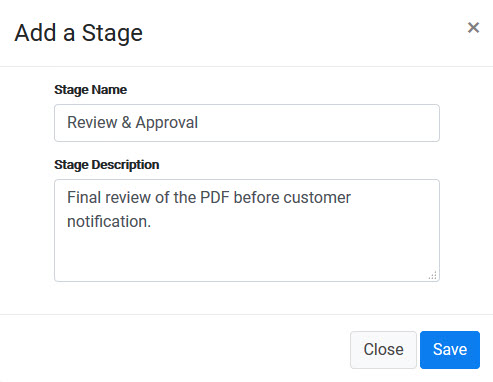
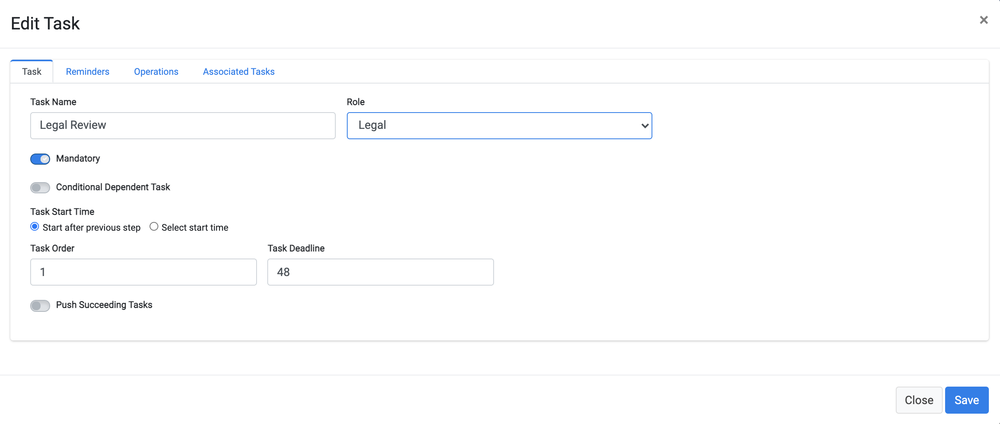
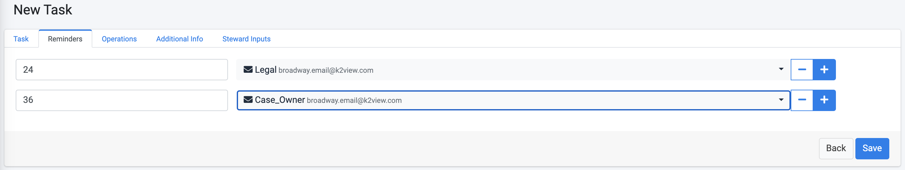
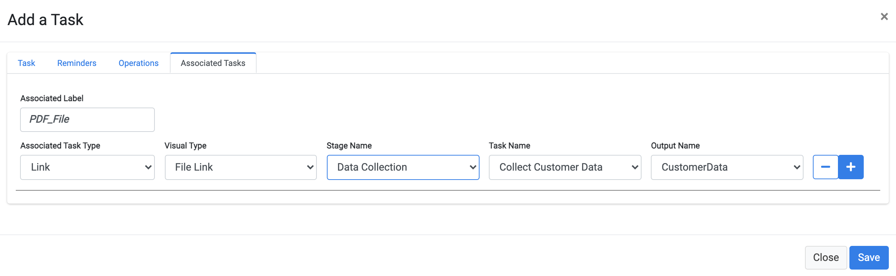
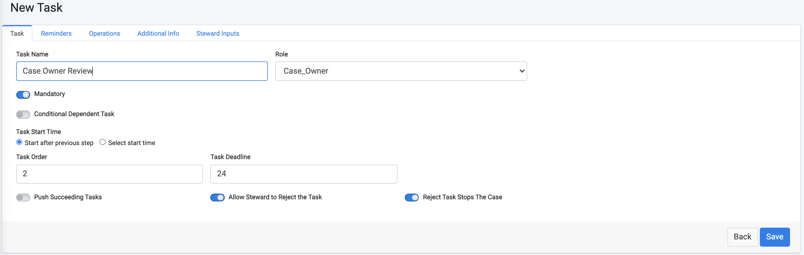

# Data Gathering and Review Tasks

In this tutorial, additional Stages and Tasks are created in order to complete the configuration of our DSAR Tutorial Flow. 

The sample Stages we will create include: 

- **Data Collection** - This Stage is an automated task that collects customer data from the different corporate systems. In the sample implementation of this tutorial, the information is collected from Odoo and Open Source Billing systems.
- **File Generation** - Once the information is collected, an automated activity creates a PDF that includes the customer data. 
- **Review and Approval**  - Review of the resulting PDF. In our example, this review should be done by both the Legal Data Steward team and the Case Owner. 
- **Customer Notification** - After the PDF is both generated and reviewed, the Request fulfilment is completed. The customer can then be notified and delivered the results. 

### Data Collection

1. Create a new Stage called **Data Collection**.

2. Add a new Task under this Stage, called **Collect Customer Data**.

3. Click the **Operations** tab and select the **CollectCaseCustomerData** operation. This automatic operation retrieves the customer data from any integrated system. Populate the information for the customer ID field as presented in the image below.

4. Click  to save the new Task.

### File Generation

1. Add a new Stage called **File Creation**. 

2. Add a new Task under this Stage called **Generate PDF File**.

3. Click the **Operations** tab and select the **GenerateCustomerPDF** operation. This automatic operation formats the data that was collected about the customer in a PDF. 

4. Click  to save the new Task.

### Review and Approval

1. Create a new Stage called **Review & Approval**. 

2. Add a new Task under this Stage, called **Legal Review**. This is configured as a manual Task where the Legal Data Stewards team should review the PDF that was generated by the previous Task. If the PDF content meets expectations, they approve the notification that is sent to the customer.  Being a manual Task, it may take longer to complete, so adjust the **Task Deadline** according to the duration you consider reasonable. We have set it to 48 hours in the example below. 

   A comment about the duration: in order to facilitate the testing process of your flows, the DPM system can be configured to work with different time units such as minutes or hours. During testing, you would normally use the configuration of minutes so that tests can be rapidly concluded. However, in production, you would typically use the hours configuration;  

3. Click the **Reminders** tab. Since this is a manual operation, we will also configure reminders in two intervals - one to the Legal team and the other to the Case Owner, so that if this Task is not being completed, the relevant users should be notified to take action. 

4. Choose the Associated Task tab in order to configure what information should be presented to the steward for validation. For DSAR request, the steward is in most cases requested to validate the PDF that was generated following the customer's request. 

   Populate the associated task parameters as demonstrated at the following image. The meaning of this configuration is that when the data steward access the review task of a specific customer request, a link would be presented for the user to access and review the PDF that was generated in the previous task. 

   

5. Click  to save the new Task.

6. Create another Task under the same Stage: **Case Owner Review**. Assign it to the **Role** of **Case_Owner**. This is also a manual Task that should be executed after the legal review is complete. Therefore, set the **Task Order** to **2**, and give it a **Task Deadline** of **24** hours. 

Configure the Associated task tab of this Task in the same way as for the previous Data Steward associated task, so that the Case owner can review the PDF as well.

Save the Case Owner Review task. 

### 	Customer Notification

1. Create a new Stage called **Customer Notification**. 

2. Add a new Task under this Stage, called **E-mail Customer**.

3. Click the **Operations** tab and select the **SendDPMEmailTo** operation. This automatic operation will send a notification to the customer once the Request is successfully completed, and the PDF can be delivered to the customer. Configure the **Inputs** parameters as shown below. 

   
   
   * **File Name** - YourData
   * **PDF** - link to the PDF that was created in the previous steps.
   * **E-mail type** - The value we use here is DSAR_CUST_FOUND, which is the e-mail layout we created for this task (personalized in your real-life implementation).
   * **Customer ID** - is obtained from the task Get Customer ID from the first stage
   * **Subject** - The E-mail subject - set it to be **Your K2View Data Subject Access Request** 
   * **Recipients** - configured to be obtained from the customer when they submit the request. Set the label to be: **What is your email address?**. We use the same text as used in the task of sending confirmation mail to the customer, so that it would be asked only once as input. 

4. Click  to save the new Task.

Your DSAR Flow is now complete. The final result should look similar to the following image.

**Note:** If you have any doubt about the configuration described above, you can also review the DSAR Flow implementation that comes built-in with your DPM installation (with the exception of the review tasks which are not part of the built-in automated flow).

