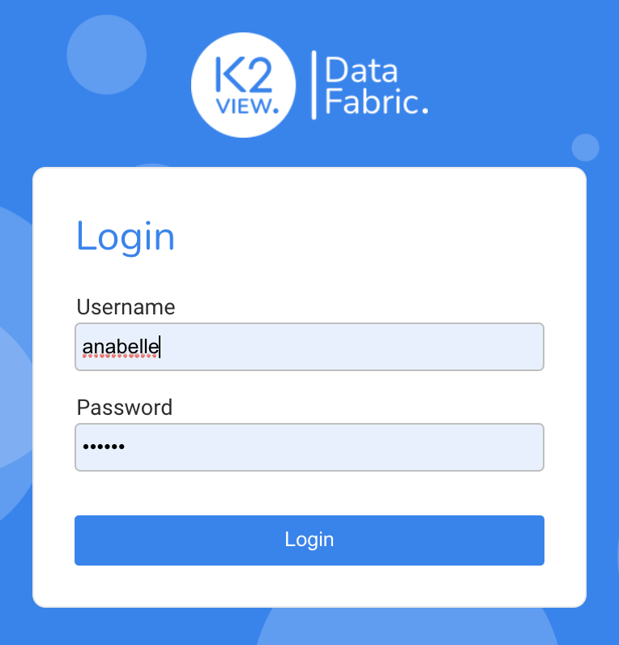
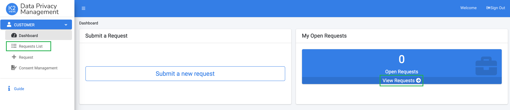
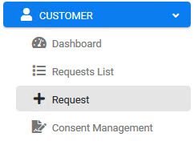
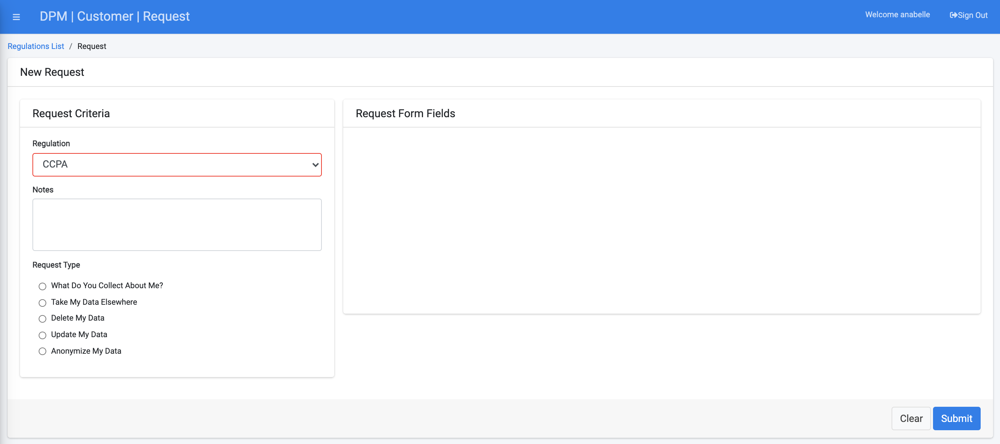
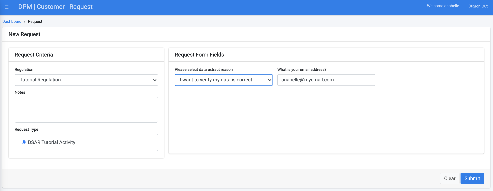
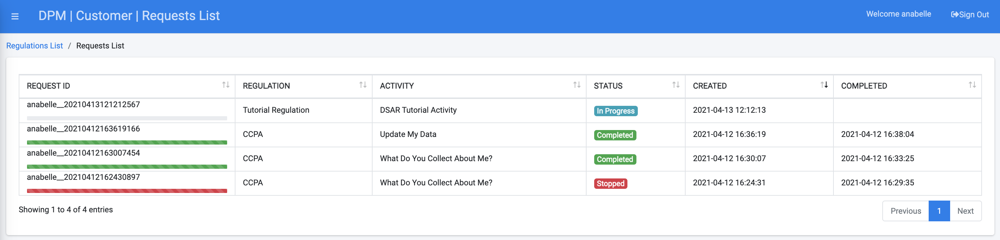
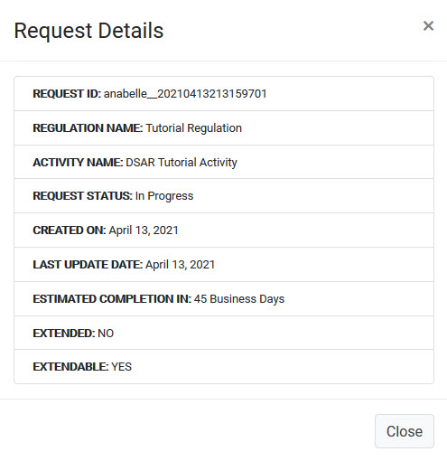

## Customer Submits a DSAR Request

In order to submit a customer DSAR request, you should now login to the DPM system as a customer. 

For the purpose of the tutorial, we will request you to login with the credentials of the customer that was created for you in this section, and through the remainder of the tutorial, wherever a customer role is requested. The credentials of this customer are provided to you in the e-mail we sent you upon registration for this demonstration environment

This customer has information in both the systems that we have defined as "Source Systems" for the purpose of this tutorial: Odoo and OpenSourceBilling (OSB)

Enter the customer credentials that were provided to you in order to access the DPM as a Customer. 
For the purpose of demonstration we use a customer named Anabelle Deleon, that has the role of a customer.

- **Username** - anabelle

- **Password** - k2view

                               

Click **Login**.

Once a user logs into the DPM system as a Customer, the screen is updated with two frames (windows) of information. The left frame displays a list of menu options for this module. The right frame displays the interactive components of the selection. The Dashboard screen displays by default after logging into the system.

    

Click  under the CUSTOMER menu options, located on the left side of the screen. 
 

The New Request screen displays.

Select a Regulation from the drop-down list. For this tutorial, we will select the **Tutorial Regulation** that we created in the previous chapter.

Under the **Request Type** section of the screen, select **DSAR Tutorial Activity**, which was created in the previous chapter. 

  

Complete the field(s) on the right side of the form. The **DSAR Tutorial Activity** Request Type displays the email address entry field that you configured in the previous section. Enter the customer email address. Confirmation of this Request completion will be sent to the email address entered into this field.    

Click  to submit the Request.

Once the Request is submitted, the customer can access the **Requests List** using the menu option on the left of the screen and view the request progress:

 

Copy the Request ID from left-most field of the table, so you can search for it when performing the fulfillment steps described in the following sections of this tutorial. 

Note the progress bar below the **Request ID**. It indicates the progress of the fulfillment process as part of the expected duration until the request is completed.  

To view additional details, click the Request entry in the table. 

 

